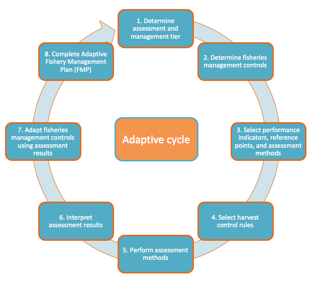

# Toolkit Overview

## Purpose Statement

-   This toolkit provides you the tools you
    will need to estimate how your fishery is doing and achieve your
    fishery goals by managing it adaptively. The toolkit will help you
    implement fisheries management measures based on your best available
    science, learn how these management interventions are performing,
    and then adjust them as necessary.

-   This toolkit will help you create an Adaptive Fisheries Management
    Plan, one of the four critical Fish Forever design specifications
    from the Fishery Management element of success of our program

-   Certain workbooks provided in this toolkit will help you calculate
    certain indicators of Global M&E Plan (CPUE, total landings, average
    length of key target species, fishing mortality of key target
    species, fish biomass inside the reserve, and fish biomass outside
    the reserve)

-   See Figure 1 below for a step-by-step process schematic of the
    toolkit

## Suggested Audience

-   The toolkit is designed as a facilitation document that is led by
    one person. However, during each step, this person would work with a
    multi-stakeholder group to reach consensus and make decisions

-   The exact person who should facilitate this process will depend on
    team skills and goals from country programs. Here are two general
    approaches:

    -   The toolkit may be used by regional technical Rare staff, who
        may each support several FF sites

    -   The toolkit may also be used by technical staff at each FF site,
        such as the TURF-Reserve Specialist (TRS) or Assistant Campaign
        Fellow (ACF)

## Skills Necessary to Use Toolkit

-   General knowledge and skills in fisheries
    science (ecology, management, population dynamics, local policy)

-   Familiarity with the FF curriculum course “Managing Fisheries in a
    TURF-Reserve”

-   Familiarity with Excel

-   Facilitation skills to coordinate and lead multi-stakeholder
    discussions (see Pride curriculum)

-   Communication skills to effectively convey the benefits and
    tradeoffs of different fisheries assessment and management options
    to a variety of stakeholders

## Toolkit Objectives 

-   This toolkit provides a step-by-step
    process that you can use to analyze data, evaluate the performance
    of your fishery, choose management measures, and adjust management
    so that the fishery achieves your management objectives.
    Specifically, the toolkit helps managers:

    -   Select fisheries management controls (regulations) designed to
        help managers achieve their fisheries goals (i.e. limit fishing
        mortality, protect ecological and biological function, reduce
        bycatch, etc.)

    -   Determine which and how data should be used to monitor and
        evaluate target species and/or ecosystem status over time;

    -   Perform data-limited assessment techniques to evaluate fisheries
        performance using simple workbooks in Excel;

    -   Define a process for how fisheries assessment and management
        will be reviewed and adapted periodically over time, using the
        best available scientific data and local ecological knowledge

<!-- -->

-   By working through the above steps, this toolkit will help you
    create an Adaptive Fisheries Management Plan for TURF-Reserve sites.

-   Using data collected at your site, the Excel Workbooks, specifically
    those tabs related to data exploration and visualization, can be
    used as a “spot check” to detect problems with data collection
    sampling protocols. You may wish to revisit these workbooks
    frequently (every few months) during the beginning stages of data
    collection to adaptively correct problems.

## When to Use the Toolkit

-   This toolkit has been designed to work holistically with the
    Fisheries Landscape Assessment and Goal Setting (FLAGS) Toolkit and
    with the TURF-Reserve Design Toolkit. In most Fish Forever sites, it
    is recommended that implementing partners work sequentially with
    communities and other relevant stakeholders through the toolkits to
    conduct assessments and make management decisions, starting with
    FLAGS, then TURF-Reserve Design, and finally the AFAM toolkits. To
    properly assess and manage your fishery, it will be important to
    have clearly articulated goals, prioritized species, and a
    TURF-Reserve system within which to implement fisheries management –
    these steps are all accomplished through the use of the FLAGS and
    TURF-Reserve Design Toolkits. At the very least, the TURF-Reserve
    Design Survey will also be a required data input to the AFAM
    toolkit. It should be noted, however, that regardless of when the
    AFAM toolkit will be used at your site, fishery-dependent and
    fishery-independent monitoring and data collection should start as
    soon as possible, as outlined in the Global Monitoring & Evaluation
    Plan. Please see the following section for a more detailed
    description of data requirements and recommendations.

-   Once your site is ready to use the AFAM toolkit, the toolkit should
    be used on an annual basis at least for the first few years in order
    to take advantage of the adaptive nature of this framework. As time
    progresses and more data and information become available for the
    fishery, different assessment and management tiers should be used.
    Additionally, as technical capacity for data analysis develops at
    your site, more advanced assessment methods may be appropriate. Due
    to changing biological, ecological, environmental, and socioeconomic
    conditions, it will also be important to perform each assessment
    method on an annual basis in order to measure changes in the fishery
    and adjust fisheries management controls accordingly.

## Data Necessary to Use the Toolkit

Below we describe the minimum data requirements as well as additional
optional data that is recommended but not required. For each type of
data, we list the Fish Forever data stream or toolkit outputs that the
AFAM toolkit can use. For each data stream or toolkit output, we also
describe exactly what information the AFAM toolkit will use from that
source. While we recommend that sites use the toolkits and data stream
collection protocols outlined in the Global M&E Plan and the FF Data
Collection Manual, we realize some regions may have other tools or data
collection processes for getting the same type of information. The AFAM
toolkit can be used with whatever data is available, although the most
important types of data for data-limited fisheries assessment come from
catch reporting, boat intercept or landing site surveys,
fishery-dependent length composition surveys, and fishery-independent
surveys (using underwater visual surveys or experimental fishing).

Table 1: Minimum required and optional recommended data for using the
AFAM Toolkit

+-----------------------------------+-----------------------------------+
| **Minimum Required Data**         |                                   |
+===================================+===================================+
| **Fish Forever Data Stream or     | **What information the AFAM       |
| Toolkit Outputs**                 | Toolkit will use**                |
+-----------------------------------+-----------------------------------+
| TURF-Reserve Design Survey        | Qualitative characterization of   |
|                                   | the fishery (including local      |
|                                   | history, gear types, target       |
|                                   | species, fishing locations,       |
|                                   | fishing seasons, etc)             |
+-----------------------------------+-----------------------------------+
| TURF-Reserve Design Toolkit       | TURF and Reserve size and         |
| Outputs (*or other regional tool  | location                          |
| that yields the same outputs*)    |                                   |
+-----------------------------------+-----------------------------------+
|   FLAGS Toolkit Outputs (*or      |   List or prioritized species for |
|   other regional tool that yields |   management                      |
|   the same outputs*)              |                                   |
|                                   |   List or prioritized goals for   |
|                                   |   management                      |
|                                   |                                   |
|                                   |   Estimated vulnerability of      |
|                                   |   prioritized target species      |
+-----------------------------------+-----------------------------------+
| **Additional Recommended Data**   |                                   |
+-----------------------------------+-----------------------------------+
| **Fish Forever Data Stream**      | **What information the AFAM       |
|                                   | Toolkit will use**                |
+-----------------------------------+-----------------------------------+
| Individual Catch reporting system | Landings, effort, and CPUE of key |
|                                   | target species                    |
+-----------------------------------+-----------------------------------+
| Boat-intercept or landing site    | Landings, effort, and CPUE of key |
| survey                            | target species                    |
+-----------------------------------+-----------------------------------+
| Fishery-dependent                 | Length composition data of key    |
| length-composition survey         | target species                    |
+-----------------------------------+-----------------------------------+
| Fishery-independent survey        | Fished:Unfished density ratio     |
| (Underwater visual survey or      | (key target species) Coral reef   |
| Experimental Fishing)             | thresholds (aggregated across     |
|                                   | species – only for underwater     |
|                                   | visual survey)                    |
+-----------------------------------+-----------------------------------+
| KAP Survey                        | Household survey data on the      |
|                                   | community’s knowledge, attitudes, |
|                                   | interpersonal communication, and  |
|                                   | practices relating to fisheries   |
|                                   | management                        |
+-----------------------------------+-----------------------------------+
| Social Impact / Household Survey  | Household survey data on the      |
|                                   | impact fisheries management is    |
|                                   | having on the community           |
+-----------------------------------+-----------------------------------+
| Enforcement Logbooks              | Information on violations of the  |
|                                   | NTZ and violations of TURF        |
|                                   | regulations                       |
+-----------------------------------+-----------------------------------+
| Qualitative information from      | Qualitative information on the    |
| campaign research (i.e., in-depth | community’s preparedness for      |
| interviews, focus group           | implementing fisheries management |
| discussions, barrier removal      | and what barriers that may need   |
| workshops)                        | to first be removed               |
+-----------------------------------+-----------------------------------+

## Supporting Documents

-   There are accompanying Excel workbooks that provide how-to
    instructions for using each assessment method, in addition to the
    step-by-step decision support framework provided in this document as
    well as the worksheet, tables, and figures in the appendices,. The
    FF curriculum course “Managing Fisheries in a TURF-Reserve” is also
    a resource for background material.

## How this Toolkit was Developed

This toolkit builds on extensive research over the past decades in
data-limited fisheries assessment and management approaches (see
Appendix 8 – References for a list of the approaches this toolkit draws
from). This toolkit also utilizes extensive first-hand experience in
designing a similar Adaptive Management Framework for the Belizean conch
and lobster fisheries, an initiative undertaken between the Belize
Fisheries Department, Belize Science Team, and several members of the
Fish Forever team (McDonald e*t al.*, 2014, manuscript included in AFAM
package).

# Introduction – How to use this toolkit

This toolkit will guide you through an eight-step process that should be
conducted on an annual basis. Figures and table that are referenced in
the text are mostly contained in the appendix, and are also hyperlinked
in the word document for easily moving back and forth. Appendices and
steps are also hyperlinked. Hyperlinks throughout the document are
*underlined*. Definitions of many terms throughout this document can be
found in the Glossary (Appendix 6 – Glossary). Words or phrases that are
found in the glossary are often *italicized*.

The toolkit also includes a worksheet in Appendix 1 – Your AFAM Toolkit
Worksheet that you can use throughout the process to document and
consolidate decisions and notes from each step. Specific instructions
are provided at the end of each step to guide you in filling out the
worksheet. These instructions are in blue boxes. Each step of the
process has one or more corresponding tables in the worksheet. This
worksheet should be filled out each time you use the toolkit. This
record will be used to develop or modify your Fishery Management Plan
and will be helpful when re-visiting the toolkit in the future (Appendix
9 – Fishery Management Plan Template).

**8 Steps in the Toolkit:**

The toolkit process is broken into 8 steps, shown in the schematic
(Figure 1) and described below.

Figure 1: AFAM Toolkit 8-step Schematic

1.  Step 1 – Determine Assessment and Management Tier

    a.  Your assessment and management tier is based on the data you
        have available and will determine what assessment and management
        options you have at your disposal

2.  Step 2 – Determine Appropriate Fisheries Management Controls

    a.  Fishery management controls are what allow managers to limit
        aspects of fishing behavior to limit fishing mortality or to
        protect key biological or ecological function (i.e., Total
        Allowable Catch or seasonal closures to protect spawning
        aggregations)

3.  Step 3 – Select Performance Indicators, Reference Points, and
    Assessment Methods

    a.  Performance indicators are numerical values based on data that
        give an indication of how the fishery is performing relative to
        a reference point. Reference points may define either a target
        where you want the fishery to move towards or a limit where you
        want the fishery to stay away from. The assessment method is the
        technique for calculating your performance indicator using
        available data. For example, a performance indicator could be
        fishing mortality with a target reference point of natural
        mortality. In this case, the assessment method to calculate
        fishing mortality could be Catch Curve.

4.  Step 4 – Define Harvest Control Rules

    a.  A harvest control rule helps stakeholders to compare performance
        indicators with reference points and adjust fisheries management
        controls accordingly. In other words, a harvest control rule is
        a plan for pre-agreed management actions as a function of
        variables related to the status of stock in question. For
        example, a simple harvest control rule could specify that if
        fishing mortality is above natural mortality, the Total
        Allowable Catch should be reduced.

5.  Step 5 - Perform Assessment Methods

    a.  You will learn about the various types of assessment methods and
        use the appropriate assessment method to calculate your selected
        performance indicators and reference points. This section
        provides a “how-to” guide for using each assessment method.
        Excel workbooks will accompany some assessment methods.

6.  Step 6 – Interpret Assessment Results

    a.  You will interpret your assessment results, together with local
        ecological knowledge and other available data, to determine if a
        management response is required or not.

7.  Step 7 – Adjust Fisheries Management Controls Using Defined Harvest
    Control Rules

    a.  You will use the harvest control rules defined in Step 4 and the
        interpretations generated in Step 6 to adjust fisheries
        management controls appropriately.

8.  Step 8 – Complete your Fishery Management Plan

    a.  You will use the outputs of the AFAM toolkit as well as other
        Fish Forever documents to fill out a Fishery Management Plan
        template for your fishery. Note that the template provided here
        may need to be adapted to better suit regional context.

# Appendix 6 – Glossary

**Assessment Method** - The method for using raw data to calculate
performance indicators.

**Boat intercept / landing site surveys -** Baseline boat intercept and
landing site surveys are meant to gather information on catch and effort
in order to establish a baseline catch-per-unit-effort (CPUE) indicator.
These surveys can be useful in establishing baseline CPUE in areas where
individual catch reporting systems are not yet in place. This
information should be broken down by species and gear type. Boat
intercepts involve at-sea intercepts of fishing boats, and are typically
conducted in areas where fish is landed at a large number of sites.
Landing site surveys are typically conducted where fish is landed at a
relatively small number of sites. To establish baseline CPUE we
recommend landing site surveys. The information from these surveys can
be used to inform fisheries management as well as impact monitoring over
time as it relates to productive and profitable fisheries. Refer to the
FF Data Collection Manual for more details.

**Bycatch -** A species or individual fish that is caught
unintentionally. This term may refer to any landings that do not contain
the species that as targeted or it may refer to a certain size class or
sex of a species that was unintentionally landed. For example, a
juvenile fish landed that is under the specified size limit would be
considered bycatch.

**Control** – See **Fisheries Management Control (FMC)**

**Discard Mortality –** How likely a fish is to die after it has been
landed and released (and not counted as part of total harvest). Discard
mortality rates will vary with different fishing gears and between
species.

**Destructive Fishing Methods -** These are unselective fishing methods
that result in high discard mortality and are defined in this tool as:
dynamite fishing, fishing with chemicals or harmful substances, the use
of nets with fine mesh.

**Experimental Fishing –** Fishery-independent experimental fishing
surveys gather ecological information on the finfish of a particular
area. This information can include biomass and species richness.
Individuals who are trained in local species and ecology conduct these
surveys. Local fishers can be employed to use a specific gear in
specified sampling locations and at specified sampling times. This type
of information can be used to better understand the health of a
particular ecosystem and inform fisheries management, and is also
important for monitoring impact as it relates to ecosystem conservation
and resilience.

**Fisheries Management Control (FMC) –** Fisheries management controls
are measures that managers may implement to limit fishing activity with
the main objective of either limiting fishing mortality or protecting
key biological or ecological features of the fishery. Definitions of
recommended FMCs for FF sites are provided in Table A2.1.

**Fishery-dependent species length composition survey -** The survey
will gather individual fish length measurements of key target species in
order to construct length frequency compositions of those species. A
fishery dependent length composition indicates how many fish of each
size are being caught in the fishery. This information can inform how
well the fishery is doing through key indicators such as average length
or fishing mortality. This can be used to inform fisheries management as
well as impact monitoring over time as it relates to productive
fisheries. Refer to the FF Data Collection Manual for more details.

**Harvest Control Rule (HCR) -** A harvest control rule helps
stakeholders to compare performance indicators with reference points and
adjust fisheries management controls accordingly. In other words, a
harvest control rule is a plan for pre-agreed management actions as a
function of variables related to the status of stock in question.

**Highgrading -** When fishermen selectively only keep harvested fish
that are the highest quality (ex. The largest) and discard the lower
quality catch. Typically occurs when only a limited number of fish can
be harvested.

**Individual Catch Reporting System -** This is the system that will
gather catch and effort data for the fishery as well as price and cost
data necessary for computing profit. This information should be broken
down by species and gear type, and in ideal circumstances would cover
all landings and effort of all fishers. Additionally, fishers should
indicate the location where their catch was caught if possible. Ideally,
all fishers report their catch daily in log books. Refer to the FF Data
Collection Manual for more details.

**Limit Reference Point (LRP)** - a numerical value that indicates that
the status of a stock is unacceptable (e.g. overfished).

**Megaspawner -** Old, large fish that contribute a disproportionately
significant amount of reproductive potential of the stock

**Performance Indicators -** a numerical value (or range of values) that
is used to determine the current state of the fishery. Performance
indicators can be examined over time, space or against a predetermined
reference point**.**

**‘Race to Fish’-** Occurs when fishermen are fishing against a single
quota or for a limited time frame. Fishermen begin to race each other to
catch as many fish as possible before the fishery is closed. This often
leads to fishermen investing in more efficient gear, using too many
gears, fishing during unsafe weather conditions, higher bycatch rates,
and reduced value of catch due to market floods.

**Reference Point:** A reference point is what your performance
indicator is compared with when assessing the performance of your
fishery. By comparing your performance indicator on an annual with a
pre-determined reference point, you can assess how your fishery is
doing. There are two types of references points: limit reference points
(LRPs) and target reference points (TRPs).

**Target Reference Point (TRP) -** a numerical value (or range of
values) that indicates that the status of a stock is at a desirable
level, often times management is geared towards achieving or maintaining
this target.

**Underwater Visual Survey –** Fishery-independent underwater visual
surveys gather ecological information on the finfish, invertebrate, and
benthic habitat composition of a particular area. This information can
include biomass, species richness, and coral and macroalgal cover.
Individuals who are trained in local species and ecology conduct these
surveys. SCUBA or snorkeling is used in order to conduct linear
transects, quadrats, patch reef surveys, manta tows, or roaming surveys.
This type of information can be used to better understand the health of
a particular ecosystem and inform fisheries management, and is also
important for monitoring impact as it relates to ecosystem conservation
and resilience.

# Appendix 8 – References

Ault, J., Smith, S., & Bohnsack, J. (2005). Evaluation of average length
as an estimator of exploitation status for the Florida coral-reef fish
community. ICES Journal of Marine Science, 62(3), 417–423.
doi:10.1016/j.icesjms.2004.12.001

Babcock, E. a., & MacCall, A. D. (2011). How useful is the ratio of fish
density outside versus inside no-take marine reserves as a metric for
fishery management control rules? Canadian Journal of Fisheries and
Aquatic Sciences, 68(2), 343–359. doi:10.1139/F10-146

Beverton, R. J. H., and Holt, S. J. (1959). A review of the lifespans
and mortality of fish in nature and the relation to growth and other
physiological characteristics. Ciba Foundation Colloquium on Ageing, 5:
142–177.

Ehrhardt, N.M. & Ault, J.S. (1992). Analysis of two length-based
mortality models applied to bounded catch length frequencies. Trans. Am.
Fish. Soc., 121, 115-

122.

Froese, R. (2004). Keep it simple: three indicators to deal with
overfishing. Fish and Fisheries, 5, 86–91.

Hordyk, A., Ono, K., Valencia, S., Loneragan, N., & Prince, J. (2014). A
novel length-based empirical estimation method of spawning potential
ratio (SPR), and tests of its performance, for small-scale, data-poor
fisheries. ICES Journal of Marine Science. doi:10.1093/icesjms/fsu004 A

Karr, K. A., Fujita, R., Halpern, B. S., Kappel, C. V., Crowder, L.,
Selkoe, K. A., P. M. Alcolado, and D. Rader (2014). Thresholds in
Caribbean coral reefs: Implications for ecosystem-based fishery
management. Journal of Applied Ecology. doi:10.1111/1365-2664.12388

McClanahan, T. R., Graham, N. a. J., MacNeil, M. A., Muthiga, N. a.,
Cinner, J. E., Bruggemann, J. H., & Wilson, S. K. (2011). Critical
thresholds and tangible targets for ecosystem-based management of coral
reef fisheries. Proceedings of the National Academy of Sciences of the
United States of America, 108(41), 17230–3. doi:10.1073/pnas.1106861108

McDonald, G., Carcam, R., Fujita, R., Gedamke, T., Karr, K., Wilson, J.
A multi-indicator framework for adaptive management of data-limited
nearshore fisheries: A case study from Belize (2014). Proceedings of the
67^th^ Annual Gulf and Caribbean Fisheries Institute, Christ Church,
Barbados, November 2014.

Prince, J., Hordyk, A., Valencia, S. R., Loneragan, N., & Sainsbury, K.
(2014). Revisiting the concept of Beverton -Holt life-history invariants
with the aim of informing data-poor fisheries assessment. ICES Journal
of Marine Science, (1959). doi:10.1093/icesjms/fsu011

Robson, D. and G. Chapman. 1961. Catch Curves and Mortality Rates.
Transactions of the American Fisheries Society 90 (2): 1810189.
