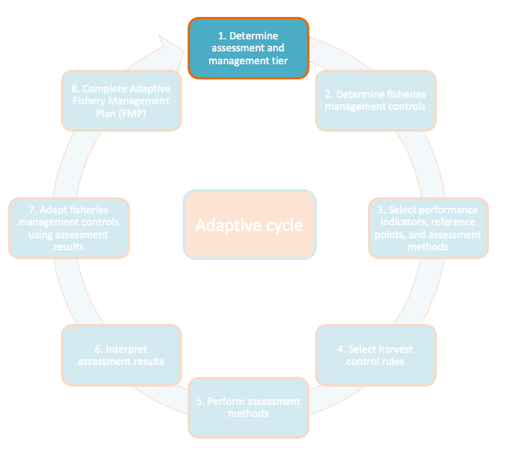
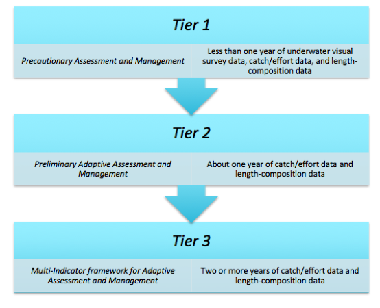

# Step 1 – Determine Assessment and Management Tier

*What information do I have, and how can I use it?*

In the first step of this toolkit, you will determine the assessment and
management “tier” of your fishery based on the types of information and
data that are available (Figure 2). Depending on the data that are
available, you will have different options for fisheries management
controls and assessment methods. The tier you determine during this step
will be used throughout the remaining steps of the toolkit. This tiered
system is based on the Global M&E Plan. If your site follows this plan,
you will automatically begin collecting the necessary data to eventually
move to Tier 3.

Figure 2: Schematic of assessment and
management tiers

## Step 1a – Fill out your Data Inventory

Fill out Table A1. 1 in the AFAM Toolkit Worksheet. This table outlines
all of the possible data streams and Fish Forever toolkit outputs that
can be used by the AFAM Toolkit. For each data stream, indicate whether
or not the data is available and how many years of data is available.
Note that not all data needs to come from your time as a Fish Forever
site or from protocols as outlined in the Fish Forever Data Collection
Manual. Some data collection protocols may pre-date the Fish Forever
program. However, it is important

## Step 1b – Using your Data Inventory, Determine Assessment and Management Tier

Use the following questions to determine which assessment tier is most
appropriate for your site:

1.  Do you have two or more years of catch/effort data (from individual
    catch reporting and/or boat intercept or landing site survey)? Do
    you also have two or more years of fishery-dependent
    length-composition survey data?

    a.  **Yes** – Use the *Tier 3* category and continue collecting data
        by following your site-level Research Plan and the best
        practices provided in the Fish Forever Data Collection Manual.

    b.  **No - C**ontinue on to question two.

2.  Do you have at least one year of catch/effort data (from individual
    catch reporting and/or boat intercept or landing site survey) and
    fishery-dependent length-composition survey data?

    a.  **Yes -** Use the *Tier 2* category and continue collecting data
        by following your site-level Research Plan and the best
        practices provide in the Fish Forever Data Collection Manual.

    b.  **No** –Use the *Tier 1* category and follow your site-level
        Research Plan and the best practices provided in the Fish
        Forever Data Collection.

The three assessment and management categories are described in more
detail below. We will discuss the specifics of fisheries management
controls and performance indicators in the following steps. As you
collect more and more data as the Fish Forever intervention progresses,
your site will be able to move from one tier to the next.

*Tier 1 – Precautionary Assessment and Management (for new FF sites with
less than one year of data)*

Under most scenarios, Tier 1 describes a new Fish Forever site, with no
pre-existing standardized data collection and monitoring program in
place. The only information available will likely come from the
TURF-Reserve Design Survey, underwater visual surveys or experimental
fishing (if available), and outputs from the FLAGS and TURF-Reserve
Design toolkits. Even though little to no data is present, managers can
still perform a basic fisheries assessment and select precautionary
fisheries management controls (FMCs) until more data is collected. The
goal of Tier 1 is to implement precautionary assessment and management
measures that can benefit a fishery of any status until more data is
collected for the fishery. When we are uncertain about the status and
dynamics of a resource, it is prudent to interact with the resource in a
way that minimizes the risks of something ‘bad’ happening. One of the
most effective precautionary management techniques is to limit the use
of destructive fishing gears and/or practices. Another common
precautionary management technique is to protect spawning aggregations
through the implementation of a seasonal closure.

*Tier 2 – Preliminary Adaptive Assessment and Management (for FF sites
with one year of data)*

Tier 2 sites will have roughly one year of data that come from some
combination of catch reporting, boat intercept or landing site survey,
or fishery-dependent length-composition surveys. The goal of Tier 2 is
to provide the preliminary assessment and management methods for a
fishery, while continuing to collect more data. A suite of FMCs can also
be used in combination to meet multiple objectives where appropriate.

*Tier 3 – Multi-Indicator framework for Adaptive Assessment and
Management (for sites with more than one year of data)*

Tier 3 sites will have a time series of data available that can be used
to examine trends in multiple performance indicators and implement FMCs
such based on an improved scientific understanding of stock status.
Under Tier 3, each species should have several performance indicators,
which should ideally come from different data streams, in order to gain
a more complete understanding of the fishery and reduce uncertainty.
Multiple performance indicators from multiple data streams are used to
gain a more complete understanding of the fishery and to reduce the
implications of uncertainty, bias, or error associated with any single
indicator or data stream. Furthermore, corroboration between indicators
can allow for a confident interpretation of fishery performance.
Additionally, with multiple years of data, limits and targets can be
estimated from running averages or the average of the past few years.
Running averages take into account variability in the environment and
the fishery. Ecosystem-level indicators should be included if the
sustainable provision of non-fishery ecosystem services is a management
goal.
