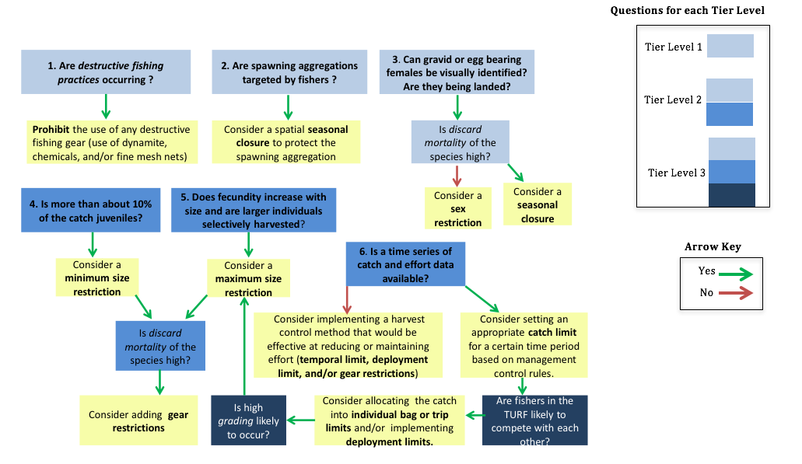

# Step 2 – Determine Appropriate Fisheries Management Controls

*What fisheries management controls are appropriate for your fishery?*

## Step 2a – Summarize and Qualitatively Assess Any Existing Fisheries Management Controls

As an important first step, summarize any existing fisheries management
controls that may affect your site. If there are no existing FMCs, skip
to Step 2b.

Qualitatively assess how existing fisheries management controls are
performing. This will help determine whether or not these controls are
appropriate, or if other or additional controls should be used instead.
Think about the following considerations:

-   **Who mandates this FMC?** Is it locally mandated (in which case it
    could potentially be modified or removed), or is it mandated by a
    higher body (such as a regional or national body – this may make the
    FMC more difficult to modify or remove)? This can help frame a
    discussion around whether or not this FMC could be modified or
    removed.

-   **What is the cost of this FMC?** Does it require expensive data
    collection or enforcement?

-   **What is the level of compliance with this FMC?**

-   **What is public attitude towards this FMC?** You may be able to use
    existing KAP survey data to help quantify this.

-   **Are current FMCs helping the fishery reach its goals?** You may
    use Table A2. 2, Table A2. 3, and Table A2. 4 to see common goals of
    many FMCs and determine if the goals of your fishery are being met.

-   **What are other implementation pros/cons**?

Based on this qualitative assessment, you may be happy with the current
set of FMCs in which case you can skip to Step 2c. Alternatively, if the
FMCs are not performing as your community may wish, proceed to Step 2b
to explore selecting different FMCs. Either way, you will quantitatively
assess how well FMCs are doing in terms of fisheries performance in Step
5 by performing data-limited assessments using any available data. Based
on this quantitative evaluation, you may wish to change FMCs during the
next iteration of the AFAM cycle.

## Step 2b – Preliminary Selection of New Fisheries Management Controls

Fisheries managers have a number of different fisheries management
controls (FMCs) to choose from to manage their fishery goals. Many FMCs
are designed with the primary objective of limiting fishing mortality
such as catch limits; however, other FMCs are designed to protect
certain biological or ecological functions in an ecosystem such as
seasonal closures to protect spawning aggregations. Descriptions of
commonly used FMCs are listed in *Table A2. 1*. This table also includes
data requirements and enforcement considerations for the implementation
of each FMC. Additionally, Appendix 7 – Fisheries Management Control
Case Studies has case studies for each FMC that describe situations
where the FMC has been implemented in a small-scale fishery. These case
studies present some of the opportunities, challenges, and implications
these different FMCs bring to small-scale fisheries.

To select a list of preliminary fisheries management controls, use the
six questions in the decision tree below (Figure 3) as a general guide
and first step to determine what FMCs may be appropriate for your
fishery. However, conditions occurring in your specific fishery must be
carefully considered as well as the community goals for your
TURF-Reserve. Additionally, while this figure is one tool for helping
select the type of FMC (i.e., minimum size limit) it does no provide
guidance on the specific FMC that should be implemented (i.e., what that
minimum size limit should be) Steps 2c and 2d are designed to guide
additional considerations when determining appropriate and specific
FMCs.

**Figure 3: Decision tree to help identify
potentially appropriate Fisheries Management Control(s). Answer
questions \#1-6 that correspond to your Tier and follow the arrow that
best represents your fishery to determine potentially appropriate
FMC(s). FMCs are found in the yellow boxes and are listed in bold.
Definitions can be found in *Table A2. 1*. Definitions of the italicized
terms can be found in *Appendix 6 – Glossary*.**

## Step 2c – Consider Applying Additional Fisheries Management Controls to Better Meet Goals

There is no prescriptive method for determining the ‘perfect’
combination of FMCs for every site because the most appropriate FMCs
will greatly depend on the specific conditions and characteristics of
the TURF-reserve and surrounding community. The following 6 steps, along
with the information in in Table A2. 2, Table A2. 3, and Table A2. 4,
can serve as a guide to help identify a set of FMCs that may be
effective at meeting your site’s management goals.

1.  Find the FMC(s) that were either existing (Step 2a) or newly
    selected (Step 2b) in Table A2. 2, Table A2. 3, and Table A2. 4.
    These tables describe potential negative or positive impacts of each
    FMC on common biological, ecological, and socioeconomic fishery
    management objectives.

2.  Identify which of the management objectives in the first row of
    Table A2. 2, Table A2. 3, and Table A2. 4 align with the site’s
    management goals that were identified during the goal setting
    exercise of the FLAGS toolkit (or other goal setting activities your
    site has conducted).

3.  Review the potential impact of each FMC being considered for your
    site on each of your management objectives.

4.  Determine if the preliminary selection of FMC(s) will conflict with
    or fail to accomplish any of your site’s management goals. For
    example, a catch limit may have been identified as an appropriate
    FMC to control harvest at a site but additional management goals of
    the site may be to protect habitat and reduce bycatch. Table A2. 3
    shows that implementing a catch limit may result in an increase in
    bycatch rates and increased habitat damage if implemented without
    any other FMCs.

5.  Use Table A2. 2, Table A2. 3, and Table A2. 4 to identify FMC(s)
    that are associated with positive impacts on the sites management
    objectives. FMC(s) identified here can be chosen in combination with
    FMC(s) identified in Step 2a to meet multiple management objectives.
    For example, in some fisheries, combining gear restrictions with
    catch limits may be effective at controlling harvest, and reducing
    bycatch and habitat damage.

6.  In Table A2. 2, Table A2. 3, and Table A2. 4, some FMCs have similar
    impacts across management objectives and it may be unclear which FMC
    is most appropriate for your site. To determine the most appropriate
    FMC(s) for your site, consider the “ease of implementation” for each
    FMC listed in Table A2. 1 and how it aligns with the specific
    conditions and characteristics the site.

## Step 2d – Consider Implications with Relevant Stakeholders

Before finalizing which FMC(s)will be implemented at your site, consider
how fishers (as well as other stakeholders such as middlemen,
enforcement organizations, etc.) may respond to this management control
by considering the following questions:

-   What management methods have successfully been implemented in the
    past?

-   Can this management method be effectively implemented and enforced?

-   Is this method socially and politically feasible, and will fishers
    comply with it?

The ability of the selected FMCs to meet the stated community objectives
for the TURF-Reserve defined in the FLAGS toolkit should be discussed
will all relevant stakeholders, along with any potential tradeoffs of
implementing the selected FMC(s).

Additionally, prior to implementing FMC(s), any existing KAP and social
Impact Survey data should be reviewed. KAP data can be used to provide
insight into individual attitudes towards fishery management in your
community. Social Impact Survey data can be used to provide context as
to how dependent the community is on the fishery and how changes in FMCs
may affect their livelihoods. Any information on enforcement should also
be reviewed to gain a better understanding of the likelihood of
compliance with implementation of new FMCs.

## Step 2e – General Guidance for Setting Effective FMCs for the First Time

***Note – This step is only applicable when developing your Adaptive
Fisheries Assessment and Management Framework for the first time. In
following years, you will use harvest control rules (defined later) to
adaptively adjust these initial controls.***

Once you have finalized your list of FMCs that will be implemented in
your community, you will need to define the specifics of the FMC for the
first time. For example, what will your catch limit actually be? The
specifics will depend on the status of your site’s resources, the
population dynamics of the targeted species at the site, and your site’s
specific management objectives. If you believe target species are
depleted, if little information is available, and/or if enforcement or
compliance is low, we recommend taking a precautionary approach using
the following suggestions:

-   **Catch Limit** - Set annual catch limit at or below the previous
    year’s total catch

-   **Bag or Trip Limit** - Divide the previous year’s catch by the
    number of fishers participating in the fishery. Set the Bag or trip
    limit at that level or below

-   **Size limit** - Set a minimum size limit above the minimum size at
    maturity. A maximum size limit may also be set to protect
    *megaspawners*.

-   **Temporal limits** – Close the fishery during biologically
    sensitive times or during times (or areas) when the catchability of
    species greatly increases (such as Spawning aggregations).

-   **Vessel/gear restrictions** - Gear and vessel restrictions should
    be set that minimize the impact of the fishery on habitat. Gear
    dimensions should also be set that reduce bycatch. For example,
    small mesh size in nets may be prohibited to reduce the landings of
    individuals below reproductive maturity.

-   **Deployment Limits** - Initial deployment limits may be set to
    restrict the number of gears being used to the same number of gears
    that were used in the previous year or below.

-   **Sex specific** - Ban the take of females that are egg-bearing or
    the take of females during a biologically sensitive period.

-   **Protection of Ecologically Important Species** - Restrict fishing
    of specific species in order to protect key ecological function,
    such as herbivorous parrotfish that control macroalgae cover.

# Appendix 2 – Selecting Your fisheries Management Controls

## Table A2.1: Descriptions and implementation considerations for different fisheries management controls

+-------------+-------------+-------------+-------------+-------------+
| **Fisheries | **Primary   | **Descripti | **Minimum   | **Enforceme |
| Management  | Objective** | on**        | Data        | nt**        |
| Control**   |             |             | Requirement |             |
|             |             |             | s**         |             |
+=============+=============+=============+=============+=============+
| Catch Limit | Limit       | Sets an     | A time      | Catch       |
|             | fishing     | upper limit | series of   | limits      |
|             | mortality   | on how many | catch and   | (individual |
|             |             | fish can be | effort      | or group    |
|             |             | removed by  | data;       | allocated)  |
|             |             | a fishery   | information | can be      |
|             |             | in a given  | on the      | enforced if |
|             |             | time. This  | stock's     | landings    |
|             |             | can be for  | productivit | are         |
|             |             | an entire   | y           | relatively  |
|             |             | fishery or  | (length-bas | centralized |
|             |             | can be      | ed          | but may be  |
|             |             | allocated   | DLSA        | more        |
|             |             | to          | methods can | difficult   |
|             |             | individuals | be used for | if landing  |
|             |             | or groups   | proxies);   | sites are   |
|             |             | of          | life        | more        |
|             |             | individuals | history     | dispersed.  |
|             |             | (such as a  | information | Any catch   |
|             |             | fisher      |             | limit       |
|             |             | association |             | program     |
|             |             | ).          |             | will have   |
|             |             | Limits can  |             | associated  |
|             |             | be set for  |             | monitoring  |
|             |             | individual  |             | costs for   |
|             |             | species or  |             | implementat |
|             |             | groups of   |             | ion         |
|             |             | species     |             | to be       |
|             |             | (also known |             | effective.  |
|             |             | as a “quota |             |             |
|             |             | basket). If |             |             |
|             |             | set         |             |             |
|             |             | correctly   |             |             |
|             |             | and         |             |             |
|             |             | fishers’    |             |             |
|             |             | incentives  |             |             |
|             |             | are         |             |             |
|             |             | aligned,    |             |             |
|             |             | catch       |             |             |
|             |             | limits are  |             |             |
|             |             | the most    |             |             |
|             |             | direct way  |             |             |
|             |             | of managing |             |             |
|             |             | fishing     |             |             |
|             |             | mortality.  |             |             |
|             |             | Catch       |             |             |
|             |             | limits can  |             |             |
|             |             | be set on   |             |             |
|             |             | the species |             |             |
|             |             | basis but   |             |             |
|             |             | also        |             |             |
|             |             | aggregate   |             |             |
|             |             | level based |             |             |
|             |             | on similar  |             |             |
|             |             | life        |             |             |
|             |             | history     |             |             |
|             |             | traits and  |             |             |
|             |             | vulnerabili |             |             |
|             |             | ty.         |             |             |
|             |             | If the      |             |             |
|             |             | incentives  |             |             |
|             |             | are not     |             |             |
|             |             | aligned and |             |             |
|             |             | rights are  |             |             |
|             |             | not         |             |             |
|             |             | allocated,  |             |             |
|             |             | catch       |             |             |
|             |             | limits can  |             |             |
|             |             | perpetuate  |             |             |
|             |             | the race to |             |             |
|             |             | fish that   |             |             |
|             |             | may lead to |             |             |
|             |             | safety      |             |             |
|             |             | issues and  |             |             |
|             |             | destructive |             |             |
|             |             | fishing     |             |             |
|             |             | practices   |             |             |
|             |             | (gear lost, |             |             |
|             |             | highgrading |             |             |
|             |             | ,           |             |             |
|             |             | etc.)       |             |             |
|             |             |             |             |             |
|             |             | Need at     |             |             |
|             |             | least one   |             |             |
|             |             | year’s      |             |             |
|             |             | worth of    |             |             |
|             |             | catch and   |             |             |
|             |             | effort data |             |             |
|             |             | to know     |             |             |
|             |             | where to    |             |             |
|             |             | set the     |             |             |
|             |             | limit.      |             |             |
+-------------+-------------+-------------+-------------+-------------+
| Bag or Trip | Limit       | Limits the  | Time series | Can be      |
| Limit       | fishing     | number or   | of catch    | enforced if |
|             | mortality   | weight of   | and effort  | landings    |
|             |             | fish that   | data,       | are         |
|             |             | can be      | information | relatively  |
|             |             | landed by   | on the      | centralized |
|             |             | an          | stock's     | but may be  |
|             |             | individual  | productivit | more        |
|             |             | fisher or   | y           | difficult   |
|             |             | vessel on a | (length-bas | if landing  |
|             |             | single day  | ed          | sites are   |
|             |             | or fishing  | DLSA        | more        |
|             |             | trip. If no | methods can | dispersed.  |
|             |             | illegal     | be used for | Monitoring  |
|             |             | discarding  | proxies),   | for every   |
|             |             | is          | and total   | vessel or   |
|             |             | occurring,  | number of   | individual  |
|             |             | than bag    | fishermen   | in a        |
|             |             | limits and  | participati | fishery     |
|             |             | trip limits | ng          | will result |
|             |             | based on    | in a        | in          |
|             |             | number of   | fishery     | significant |
|             |             | fish        |             | implementat |
|             |             | allowed to  |             | ion         |
|             |             | catch can   |             | costs.      |
|             |             | directly    |             |             |
|             |             | control     |             |             |
|             |             | fishing     |             |             |
|             |             | mortality.  |             |             |
|             |             | Can         |             |             |
|             |             | perpetuate  |             |             |
|             |             | high        |             |             |
|             |             | grading and |             |             |
|             |             | illegal     |             |             |
|             |             | discarding. |             |             |
+-------------+-------------+-------------+-------------+-------------+
| Size Limit  | Limit       | Sets        | Size at     | Can be      |
|             | fishing     | minimum     | maturity    | enforced if |
|             | mortality   | and/or      | and/or size | landings    |
|             |             | maximum     | of          | are         |
|             |             | bounds on   | megaspawner | relatively  |
|             |             | the size of | s;          | centralized |
|             |             | fish that   | discard     | but may be  |
|             |             | can be      | mortality   | more        |
|             |             | legally     | rates for   | difficult   |
|             |             | landed in a | targeted    | if landing  |
|             |             | fishery.    | species are | sites are   |
|             |             | Size limits | helpful     | more        |
|             |             | can protect |             | dispersed.  |
|             |             | age-structu |             | Monitoring  |
|             |             | re          |             | is          |
|             |             | by          |             | straightfor |
|             |             | controlling |             | ward        |
|             |             | the size    |             | and does    |
|             |             | selectivity |             | not have    |
|             |             | of the      |             | many        |
|             |             | fishery to  |             | associated  |
|             |             | ensure fish |             | implementat |
|             |             | have the    |             | ion         |
|             |             | opportunity |             | costs.      |
|             |             | to spawn    |             |             |
|             |             | before      |             |             |
|             |             | being       |             |             |
|             |             | caught.     |             |             |
|             |             | However,    |             |             |
|             |             | the biology |             |             |
|             |             | of the      |             |             |
|             |             | species     |             |             |
|             |             | must be     |             |             |
|             |             | considered  |             |             |
|             |             | carefully   |             |             |
|             |             | because     |             |             |
|             |             | size limits |             |             |
|             |             | can result  |             |             |
|             |             | in          |             |             |
|             |             | unintended, |             |             |
|             |             | negative    |             |             |
|             |             | consequence |             |             |
|             |             | s.          |             |             |
|             |             | Size limits |             |             |
|             |             | don’t       |             |             |
|             |             | directly    |             |             |
|             |             | control     |             |             |
|             |             | fishing     |             |             |
|             |             | mortality   |             |             |
|             |             | and may     |             |             |
|             |             | cause size  |             |             |
|             |             | truncation  |             |             |
|             |             | over time   |             |             |
|             |             | by removing |             |             |
|             |             | the largest |             |             |
|             |             | individuals |             |             |
|             |             | from a      |             |             |
|             |             | fishery     |             |             |
+-------------+-------------+-------------+-------------+-------------+
| Temporal    | Limit       | Restricts   | Temporal    | Can be      |
| Limit       | fishing     | the time    | dynamics of | enforced if |
|             | mortality   | period over | fishing     | landings    |
|             |             | which a     | effort;     | are         |
|             |             | fish can be | temporal    | relatively  |
|             |             | legally     | characteris | centralized |
|             |             | landed. If  | tics        | but may be  |
|             |             | fishing     | or behavior | more        |
|             |             | mortality   | of target   | difficult   |
|             |             | doesn’t     | species;    | if landing  |
|             |             | increase    | information | sites are   |
|             |             | before or   | on the      | more        |
|             |             | after the   | relationshi | dispersed.  |
|             |             | closure,    | p           | Temporal    |
|             |             | temporary   | between     | limits are  |
|             |             | closures    | catch and   | more        |
|             |             | allow       | effort is   | straightfor |
|             |             | marine      | helpful     | ward        |
|             |             | resources   |             | to monitor  |
|             |             | to increase |             | if the      |
|             |             | without     |             | limit       |
|             |             | disturbance |             | covers all  |
|             |             | to ensure   |             | species,    |
|             |             | fish grow   |             | but may be  |
|             |             | bigger and  |             | more        |
|             |             | new         |             | difficult   |
|             |             | recruits    |             | if the      |
|             |             | enter the   |             | limit only  |
|             |             | fishery.    |             | covers a    |
|             |             | Perpetuates |             | certain     |
|             |             | the race to |             | species in  |
|             |             | fish before |             | the         |
|             |             | and after   |             | fishery.    |
|             |             | the         |             |             |
|             |             | closure.    |             |             |
|             |             | Increases   |             |             |
|             |             | fishing     |             |             |
|             |             | effort      |             |             |
|             |             | before and  |             |             |
|             |             | after the   |             |             |
|             |             | closure.    |             |             |
|             |             | Doesn’t     |             |             |
|             |             | directly    |             |             |
|             |             | manage      |             |             |
|             |             | fishing     |             |             |
|             |             | mortality.  |             |             |
+-------------+-------------+-------------+-------------+-------------+
| Gear        | Limit       | Restricts   | Information | Gear        |
| Restriction | fishing     | the type of | on the      | restriction |
| s           | mortality   | fishing     | relationshi | s           |
| – Gear Type |             | gear        | p           | are         |
|             |             | allowed to  | between     | relatively  |
|             |             | participate | gear        | straightfor |
|             |             | in a        | characteris | ward        |
|             |             | fishery     | tics,       | to enforce  |
|             |             | (including  | fishing     | however,    |
|             |             | banning     | effort, and | gathering   |
|             |             | destructive | selectivity | information |
|             |             | fishing     | .           | required    |
|             |             | gear such   | If only     | for an      |
|             |             | as          | banning     | effective   |
|             |             | dynamite,   | destructive | implementat |
|             |             | cyanide,    | fishing     | ion         |
|             |             | and fine    | gear, no    | can be      |
|             |             | mesh nets)  | data is     | costly*.*   |
|             |             | but doesn’t | required.   | If only     |
|             |             | directly    |             | banning     |
|             |             | manage      |             | destructive |
|             |             | fishing     |             | fishing     |
|             |             | mortality.  |             | gear, there |
|             |             |             |             | are low     |
|             |             |             |             | upfront     |
|             |             |             |             | costs but   |
|             |             |             |             | ongoing     |
|             |             |             |             | monitoring  |
|             |             |             |             | costs       |
|             |             |             |             | should be   |
|             |             |             |             | considered. |
+-------------+-------------+-------------+-------------+-------------+
| Gear        | Limit       | Places a    | Current     | The ease    |
| Restriction | fishing     | cap on the  | fishing     | and cost of |
| s           | mortality   | number of   | effort      | enforcement |
| – Gear      |             | gears each  | levels in   | will depend |
| Number      |             | fisher can  | terms of    | on how      |
| (also known |             | use (such   | number of   | easily      |
| as          |             | as the      | gears;      | fishing     |
| Deployment  |             | number of   | information | gears can   |
| Limits)     |             | fixed traps | on the      | be          |
|             |             | or the      | relationshi | observed.   |
|             |             | number of   | p           |             |
|             |             | hooks on a  | between     |             |
|             |             | line). Does | catch and   |             |
|             |             | not         | effort is   |             |
|             |             | directly    | helpful     |             |
|             |             | manage      |             |             |
|             |             | fishing     |             |             |
|             |             | mortality.  |             |             |
|             |             | Can reduce  |             |             |
|             |             | the number  |             |             |
|             |             | of gear in  |             |             |
|             |             | the water   |             |             |
|             |             | thus        |             |             |
|             |             | decreasing  |             |             |
|             |             | habitat     |             |             |
|             |             | impacts..   |             |             |
+-------------+-------------+-------------+-------------+-------------+
| Sex-Specifi | Limit       | Protect     | Information | Sex-specifi |
| c           | fishing     | reproductiv | on          | c           |
| Controls    | mortality   | ely         | reproductiv | controls    |
|             |             | important   | e           | are         |
|             |             | individuals | traits and  | straightfor |
|             |             | by setting  | sex ratios  | ward        |
|             |             | sex-specifi |             | to enforce  |
|             |             | c           |             | if there    |
|             |             | prohibition |             | are obvious |
|             |             | s           |             | differences |
|             |             | on fishing  |             | between the |
|             |             | activity.   |             | sexes.      |
|             |             |             |             | Monitoring  |
|             |             |             |             | costs will  |
|             |             |             |             | depend on   |
|             |             |             |             | how easily  |
|             |             |             |             | the catch   |
|             |             |             |             | can be      |
|             |             |             |             | observed.   |
+-------------+-------------+-------------+-------------+-------------+
| Seasonal    | Protect     | Protect     | Information | Can be      |
| Closures to | vulnerable  | vulnerable  | on seasonal | enforced if |
| Protect     | life        | life        | behavior    | landings    |
| Vulnerable  | history     | history     | such as     | are         |
| Life        | stages      | stages by   | spawning    | relatively  |
| History     |             | restricting | aggregation | centralized |
| Stages      |             | the fishery | s           | but may be  |
|             |             | during      | and         | more        |
|             |             | certain     | migrations, | difficult   |
|             |             | seasons.    | and the     | if landing  |
|             |             | Seasonal    | temporal    | sites are   |
|             |             | spawning    | and spatial | more        |
|             |             | closures    | variability | dispersed.  |
|             |             | allow       | of these    | Seasonal    |
|             |             | spawning to | behaviors   | closures    |
|             |             | occur       |             | are more    |
|             |             | without     |             | straightfor |
|             |             | disruption  |             | ward        |
|             |             | to ensure   |             | to monitor  |
|             |             | recruits    |             | if the      |
|             |             | enter the   |             | closure     |
|             |             | fishery.    |             | covers all  |
|             |             | Perpetuates |             | species,    |
|             |             | the race to |             | but may be  |
|             |             | fish before |             | more        |
|             |             | and after   |             | difficult   |
|             |             | closure.    |             | if the      |
|             |             | Increases   |             | closure     |
|             |             | fishing     |             | only covers |
|             |             | effort      |             | a certain   |
|             |             | before and  |             | species in  |
|             |             | after the   |             | the         |
|             |             | closure.    |             | fishery.    |
|             |             | Doesn’t     |             |             |
|             |             | directly    |             |             |
|             |             | manage      |             |             |
|             |             | fishing     |             |             |
|             |             | mortality.  |             |             |
+-------------+-------------+-------------+-------------+-------------+
| Protection  | Protect     | Restrict    | Information | Protection  |
| of          | ecological  | fishing of  | on          | of          |
| Ecologicall | function    | specific    | ecological  | ecologicall |
| y           |             | species in  | interaction | y           |
| Important   |             | order to    | s           | important   |
| Species     |             | protect key | and roles   | species can |
|             |             | ecological  |             | be          |
|             |             | functions.  |             | straightfor |
|             |             | Does not    |             | ward        |
|             |             | directly    |             | but         |
|             |             | control     |             | monitoring  |
|             |             | fishing     |             | costs will  |
|             |             | mortality.  |             | depend on   |
|             |             |             |             | how easily  |
|             |             |             |             | the species |
|             |             |             |             | and fishery |
|             |             |             |             | catch can   |
|             |             |             |             | be          |
|             |             |             |             | observed.   |
+-------------+-------------+-------------+-------------+-------------+

## Table A2.2: Effectiveness of different fisheries management controls in meeting biological objectives

+-----------------+-----------------+-----------------+-----------------+
| **Fisheries     | **Protect       | **Protect       | **Protect       |
| Management      | Spawning Stock  | Age-Structure** | Vulnerable Life |
| Control**       | Biomass (SSB)** |                 | History         |
|                 |                 |                 | Stages**        |
+=================+=================+=================+=================+
| Catch Limit     | Catch limits    | Catch limits do | Catch limits do |
|                 | directly        | not directly    | not directly    |
|                 | protect SSB     | protect         | protect         |
|                 |                 | age-structure   | vulnerable life |
|                 |                 | and may have a  | history stages  |
|                 |                 | negative impact |                 |
|                 |                 | on the          |                 |
|                 |                 | age-structure   |                 |
|                 |                 | because fishers |                 |
|                 |                 | are choosing an |                 |
|                 |                 | overall         |                 |
|                 |                 | quantity        |                 |
|                 |                 | indiscriminate  |                 |
|                 |                 | of size or age. |                 |
+-----------------+-----------------+-----------------+-----------------+
| Bag or Trip     | Bag or trip     | Bag or trip     | Bag or trip     |
| Limit           | limits do not   | limits do not   | limits do not   |
|                 | directly        | directly        | directly        |
|                 | protect SSB     | protect         | protect         |
|                 | because a       | age-structure   | vulnerable life |
|                 | increase in     | and may         | history stages  |
|                 | total fishing   | incentivize     |                 |
|                 | effort can      | fishers to      |                 |
|                 | still occur     | choose larger   |                 |
|                 |                 | and more        |                 |
|                 |                 | valuable fish   |                 |
|                 |                 | than they would |                 |
|                 |                 | otherwise       |                 |
|                 |                 | catch, which    |                 |
|                 |                 | may have a      |                 |
|                 |                 | negative impact |                 |
|                 |                 | on age          |                 |
|                 |                 | structure       |                 |
+-----------------+-----------------+-----------------+-----------------+
| Size Limit      | Size limits do  | Size limits can | Size limits may |
|                 | not directly    | protect         | protect         |
|                 | protect SSB     | age-structure   | vulnerable life |
|                 | because they do | by controlling  | history stages  |
|                 | not control     | the size        | if those stages |
|                 | total harvest   | selectivity of  | are associated  |
|                 | of a stock      | the fishery if  | with a certain  |
|                 |                 | discard         | size.           |
|                 |                 | mortality rates |                 |
|                 |                 | are low.        |                 |
|                 |                 | However, the    |                 |
|                 |                 | biology of the  |                 |
|                 |                 | species must be |                 |
|                 |                 | considered      |                 |
|                 |                 | carefully       |                 |
|                 |                 | because size    |                 |
|                 |                 | limits can      |                 |
|                 |                 | result in       |                 |
|                 |                 | unintended,     |                 |
|                 |                 | negative        |                 |
|                 |                 | consequences    |                 |
|                 |                 | such as size    |                 |
|                 |                 | structure       |                 |
|                 |                 | truncation.     |                 |
+-----------------+-----------------+-----------------+-----------------+
| Temporal Limit  | Temporal limits | Temporal limits | Temporal limits |
|                 | do not directly | do not protect  | can be designed |
|                 | protect SSB     | age-structure   | to protect      |
|                 | because they do | and may have a  | vulnerable life |
|                 | not control     | negative impact | history stages  |
|                 | total harvest   | on the          | associated with |
|                 | of a stock      | age-structure   | the timeframe   |
|                 |                 | because fishers | of the limit.   |
|                 |                 | may race to     |                 |
|                 |                 | catch as much   |                 |
|                 |                 | fish as they    |                 |
|                 |                 | can, while they |                 |
|                 |                 | can,            |                 |
|                 |                 | indiscriminate  |                 |
|                 |                 | of size or age. |                 |
+-----------------+-----------------+-----------------+-----------------+
| Gear            | Gear type       | Gear type       | Gear type       |
| Restrictions –  | restrictions do | restrictions    | restrictions    |
| Gear Type       | not directly    | can be          | may protect     |
|                 | protect SSB     | implemented to  | vulnerable life |
|                 | because they do | protect         | history stages  |
|                 | not control     | age-structure   |                 |
|                 | total harvest   | by modifying    |                 |
|                 | of a stock      | selectivity to  |                 |
|                 |                 | allow           |                 |
|                 |                 | individuals of  |                 |
|                 |                 | a specific size |                 |
|                 |                 | to escape       |                 |
|                 |                 | harvest.        |                 |
+-----------------+-----------------+-----------------+-----------------+
| Gear            | Gear number     | Gear number     | Gear number     |
| Restrictions –  | restrictions do | restrictions do | restrictions do |
| Gear Number     | not directly    | not directly    | not directly    |
| (also known as  | protect SSB     | protect age     | protect         |
| Deployment      | because an      | structure       | vulnerable life |
| Limits)         | increase in     |                 | history stages  |
|                 | effort may      |                 |                 |
|                 | occur if new    |                 |                 |
|                 | fishers join    |                 |                 |
|                 | the fishery     |                 |                 |
+-----------------+-----------------+-----------------+-----------------+
| Sex-Specific    | Sex-specific    | Sex-specific    | Sex-specific    |
| Controls        | controls        | controls do not | controls may    |
|                 | protect the     | protect         | protect a       |
|                 | spawning        | age-structure   | vulnerable life |
|                 | biomass of the  | and may have    | stage if that   |
|                 | sex targeted by | negative        | occurs for a    |
|                 | the regulation  | consequences    | specific sex    |
|                 |                 | for             |                 |
|                 |                 | age-structure   |                 |
|                 |                 | because fishers |                 |
|                 |                 | may target the  |                 |
|                 |                 | largest         |                 |
|                 |                 | individuals of  |                 |
|                 |                 | the sex that is |                 |
|                 |                 | not protected   |                 |
+-----------------+-----------------+-----------------+-----------------+
| Seasonal        | Seasonal        | Seasonal        | Seasonal        |
| Closures to     | closures        | closures do not | closures        |
| Protect         | protect         | directly        | protect         |
| Vulnerable Life | spawning        | protect         | seasonal        |
| History Stages  | biomass during  | age-structure   | vulnerable life |
|                 | specific        |                 | history stages  |
|                 | seasons         |                 |                 |
+-----------------+-----------------+-----------------+-----------------+
| Protection of   | Protection of   | Protection of   | Protection of   |
| Ecologically    | ecologically    | ecologically    | ecologically    |
| Important       | important       | important       | important       |
| Species         | species         | species         | species does    |
|                 | protects the    | protects the    | not directly    |
|                 | SSB of the      | age-structure   | protect         |
|                 | species of      | of the          | vulnerable life |
|                 | interest but    | protected       | history stages  |
|                 | does not        | population but  |                 |
|                 | directly        | does not        |                 |
|                 | protect SSB of  | directly        |                 |
|                 | other target    | protect         |                 |
|                 | species         | age-structure   |                 |
|                 |                 | of other target |                 |
|                 |                 | species         |                 |
+-----------------+-----------------+-----------------+-----------------+

## Table A2.3: Effectiveness of different fisheries management controls in meeting ecological objectives

+-----------------------+-----------------------+-----------------------+
| **Fisheries           | **Protect Habitat**   | **Reduce Bycatch      |
| Management Control**  |                       | and/or Discards**     |
+=======================+=======================+=======================+
| Catch Limit           | Catch limits do not   | Bycatch can often     |
|                       | protect habitat and   | increase under a      |
|                       | may have a negative   | catch limit if there  |
|                       | impact on habitat     | is not a limit for    |
|                       | unless the use of     | bycatch species along |
|                       | excessive gear that   | with target species   |
|                       | could damage habitat  | and/or if a           |
|                       | is mitigated by an    | single-species catch  |
|                       | individual allocation | limit has been        |
|                       | that stops the race   | reached in a          |
|                       | to fish.              | multi-species         |
|                       |                       | fishery.              |
+-----------------------+-----------------------+-----------------------+
| Bag or Trip Limit     | Bag or trip limits do | Bag or trip limits    |
|                       | not directly protect  | often result in an    |
|                       | habitat               | increase in bycatch   |
|                       |                       | and/or discards       |
|                       |                       | because of the        |
|                       |                       | incentives to catch   |
|                       |                       | the largest and       |
|                       |                       | highest value fish,   |
|                       |                       | and/or if a           |
|                       |                       | single-species catch  |
|                       |                       | limit has been        |
|                       |                       | reached in a          |
|                       |                       | multi-species fishery |
+-----------------------+-----------------------+-----------------------+
| Size Limit            | Size limits do not    | Bycatch and/or        |
|                       | directly protect      | discards can increase |
|                       | habitat               | under a size limit    |
|                       |                       | because under- or     |
|                       |                       | over-sized            |
|                       |                       | individuals must be   |
|                       |                       | discarded. High       |
|                       |                       | discard mortality     |
|                       |                       | rates can result in   |
|                       |                       | size-limits having    |
|                       |                       | unintended, negative  |
|                       |                       | consequences. Discard |
|                       |                       | mortality may be less |
|                       |                       | of a problem for      |
|                       |                       | invertebrates,        |
|                       |                       | however.              |
+-----------------------+-----------------------+-----------------------+
| Temporal Limit        | Temporal limits do    | Temporal limits can   |
|                       | not protect habitat   | be designed to reduce |
|                       | and may have a        | bycatch if a fishery  |
|                       | negative impact if    | interaction with a    |
|                       | excessive gear is set | bycatch species is    |
|                       | during the            | seasonal. Temporal    |
|                       | race-to-fish and is   | limits not designed   |
|                       | lost or abandoned     | to reduce bycatch may |
|                       |                       | cause an increase in  |
|                       |                       | bycatch because       |
|                       |                       | fishers are less      |
|                       |                       | selective during the  |
|                       |                       | race-to-fish          |
+-----------------------+-----------------------+-----------------------+
| Gear Restrictions –   | Gear type             | Gear type             |
| Gear Type             | restrictions do not   | restrictions may      |
|                       | directly protect      | reduce bycatch by     |
|                       | habitat but can be    | improving selectivity |
|                       | designed to reduce    | in a fishery          |
|                       | the impact a fishery  |                       |
|                       | has on habitat        |                       |
+-----------------------+-----------------------+-----------------------+
| Gear Restrictions –   | Gear number do not    | Gear number           |
| Gear Number (also     | directly protect      | restrictions do not   |
| known as Deployment   | habitat               | directly reduce       |
| Limits)               |                       | bycatch               |
+-----------------------+-----------------------+-----------------------+
| Sex-Specific Controls | Sex-specific controls | Sex-specific controls |
|                       | do not directly       | can increase discards |
|                       | protect habitat       | because individuals   |
|                       |                       | of the protected sex  |
|                       |                       | must be returned to   |
|                       |                       | sea and depending on  |
|                       |                       | the species may not   |
|                       |                       | survive               |
+-----------------------+-----------------------+-----------------------+
| Seasonal Closures to  | Seasonal closures do  | Seasonal closures do  |
| Protect Vulnerable    | not directly protect  | not reduce bycatch    |
| Life History Stages   | habitat and may have  | and can increase      |
|                       | a negative impact on  | bycatch and discards  |
|                       | habitat if excessive  | during the race to    |
|                       | gear is set during    | fish                  |
|                       | the race-to-fish and  |                       |
|                       | is lost or abandoned  |                       |
+-----------------------+-----------------------+-----------------------+
| Protection of         | Protection of         | Protection of         |
| Ecologically          | ecologically          | ecologically          |
| Important Species     | important species may | important species can |
|                       | protect the habitat   | increase discards     |
|                       | if the species of     | because individuals   |
|                       | interest plays an     | of the protected      |
|                       | important role in     | species can be        |
|                       | maintaining ecosystem | discarded to avoid    |
|                       | health                | enforcement           |
|                       |                       | penalties.            |
+-----------------------+-----------------------+-----------------------+

## Table A2.4: Effectiveness of different fisheries management controls in meeting socioeconomic objectives

+-------------+-------------+-------------+-------------+-------------+
| **Fisheries | **Increase  | **Increase  | **Maintain  | **Fisher    |
| Management  | Fisher      | Product     | Fishing     | Safety**    |
| Control**   | Profits**   | Quality**   | Efficiency* |             |
|             |             |             | *           |             |
+=============+=============+=============+=============+=============+
| Catch Limit | Catch       | If market   | Catch       | Catch       |
|             | limits that | flooding    | limits do   | limits may  |
|             | are not     | occurs,     | not         | have a      |
|             | allocated   | product may | directly    | negative    |
|             | at an       | be frozen   | impact      | impact on   |
|             | individual  | or spoil,   | **short-ter | the safety  |
|             | level often | decreasing  | m**         | of fishing  |
|             | cause a     | the product | fishing     | because     |
|             | **short-ter | value.      | efficiency. | during the  |
|             | m**         | Eliminating | Individual  | race-to-fis |
|             | decrease in | market      | allocation  | h,          |
|             | fisher      | flooding by | of catch    | fishers may |
|             | profits     | eliminating | limits can  | continue    |
|             | because the | the         | increase    | fishing     |
|             | race-to-fis | race-to-fis | fishing     | even if     |
|             | h           | h           | efficiency  | fishing     |
|             | incentivize | through     | as the      | conditions  |
|             | s           | individual  | race-to-fis | become      |
|             | capital     | allocation  | h           | unsafe.     |
|             | stuffing    | of catch    | is stopped  | Individual  |
|             | and may     | limits can  | and fishers | allocation  |
|             | cause       | increase    | have more   | of catch    |
|             | market      | product     | control     | limits can  |
|             | flooding.   | quality.    | over when   | have a      |
|             | Once a      |             | to fish.    | positive    |
|             | depleted    |             | Once a      | impact on   |
|             | stock       |             | depleted    | fisher      |
|             | recovers,   |             | stock       | safety      |
|             | there may   |             | recovers,   | since they  |
|             | be a        |             | there may   | can         |
|             | **long-term |             | be a        | eliminate   |
|             | **          |             | **long-term | the         |
|             | increase in |             | **          | race-to-fis |
|             | fisher      |             | increase in | h.          |
|             | profits.    |             | fishing     |             |
|             | Effects     |             | efficiency. |             |
|             | from the    |             |             |             |
|             | race-to-fis |             |             |             |
|             | h           |             |             |             |
|             | and capital |             |             |             |
|             | stuffing    |             |             |             |
|             | may be      |             |             |             |
|             | reduced in  |             |             |             |
|             | the case of |             |             |             |
|             | individuall |             |             |             |
|             | y           |             |             |             |
|             | allocated   |             |             |             |
|             | limits.     |             |             |             |
+-------------+-------------+-------------+-------------+-------------+
| Bag or Trip | Bag limits  | Product     | Bag or trip | Bag or trip |
| Limit       | often cause | quality may | limits      | limits may  |
|             | a           | increase    | fishers do  | have a      |
|             | **short-ter | under bag   | not         | negative    |
|             | m**         | or trip     | directly    | impact on   |
|             | decrease in | limits      | impact      | safety if   |
|             | fisher      | because     | **short-ter | increasing  |
|             | profits,    | there is an | m**         | the number  |
|             | because     | incentive   | fishing     | of fishing  |
|             | fishers are | to catch    | efficiency. | trips means |
|             | incentivize | the biggest | Once a      | that they   |
|             | d           | and highest | depleted    | will need   |
|             | to take     | value/quali | stock       | to fish in  |
|             | more trips  | ty          | recovers,   | bad weather |
|             | to maintain | fish.       | there may   |             |
|             | landings,   |             | be a        |             |
|             | increasing  |             | **long-term |             |
|             | fishing     |             | **          |             |
|             | costs. Once |             | increase in |             |
|             | a depleted  |             | fishing     |             |
|             | stock       |             | efficiency. |             |
|             | recovers,   |             |             |             |
|             | there may   |             |             |             |
|             | be a        |             |             |             |
|             | **long-term |             |             |             |
|             | **          |             |             |             |
|             | increase in |             |             |             |
|             | fisher      |             |             |             |
|             | profits.    |             |             |             |
+-------------+-------------+-------------+-------------+-------------+
| Size Limit  | Size limits | Size limits | Size limits | Size limits |
|             | do not      | can be      | do not      | do not have |
|             | increase    | implemented | directly    | a direct    |
|             | **short-ter | to increase | impact      | impact on   |
|             | m**         | product     | **short-ter | the fisher  |
|             | fisher      | quality if  | m**         | safety      |
|             | profits and | the quality | fishing     |             |
|             | may cause a | of the      | efficiency. |             |
|             | decrease in | product is  | Once a      |             |
|             | landings    | related to  | depleted    |             |
|             | revenue if  | its size    | stock       |             |
|             | a large     |             | recovers,   |             |
|             | portion of  |             | there may   |             |
|             | landings is |             | be a        |             |
|             | over or     |             | **long-term |             |
|             | undersized  |             | **          |             |
|             | and needs   |             | increase in |             |
|             | to be       |             | fishing     |             |
|             | discarded.  |             | efficiency. |             |
|             | Once a      |             |             |             |
|             | depleted    |             |             |             |
|             | stock       |             |             |             |
|             | recovers,   |             |             |             |
|             | there may   |             |             |             |
|             | be a        |             |             |             |
|             | **long-term |             |             |             |
|             | **          |             |             |             |
|             | increase in |             |             |             |
|             | fisher      |             |             |             |
|             | profits.    |             |             |             |
+-------------+-------------+-------------+-------------+-------------+
| Temporal    | Fishers     | Fishers     | Temporal    | Temporal    |
| Limit       | often begin | often       | limits do   | limits may  |
|             | targeting   | become less | not         | have a      |
|             | other, less | selective   | directly    | negative    |
|             | valuable    | during the  | impact      | impact on   |
|             | species     | race-to     | **short-ter | the safety  |
|             | when a      | -fish,      | m**         | of fishing  |
|             | fishery is  | resulting   | fishing     | because     |
|             | closed due  | in a        | efficiency. | during the  |
|             | to a        | decrease in | Once a      | race-to-fis |
|             | temporal    | product     | depleted    | h,          |
|             | limit,      | quality     | stock       | fishers     |
|             | causing     |             | recovers,   | continue    |
|             | **short-ter |             | there may   | fishing     |
|             | m**         |             | be a        | even if     |
|             | fisher      |             | **long-term | fishing     |
|             | profits to  |             | **          | conditions  |
|             | decrease.   |             | increase in | become      |
|             | Once a      |             | fishing     | unsafe      |
|             | depleted    |             | efficiency. |             |
|             | stock       |             |             |             |
|             | recovers,   |             |             |             |
|             | there may   |             |             |             |
|             | be a        |             |             |             |
|             | **long-term |             |             |             |
|             | **          |             |             |             |
|             | increase in |             |             |             |
|             | fisher      |             |             |             |
|             | profits.    |             |             |             |
+-------------+-------------+-------------+-------------+-------------+
| Gear        | Gear type   | Gear type   | Gear type   | Gear type   |
| Restriction | restriction | restriction | restriction | restriction |
| s           | s           | s           | s           | s           |
| – Gear Type | incentivize | can be      | reduce      | do not      |
|             | fishers to  | designed to | **short-ter | typically   |
|             | invest and  | increase    | m**         | have a      |
|             | improve in  | product     | fishing     | direct      |
|             | unregulated | quality in  | efficiency. | impact on   |
|             | dimensions  | a fishery   | Once a      | fisher      |
|             | of gear,    | by          | depleted    | safety      |
|             | increasing  | improving   | stock       | (unless     |
|             | fishing     | selectivity | recovers,   | banning     |
|             | costs and   | of higher   | there may   | destructive |
|             | reducing    | value       | be a        | fishing     |
|             | **short-ter | individuals | **long-term | gear that   |
|             | m**         |             | **          | can have    |
|             | fisher      |             | increase in | unintended  |
|             | profits.    |             | fishing     | negative    |
|             | Once a      |             | efficiency. | impacts on  |
|             | depleted    |             |             | fisher,     |
|             | stock       |             |             | such as     |
|             | recovers,   |             |             | dynamite).  |
|             | there may   |             |             |             |
|             | be a        |             |             |             |
|             | **long-term |             |             |             |
|             | **          |             |             |             |
|             | increase in |             |             |             |
|             | fisher      |             |             |             |
|             | profits.    |             |             |             |
+-------------+-------------+-------------+-------------+-------------+
| Gear        | Gear number | Gear number | Gear number | Gear number |
| Restriction | restriction | restriction | restriction | restriction |
| s           | s           | s           | s           | s           |
| – Gear      | do not      | do not have | may reduce  | do not have |
| Number      | directly    | an impact   | **short-ter | a direct    |
| (also known | impact      | on product  | m**         | impact on   |
| as          | **short-ter | quality     | fishing     | fisher      |
| Deployment  | m**         |             | efficiency. | safety      |
| Limits)     | profits but |             | Once a      |             |
|             | may help    |             | depleted    |             |
|             | stabilize   |             | stock       |             |
|             | fishing     |             | recovers,   |             |
|             | costs. Once |             | there may   |             |
|             | a depleted  |             | be a        |             |
|             | stock       |             | **long-term |             |
|             | recovers,   |             | **          |             |
|             | there may   |             | increase in |             |
|             | be a        |             | fishing     |             |
|             | **long-term |             | efficiency. |             |
|             | **          |             |             |             |
|             | increase in |             |             |             |
|             | fisher      |             |             |             |
|             | profits.    |             |             |             |
+-------------+-------------+-------------+-------------+-------------+
| Sex-Specifi | Sex-specifi | Sex-specifi | Sex-specifi | Sex-specifi |
| c           | c           | c           | c           | c           |
| Controls    | controls    | controls do | controls do | controls do |
|             | may         | not affect  | not         | not have a  |
|             | decrease    | product     | directly    | direct      |
|             | **short-ter | quality     | impact      | impact on   |
|             | m**         | unless      | **short-ter | fisher      |
|             | fisher      | quality is  | m**         | safety      |
|             | profits     | related to  | fishing     |             |
|             | because a   | sex         | efficiency. |             |
|             | portion of  |             | . Once a    |             |
|             | the catch   |             | depleted    |             |
|             | must be     |             | stock       |             |
|             | discarded.  |             | recovers,   |             |
|             | Once a      |             | there may   |             |
|             | depleted    |             | be a        |             |
|             | stock       |             | **long-term |             |
|             | recovers,   |             | **          |             |
|             | there may   |             | increase in |             |
|             | be a        |             | fishing     |             |
|             | **long-term |             | efficiency. |             |
|             | **          |             |             |             |
|             | increase in |             |             |             |
|             | fisher      |             |             |             |
|             | profits.    |             |             |             |
+-------------+-------------+-------------+-------------+-------------+
| Seasonal    | Seasonal    | Seasonal    | Seasonal    | Seasonal    |
| Closures to | closures do | closures    | closures do | closure may |
| Protect     | not         | can lead to | not         | have a      |
| Vulnerable  | increase    | a decrease  | directly    | negative    |
| Life        | **short-ter | in product  | impact      | impact on   |
| History     | m**         | quality as  | **short-ter | fisher      |
| Stages      | fisher      | fishers     | m**         | safety      |
|             | profits and | shift to    | fishing     | because     |
|             | may cause a | less        | efficiency. | during the  |
|             | decrease in | desirable   | . Once a    | race-to-fis |
|             | income      | species     | depleted    | h,          |
|             | because     |             | stock       | fishers may |
|             | fishers     |             | recovers,   | fish in     |
|             | often shift |             | there may   | unsafe      |
|             | to less     |             | be an       | conditions  |
|             | valuable    |             | additional  |             |
|             | species.    |             | **long-term |             |
|             | Once a      |             | **          |             |
|             | depleted    |             | increase in |             |
|             | stock       |             | fishing     |             |
|             | recovers,   |             | efficiency. |             |
|             | there may   |             |             |             |
|             | be a        |             |             |             |
|             | **long-term |             |             |             |
|             | **          |             |             |             |
|             | increase in |             |             |             |
|             | fisher      |             |             |             |
|             | profits.    |             |             |             |
+-------------+-------------+-------------+-------------+-------------+
| Protection  | Protection  | Protection  | Protection  | Protection  |
| of          | of          | of          | of          | of          |
| Ecologicall | ecologicall | ecologicall | ecologicall | ecologicall |
| y           | y           | y           | y           | y           |
| Important   | important   | important   | important   | important   |
| Species     | species     | species may | species     | species     |
|             | will        | increase    | does not    | does not    |
|             | decrease    | the product | directly    | have an     |
|             | **short-ter | quality of  | impact      | impact on   |
|             | m**         | other       | **short-ter | fisher      |
|             | fisher      | target      | m**         | safety      |
|             | profits.    | species if  | fishing     |             |
|             | Once        | the         | efficiency. |             |
|             | ecological  | protected   | Once a      |             |
|             | function    | species is  | depleted    |             |
|             | improves    | prey for    | stock       |             |
|             | and other   | the target  | recovers,   |             |
|             | depleted    | species     | there may   |             |
|             | target      |             | be an       |             |
|             | stocks      |             | additional  |             |
|             | recover,    |             | **long-term |             |
|             | there may   |             | **          |             |
|             | be a        |             | increase in |             |
|             | **long-term |             | fishing     |             |
|             | **          |             | efficiency. |             |
|             | increase in |             |             |             |
|             | fisher      |             |             |             |
|             | profits.    |             |             |             |
+-------------+-------------+-------------+-------------+-------------+

# Appendix 7 – Fisheries Management Control Case Studies

*Return to* Step 2 – Determine appropriate Fisheries Management Controls

***Please note: These examples do not necessarily come from TURF-Reserve
systems, but are still indicative of how these fisheries management
control approaches have been used in small-scale near shore tropical
fisheries***

**Catch Limits**

In the sea cucumber fishery in the Northern District of New Caledonia,
fishermen noticed a decline in commercial sized sea cucumber known as
sandfish (*Holothuria scabra*) in the early 2000s. After closing the
fishery for a short period of time, they worked with the Fisheries
Department in 2008 to set a total allowable catch (TAC) for the fishery,
which they then allocated into quotas for individual fishermen. The TAC
was set according to the total biomass of legally-sized adult sandfish,
taking into account both abundance and body size. This harvestable
biomass was calculated through sampling of the sandfish population and
was re-assessed periodically. After implementing the TAC, there was an
increase in total sandfish biomass and a 142% increase in the number of
individuals. There was also an increase in the mean weight of sandfish
and the density of individuals. Due to the increases in the sandfish
population, the fishermen were able to raise the TAC in subsequent
years. They also combined the use of the TAC with a cycle of open and
closed periods of fishing.

*Leopold, M., Cornuet, N., Andrefouet, S., Moenteapo, Z., Duvauchelle,
C., Raubani, J., Ham, J., & Dumas, P. (2013). Comanaging small-scale sea
cucumber fisheries in New Caledonia and Vanuatu using stock biomass
estimates to set spatial catch quotas. Environmental Conservation 40(4),
367-379.*

**Bag/Trip Limits**

In the recreational gag *(Mycteroperca microlepis*) fishery in the Gulf
of Mexico, bag limits are used to prevent recruitment overfishing.
However, discard mortality rates reduce the efficiency of the fishery.

*Tetzlaff, J.C., Pine, W.E., Allen, M.S., & Ahrens, R.N.M. (2013).
Effectiveness of size limits and bag limits for managing recreational
fisheries: a case study of the Gulf of Mexico recreational gag fishery.
Bulletin of Marine Science 89(2), 483-502.*

**Size Limits**

1\. In Puerto Rico’s spiny lobster (*Panulirus argus*) fishery, landings,
catch per unit effort, and average body size all increased from
1988-2001, potentially as a result of the implementation of a minimum
size limit (Matos-Caraballo et al., 2007).

*Matos-Caraballo, D. (2007). Overview of Puerto Rico’s small-scale
fisheries statistics 2001-2004. Proceedings of the Gulf and Caribbean
Fisheries Institute 58: 95–106.*

2\. Belize’s queen conch fishery is managed by a variety of regulations,
including a prohibition on fishing with scuba equipment, marine reserves
that protect nursery, feeding, and mating grounds, a quota system, and a
minimum size limit. The minimum size limit was introduced in 2000 and
establishes a minimum shell length of 7 inches and a minimum weight of 3
ounces of partially processed meat. As a result of these regulations,
conch landings increased from 1977 to 2011, as have average conch
density and mean shell length. The minimum size was set based on the
size at maturity.

*Gongora, M. (2012). Belize National Conch Report 2012.
CFMC/OSPESCA/WECAFC/CRFM Queen Conch Working Group Meeting. Panama City,
Panama, 23 October 2012.*

*Gongora, M., & Carcamo, R. (). Belize. In: Regional Workshop on the
Monitoring and Management of Queen Conch,* Strombus gigas*. FAO
Fisheries Report 832. Kingston, Jamaica. pp. 66-76.*

*Huitric, M. (2005). Lobster and conch fisheries of Belize: a history of
sequential exploitation. Ecology and Society 10(1), 21.*

**Temporal Limits**

1\. On Ahus Island in Papua New Guinea, the community only allows fishing
in six specific areas of their lagoon for a certain number of days each
year. The locations of the restricted areas are dictated by tradition.
Ecological surveys found that the biomass and average size of target
species was much greater in the restricted areas than outside, and
harvest days did not affect the overall stock.

*Cinner, J.E., Marnane, M.J., & McClanahan, T.R. (2005). Conservation
and community benefits from traditional coral reef management at Ahus
Island, Papua New Guinea. Conservation Biology 19, 1714-1723.*

2\. In villages in Madang Province in Papua New Guinea and North
Sulawesi, Indonesia, fishers periodically close areas to harvesting and
then open them for specified periods of time. Areas managed with
periodic closures have higher biomass and average body size of target
fish species than unmanaged areas, and both long-lived and short-lived
species benefit from periodic closures. Fishers are able to harvest fish
for important events without depleting the stock in the periodically
harvested areas.

*Cinner, J., Marnane, M.J., McClanahan, T.R., & Almany, G.R. (2005).
Periodic closures as adaptive coral reef management in the Indo-Pacific.
Ecology and Society 11(1), 31.*

**Gear/Vessel Restrictions**

In Ahus Island in Papua New Guinea, the community prohibits spear and
net fishing in six areas of the reef lagoon, while line fishing is
unregulated. A comparison of the reef ecosystem inside and outside of
the areas with gear restrictions found that the areas where spear and
net fishing were prohibited had 60% more biomass of fish. The individual
fish were also larger and there was less discarded gear inside the
restricted area. There was no significant difference in the overall fish
abundance, species richness of fish, or coral cover and diversity.

*Cinner, J.E., Marnane, M.J., & McClanahan, T.R. (2005). Conservation
and community benefits from traditional coral reef management at Ahus
Island, Papua New Guinea. Conservation Biology 19, 1714-1723.*

**Deployment Limits**

In a lagoon fishery in Thua Thien Hue Province, Vietnam, fisheries
organizations worked to reduce the fishing capacity by decreasing the
number of fixed fishing gears present. The amount of fishing gear had
previously been increasing without any control over the number and
placement of traps and nets. In 2010, the fisheries organizations began
a consensus-based process to determine gear reductions of traps and
bottom nets in the lagoon.

*Takahashi, B. & van Duijn, A. P. (2012). Operationalizing fisheries
co-management: Lessons learned from lagoon fisheries co-management in
Thua Thien Hue Province, Viet Nam. FAO Regional Office for Asia and the
Pacific, Bangkok. RAP Publication 2012/02. 131 pp.*

**Sex-specific Controls**

The fisheries cooperatives in Baja California, Mexico have been
successful at managing their resources sustainably, with increased
landings of spiny lobster over the past forty years. Among other
regulations, the cooperatives prohibit the capture of egg-bearing
females, which contributes to the sustainability of the fishery.

*Orensanz, J.M., & Seijo, J.C. (2013). Rights-based management in Latin
American fisheries. FAO Fisheries and Aquaculture Technical Paper 582,
Rome. pp. 136.*

**Seasonal Closures**

In 1990, the U.S. Virgin Islands Division of Fish and Wildlife and the
Caribbean Fisheries Management Council instituted a seasonal closure of
a red hind *(Epinephelus guttatus*) spawning aggregation south of St.
Thomas, in response to declines in red hind abundance. A subsequent
study in 1997 found increases in average length and abundance, as well
as normalization of the sex ratio compared to before the creation of the
seasonal closure.

*Beets, J., & Friedlander, A. (1998). Evaluation of a conservation
strategy: a spawning aggregation closure for red hind, Epinephelus
guttatus, in the U.S. Virgin Islands. Environmental Biology of Fishes
55, 91-98.*

**Protection of Ecologically Important Species**

In 2010, the government of Bonaire prohibited the harvest of parrotfish
with the goal of protecting species that help maintain coral reef
health. Parrotfish biomass declined from 2003-2011, but the rate of
decline slowed after 2011. From 2011-2013, the density of parrotfish
increased, likely in response to the fishing ban.

*Stamieszkin, K., & Arnold, S.N. (2013). Trends in Bonaire’s herbivorous
fish: change over time, management effects and spatial patterns. In:
Status and Trends of Bonaire’s Reefs in 2013: Causes for Optimism, eds.
Steneck, R.S., Arnold, S.N., & Rasher, D.B. University of Maine School
of Marine Sciences. Pp. 17-31.*
