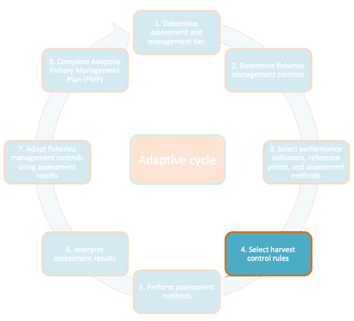

# Step 4 – Define Harvest Control Rules

*How should FMCs be adjusted according to the performance indicators of
the fishery?*

*Harvest Control Rules (HCRs)* will be used to adjust FMCs according to
where the fishery’s performance indicators fall relative to their
reference points. The HCR may specify some combination of adjustments to
the FMCs that is expected to move the performance indicator towards the
target reference point, and away from the *limit reference point***,**
therefore improving the performance of the fishery. While we provide
guidance to define HCRs, it should be noted that HCRs should be based on
realistic compliance and enforcement concerns and address community
goals for your TURF-Reserve (more guidance is provided in Step 4b).

It is important for stakeholders and managers to agree on the suite of
HCRs in a safe and neutral setting before any management decisions need
to be made. This can help improve compliance by ensuring management
responses are objective, consistent, transparent, and appropriate.
Therefore, it is important to identify all foreseeable possible
scenarios that could occur in the fishery and create corresponding HCRs
for each scenario.

## Step 4a – Define General Harvest Control Rules for All Possible Interpretations

During this step, you will define general harvest control rules (for
example, if the performance indicator is below the target reference
point, reduce the total allowable catch). In the following step, you
will add specificity to your harvest control rules (for example, if the
performance indicator is 20% below the target reference point, reduce
the total allowable catch by 20%). It is important that you define a HCR
for every foreseeable interpretation so that management responses can be
transparent and objective when the time comes to implement them.

Use *Table A4. 1*, *Table A4. 2*, and *Table A4. 3* as the framework for
defining your general HCRs. The three tables contain the performance
indicators that are associated with each tier and suggest HCRs from the
literature. For each performance indicator and assessment result, the
table lists a number of potential interpretations and corresponding
HCRs. This table provides some examples, but is by no means
comprehensive or prescriptive – it is illustrative only. During this
step, fill out Table A1. 5 using the provided HCRs that you feel are
relevant to your fishery, as well as any other foreseeable
interpretations and HCRs that you think should be put in place.

Each row also has a traffic light indicator that describes if a
management response is necessary:

-   Green indicates that either no management response is
    necessary, or management could be even less restrictive.

-   Yellow indicates that a precautionary or more restrictive
    management response should be implemented.

-   Red indicates that the fishery should be closed and a
    fishery recovery plan implemented.

## Step 4b – Add Specificity to Harvest Control Rules

During this step, you will add specificity to your HCRs (for example, if
the performance indicator is 20% below the target reference point,
reduce the total allowable catch by 20%). Be as specific as possible
when defining the magnitude to which FMCs should be adjusted given the
fishery’s performance indicator.

The magnitude that a HCR should adjust your FMC(s) will depend on:

1.  Productivity (life history) of the target species

    a.  Productivity of key target species is an output of the FLAGS
        toolkit. This information may either come from a PSA result or a
        more data-limited qualitative approach for assessing species
        productivity.

    b.  Species with low productivity will require higher, more
        restrictive levels of response when changes are necessary;
        species with higher productivity will require lower levels of
        response when changes are necessary

2.  Likelihood of compliance

3.  Social and political feasibility

4.  Enforcement capacity

5.  Level of uncertainty with data and the estimation of performance
    indicators,

    a.  The more uncertain you are, the more precautionary you may want
        to make your management

6.  Risk tolerance.

    a.  Communities with higher risk tolerance may choose to be more
        lenient when choosing HCRs, while communities with lower risk
        tolerance may choose more restrictive HCRs to be more
        precautionary in the face of changing and uncertain conditions.

You should consult any existing KAP and Social Impact Survey data when
setting HCRs. KAP data will provide an indication as to individual
attitudes towards fishery management in your community. Social Impact
Survey data will provide context as to how dependent the community is on
the fishery and how changes in fisheries management controls may affect
their livelihoods. Additionally, any existing enforcement data should be
consulted to gain a better sense for the likelihood of compliance with
any new regulations.

You should also consider the size of the NTZ and TURF when setting HCRs.
Sites with a small NTZ relative to the size of the TURF may wish the
exercise more precaution by setting more restrictive HCRs (i.e., if
indicators are interpreted to mean poor fisheries performance, make more
drastic adjustments to the FMCs). Sites with an NTZ that is not placed
explicitly in areas that protect critical habitat may also wish to
exercise more precaution with stricter HCRs. Sites with larger NTZs that
protect a significant portion of critical habitat could be more lenient
in their HCRs. Often, large and well-placed NTZs can act as a buffer
against uncertainty and variability. By completely restricting access to
a certain portion of the stock, marine reserves are analogous to an
emergency savings account. Protecting a fraction of a fish stock in
reserves reduces the risk of overfishing and the chance of stock
collapse in the long term. Displaced fishing effort and unintended
consequences resulting after implementation of a reserve can be
mitigated when effective FMCs are in place outside of the reserve. When
harvest levels are appropriately controlled a spillover of biomass from
marine reserves to the adjacent fishery may occur that can benefit
fisheries.

# Appendix 4 – Interpretations and Suggested Harvest Control Rules Tables

## Table A4.1: Indicators for Tier 1: Possible
interpretations, management implications, and suggested harvest control rules

+-------------+-------------+-------------+-------------+-------------+
| **Performan | **Assessmen | **Interpret | **Result**  | **Managemen |
| ce          | t           | ation**     |             | t           |
| Indicator** | Result**    |             |             | Response**  |
+=============+=============+=============+=============+=============+
| Fishing     | Destructive | Non-destruc | Yellow      | 1.  Ban     |
| Gear        | fishing     | tive        |             |     destruc |
|             | practices   | fishing     |             | tive        |
|             | being used  | practices   |             |     fishing |
|             |             | are no      |             |     practic |
|             |             | longer able |             | es          |
|             |             | to          |             |             |
|             |             | efficiently |             |             |
|             |             | catch fish  |             |             |
|             |             | and/or      |             |             |
|             |             | destructive |             |             |
|             |             | fishing     |             |             |
|             |             | practices   |             |             |
|             |             | have not    |             |             |
|             |             | yet been    |             |             |
|             |             | banned      |             |             |
+-------------+-------------+-------------+-------------+-------------+
|             | No          | Non-destruc | Green       | 1.  If      |
|             | destructive | tive        |             |     there   |
|             | fishing     | fishing     |             |     is no   |
|             | practices   | practices   |             |     reason  |
|             | being used  | are able to |             |     to      |
|             |             | efficiently |             |     believe |
|             |             | catch fish  |             |     precaut |
|             |             | and/or      |             | ionary      |
|             |             | destructive |             |     managem |
|             |             | fishing     |             | ent         |
|             |             | practices   |             |     is      |
|             |             | have been   |             |     necessa |
|             |             | banned      |             | ry,         |
|             |             |             |             |     make no |
|             |             |             |             |     changes |
|             |             |             |             |     to      |
|             |             |             |             |     fisheri |
|             |             |             |             | es          |
|             |             |             |             |     managem |
|             |             |             |             | ent         |
|             |             |             |             |     control |
|             |             |             |             | s           |
|             |             |             |             |     ***or** |
|             |             |             |             | *           |
|             |             |             |             |             |
|             |             |             |             | 2.  Conside |
|             |             |             |             | r           |
|             |             |             |             |     precaut |
|             |             |             |             | ionary      |
|             |             |             |             |     managem |
|             |             |             |             | ent         |
|             |             |             |             |     by      |
|             |             |             |             |     making  |
|             |             |             |             |     fisheri |
|             |             |             |             | es          |
|             |             |             |             |     managem |
|             |             |             |             | ent         |
|             |             |             |             |     control |
|             |             |             |             | s           |
|             |             |             |             |     more    |
|             |             |             |             |     restric |
|             |             |             |             | tive        |
|             |             |             |             |     (i.e.,  |
|             |             |             |             |     increas |
|             |             |             |             | e           |
|             |             |             |             |     TAC,    |
|             |             |             |             |     increas |
|             |             |             |             | e           |
|             |             |             |             |     allowab |
|             |             |             |             | le          |
|             |             |             |             |     effort, |
|             |             |             |             |     add or  |
|             |             |             |             |     modify  |
|             |             |             |             |     certain |
|             |             |             |             |     control |
|             |             |             |             | s,          |
|             |             |             |             |     etc.)   |
+-------------+-------------+-------------+-------------+-------------+
| Fishing     | Increased   | Ecosystem   | Yellow      | 1.  Make    |
| Season      | variability | likely not  |             |     fisheri |
|             | in fishing  | healthy     |             | es          |
|             | season, or  | enough to   |             |     managem |
|             | decreased   | support     |             | ent         |
|             | fishing     | historical  |             |     control |
|             | season      | fishing     |             | s           |
|             |             | season      |             |     more    |
|             |             |             |             |     restric |
|             |             |             |             | tive        |
|             |             |             |             |     (i.e.,  |
|             |             |             |             |     increas |
|             |             |             |             | e           |
|             |             |             |             |     TAC,    |
|             |             |             |             |     increas |
|             |             |             |             | e           |
|             |             |             |             |     effort  |
|             |             |             |             |     cap,    |
|             |             |             |             |     add or  |
|             |             |             |             |     modify  |
|             |             |             |             |     certain |
|             |             |             |             |     control |
|             |             |             |             | s,          |
|             |             |             |             |     expand  |
|             |             |             |             |     NTZ,    |
|             |             |             |             |     etc.)   |
+-------------+-------------+-------------+-------------+-------------+
|             | No changes  | Ecosystem   | Green       | 1.  If      |
|             | in the      | may be      |             |     there   |
|             | fishing     | healthy     |             |     is no   |
|             | season      | enough to   |             |     reason  |
|             |             | support     |             |     to      |
|             |             | historical  |             |     believe |
|             |             | fishing     |             |     precaut |
|             |             | season      |             | ionary      |
|             |             |             |             |     managem |
|             |             |             |             | ent         |
|             |             |             |             |     is      |
|             |             |             |             |     necessa |
|             |             |             |             | ry,         |
|             |             |             |             |     make no |
|             |             |             |             |     changes |
|             |             |             |             |     to      |
|             |             |             |             |     fisheri |
|             |             |             |             | es          |
|             |             |             |             |     managem |
|             |             |             |             | ent         |
|             |             |             |             |     control |
|             |             |             |             | s           |
|             |             |             |             |     ***or** |
|             |             |             |             | *           |
|             |             |             |             |             |
|             |             |             |             | 2.  Conside |
|             |             |             |             | r           |
|             |             |             |             |     precaut |
|             |             |             |             | ionary      |
|             |             |             |             |     managem |
|             |             |             |             | ent         |
|             |             |             |             |     by      |
|             |             |             |             |     making  |
|             |             |             |             |     fisheri |
|             |             |             |             | es          |
|             |             |             |             |     managem |
|             |             |             |             | ent         |
|             |             |             |             |     control |
|             |             |             |             | s           |
|             |             |             |             |     more    |
|             |             |             |             |     restric |
|             |             |             |             | tive        |
|             |             |             |             |     (i.e.,  |
|             |             |             |             |     increas |
|             |             |             |             | e           |
|             |             |             |             |     TAC,    |
|             |             |             |             |     increas |
|             |             |             |             | e           |
|             |             |             |             |     allowab |
|             |             |             |             | le          |
|             |             |             |             |     effort, |
|             |             |             |             |     add or  |
|             |             |             |             |     modify  |
|             |             |             |             |     certain |
|             |             |             |             |     control |
|             |             |             |             | s,          |
|             |             |             |             |     etc.)   |
+-------------+-------------+-------------+-------------+-------------+
| Target      | Change in   | Ecosystem   | Yellow      | 1.  Make    |
| Species     | composition | likely not  |             |     fisheri |
| Composition | of caught   | healthy     |             | es          |
|             | species     | enough to   |             |     managem |
|             | (fewer      | support     |             | ent         |
|             | species,    | historical  |             |     control |
|             | more        | target      |             | s           |
|             | pelagics)   | species     |             |     more    |
|             |             |             |             |     restric |
|             |             |             |             | tive        |
|             |             |             |             |     (i.e.,  |
|             |             |             |             |     increas |
|             |             |             |             | e           |
|             |             |             |             |     TAC,    |
|             |             |             |             |     increas |
|             |             |             |             | e           |
|             |             |             |             |     effort  |
|             |             |             |             |     cap,    |
|             |             |             |             |     add or  |
|             |             |             |             |     modify  |
|             |             |             |             |     certain |
|             |             |             |             |     control |
|             |             |             |             | s,          |
|             |             |             |             |     expand  |
|             |             |             |             |     NTZ,    |
|             |             |             |             |     etc.)   |
+-------------+-------------+-------------+-------------+-------------+
|             | No change   | Ecosystem   | Green       | 1.  If      |
|             | in          | may be      |             |     there   |
|             | composition | healthy     |             |     is no   |
|             | of caught   | enough to   |             |     reason  |
|             | species     | support     |             |     to      |
|             |             | historical  |             |     believe |
|             |             | target      |             |     precaut |
|             |             | species     |             | ionary      |
|             |             |             |             |     managem |
|             |             |             |             | ent         |
|             |             |             |             |     is      |
|             |             |             |             |     necessa |
|             |             |             |             | ry,         |
|             |             |             |             |     make no |
|             |             |             |             |     changes |
|             |             |             |             |     to      |
|             |             |             |             |     fisheri |
|             |             |             |             | es          |
|             |             |             |             |     managem |
|             |             |             |             | ent         |
|             |             |             |             |     control |
|             |             |             |             | s           |
|             |             |             |             |     ***or** |
|             |             |             |             | *           |
|             |             |             |             |             |
|             |             |             |             | 2.  Conside |
|             |             |             |             | r           |
|             |             |             |             |     precaut |
|             |             |             |             | ionary      |
|             |             |             |             |     managem |
|             |             |             |             | ent         |
|             |             |             |             |     by      |
|             |             |             |             |     making  |
|             |             |             |             |     fisheri |
|             |             |             |             | es          |
|             |             |             |             |     managem |
|             |             |             |             | ent         |
|             |             |             |             |     control |
|             |             |             |             | s           |
|             |             |             |             |     more    |
|             |             |             |             |     restric |
|             |             |             |             | tive        |
|             |             |             |             |     (i.e.,  |
|             |             |             |             |     increas |
|             |             |             |             | e           |
|             |             |             |             |     TAC,    |
|             |             |             |             |     increas |
|             |             |             |             | e           |
|             |             |             |             |     allowab |
|             |             |             |             | le          |
|             |             |             |             |     effort, |
|             |             |             |             |     add or  |
|             |             |             |             |     modify  |
|             |             |             |             |     certain |
|             |             |             |             |     control |
|             |             |             |             | s,          |
|             |             |             |             |     etc.)   |
+-------------+-------------+-------------+-------------+-------------+
| Species     | Target      | Target      | Yellow      | 1.  Make    |
| Vulnerabili | species     | species     |             |     fisheri |
| ty          | have high   | have high   |             | es          |
|             | vulnerabili | susceptibil |             |     managem |
|             | ty          | ity         |             | ent         |
|             |             | and/or low  |             |     control |
|             |             | productivit |             | s           |
|             |             | y           |             |     more    |
|             |             |             |             |     restric |
|             |             |             |             | tive        |
|             |             |             |             |     (i.e.,  |
|             |             |             |             |     increas |
|             |             |             |             | e           |
|             |             |             |             |     TAC,    |
|             |             |             |             |     increas |
|             |             |             |             | e           |
|             |             |             |             |     effort  |
|             |             |             |             |     cap,    |
|             |             |             |             |     add or  |
|             |             |             |             |     modify  |
|             |             |             |             |     certain |
|             |             |             |             |     control |
|             |             |             |             | s,          |
|             |             |             |             |     expand  |
|             |             |             |             |     NTZ,    |
|             |             |             |             |     etc.)   |
+-------------+-------------+-------------+-------------+-------------+
|             | Target      | Target      | Yellow      | 1.  Make    |
|             | species     | species     |             |     fisheri |
|             | have medium | have medium |             | es          |
|             | vulnerabili | susceptibil |             |     managem |
|             | ty          | ity         |             | ent         |
|             |             | medium      |             |     control |
|             |             | productivit |             | s           |
|             |             | y           |             |     more    |
|             |             |             |             |     restric |
|             |             |             |             | tive        |
|             |             |             |             |     (i.e.,  |
|             |             |             |             |     increas |
|             |             |             |             | e           |
|             |             |             |             |     TAC,    |
|             |             |             |             |     increas |
|             |             |             |             | e           |
|             |             |             |             |     effort  |
|             |             |             |             |     cap,    |
|             |             |             |             |     add or  |
|             |             |             |             |     modify  |
|             |             |             |             |     certain |
|             |             |             |             |     control |
|             |             |             |             | s,          |
|             |             |             |             |     expand  |
|             |             |             |             |     NTZ,    |
|             |             |             |             |     etc.)   |
+-------------+-------------+-------------+-------------+-------------+
|             | Target      | Target      | Green       | 1.  If      |
|             | species     | species     |             |     there   |
|             | have low    | have low    |             |     is no   |
|             | vulnerabili | susceptibil |             |     reason  |
|             | ty          | ity         |             |     to      |
|             |             | and/or high |             |     believe |
|             |             | productivit |             |     precaut |
|             |             | y           |             | ionary      |
|             |             |             |             |     managem |
|             |             |             |             | ent         |
|             |             |             |             |     is      |
|             |             |             |             |     necessa |
|             |             |             |             | ry,         |
|             |             |             |             |     make no |
|             |             |             |             |     changes |
|             |             |             |             |     to      |
|             |             |             |             |     fisheri |
|             |             |             |             | es          |
|             |             |             |             |     managem |
|             |             |             |             | ent         |
|             |             |             |             |     control |
|             |             |             |             | s           |
|             |             |             |             |     ***or** |
|             |             |             |             | *           |
|             |             |             |             |             |
|             |             |             |             | 2.  Conside |
|             |             |             |             | r           |
|             |             |             |             |     precaut |
|             |             |             |             | ionary      |
|             |             |             |             |     managem |
|             |             |             |             | ent         |
|             |             |             |             |     by      |
|             |             |             |             |     making  |
|             |             |             |             |     fisheri |
|             |             |             |             | es          |
|             |             |             |             |     managem |
|             |             |             |             | ent         |
|             |             |             |             |     control |
|             |             |             |             | s           |
|             |             |             |             |     more    |
|             |             |             |             |     restric |
|             |             |             |             | tive        |
|             |             |             |             |     (i.e.,  |
|             |             |             |             |     increas |
|             |             |             |             | e           |
|             |             |             |             |     TAC,    |
|             |             |             |             |     increas |
|             |             |             |             | e           |
|             |             |             |             |     allowab |
|             |             |             |             | le          |
|             |             |             |             |     effort, |
|             |             |             |             |     add or  |
|             |             |             |             |     modify  |
|             |             |             |             |     certain |
|             |             |             |             |     control |
|             |             |             |             | s,          |
|             |             |             |             |     etc.)   |
+-------------+-------------+-------------+-------------+-------------+
| Fished:unfi | Indicator   | Fishing     | Green       | 1.  Make no |
| shed        | &gt;=       | pressure    |             |     changes |
| density     | Target      | appropriate |             |     to      |
| ratio (for  |             | for         |             |     fisheri |
| key target  |             | maintaining |             | es          |
| species)    |             | or          |             |     managem |
|             |             | improving   |             | ent         |
|             |             | the health  |             |     control |
|             |             | of the      |             | s           |
|             |             | ecosystem   |             |     ***or** |
|             |             |             |             | *           |
|             |             |             |             |             |
|             |             |             |             | 2.  If      |
|             |             |             |             |     trends  |
|             |             |             |             |     have    |
|             |             |             |             |     persist |
|             |             |             |             | ed          |
|             |             |             |             |     for     |
|             |             |             |             |     more    |
|             |             |             |             |     than    |
|             |             |             |             |     one     |
|             |             |             |             |     year    |
|             |             |             |             |     and     |
|             |             |             |             |     there   |
|             |             |             |             |     is no   |
|             |             |             |             |     reason  |
|             |             |             |             |     to      |
|             |             |             |             |     believe |
|             |             |             |             |     precaut |
|             |             |             |             | ionary      |
|             |             |             |             |     managem |
|             |             |             |             | ent         |
|             |             |             |             |     is      |
|             |             |             |             |     necessa |
|             |             |             |             | ry,         |
|             |             |             |             |     make    |
|             |             |             |             |     fisheri |
|             |             |             |             | es          |
|             |             |             |             |     managem |
|             |             |             |             | ent         |
|             |             |             |             |     control |
|             |             |             |             | s           |
|             |             |             |             |     less    |
|             |             |             |             |     restric |
|             |             |             |             | tive        |
|             |             |             |             |     (i.e.,  |
|             |             |             |             |     increas |
|             |             |             |             | e           |
|             |             |             |             |     TAC,    |
|             |             |             |             |     increas |
|             |             |             |             | e           |
|             |             |             |             |     effort  |
|             |             |             |             |     cap,    |
|             |             |             |             |     etc.)   |
+-------------+-------------+-------------+-------------+-------------+
|             |             | Unfished    | Yellow      | 1.  Conside |
|             |             | area has a  |             | r           |
|             |             | low density |             |     improve |
|             |             | and does    |             | d           |
|             |             | not         |             |     enforce |
|             |             | represent a |             | ment        |
|             |             | healthy     |             |     of NTZ  |
|             |             | virgin area |             |     ***and* |
|             |             | (significan |             | **          |
|             |             | t           |             |             |
|             |             | illegal     |             | 2.  Conside |
|             |             | fishing is  |             | r           |
|             |             | occurring   |             |     targete |
|             |             | within the  |             | d           |
|             |             | NTZ)        |             |     social  |
|             |             |             |             |     marketi |
|             |             |             |             | ng          |
|             |             |             |             |     to      |
|             |             |             |             |     improve |
|             |             |             |             |     complia |
|             |             |             |             | nce         |
|             |             |             |             |     with    |
|             |             |             |             |     NTZ     |
|             |             |             |             |     ***and* |
|             |             |             |             | **          |
|             |             |             |             |             |
|             |             |             |             | 3.  Conside |
|             |             |             |             | r           |
|             |             |             |             |     precaut |
|             |             |             |             | ionary      |
|             |             |             |             |     managem |
|             |             |             |             | ent         |
|             |             |             |             |     by      |
|             |             |             |             |     making  |
|             |             |             |             |     fisheri |
|             |             |             |             | es          |
|             |             |             |             |     managem |
|             |             |             |             | ent         |
|             |             |             |             |     control |
|             |             |             |             | s           |
|             |             |             |             |     more    |
|             |             |             |             |     restric |
|             |             |             |             | tive        |
|             |             |             |             |     (i.e.,  |
|             |             |             |             |     decreas |
|             |             |             |             | e           |
|             |             |             |             |     TAC,    |
|             |             |             |             |     decreas |
|             |             |             |             | e           |
|             |             |             |             |     allowab |
|             |             |             |             | le          |
|             |             |             |             |     effort, |
|             |             |             |             |     add or  |
|             |             |             |             |     modify  |
|             |             |             |             |     certain |
|             |             |             |             |     control |
|             |             |             |             | s,          |
|             |             |             |             |     etc.)   |
+-------------+-------------+-------------+-------------+-------------+
|             |             | Unfished    | Yellow      | 1.  Conside |
|             |             | area has a  |             | r           |
|             |             | low density |             |     precaut |
|             |             | and does    |             | ionary      |
|             |             | not         |             |     managem |
|             |             | represent a |             | ent         |
|             |             | healthy     |             |     by      |
|             |             | virgin area |             |     making  |
|             |             | (NTZ is new |             |     fisheri |
|             |             | and has not |             | es          |
|             |             | yet led to  |             |     managem |
|             |             | substantial |             | ent         |
|             |             | improvement |             |     control |
|             |             | s           |             | s           |
|             |             | in          |             |     more    |
|             |             | ecosystem   |             |     restric |
|             |             | health)     |             | tive        |
|             |             |             |             |     (i.e.,  |
|             |             |             |             |     decreas |
|             |             |             |             | e           |
|             |             |             |             |     TAC,    |
|             |             |             |             |     decreas |
|             |             |             |             | e           |
|             |             |             |             |     allowab |
|             |             |             |             | le          |
|             |             |             |             |     effort, |
|             |             |             |             |     add or  |
|             |             |             |             |     modify  |
|             |             |             |             |     certain |
|             |             |             |             |     control |
|             |             |             |             | s,          |
|             |             |             |             |     etc.)   |
+-------------+-------------+-------------+-------------+-------------+
|             |             | Unfished    | Yellow      | 1.  Conside |
|             |             | area has a  |             | r           |
|             |             | low density |             |     expansi |
|             |             | and does    |             | on          |
|             |             | not         |             |     or      |
|             |             | represent a |             |     relocat |
|             |             | healthy     |             | ion         |
|             |             | virgin area |             |     of NTZ  |
|             |             | (NTZ is     |             |     ***and* |
|             |             | small with  |             | **          |
|             |             | large       |             |             |
|             |             | amounts of  |             | 2.  Conside |
|             |             | species     |             | r           |
|             |             | movement    |             |     precaut |
|             |             | between     |             | ionary      |
|             |             | fished and  |             |     managem |
|             |             | unfished    |             | ent         |
|             |             | areas)      |             |     by      |
|             |             |             |             |     making  |
|             |             |             |             |     fisheri |
|             |             |             |             | es          |
|             |             |             |             |     managem |
|             |             |             |             | ent         |
|             |             |             |             |     control |
|             |             |             |             | s           |
|             |             |             |             |     more    |
|             |             |             |             |     restric |
|             |             |             |             | tive        |
|             |             |             |             |     (i.e.,  |
|             |             |             |             |     decreas |
|             |             |             |             | e           |
|             |             |             |             |     TAC,    |
|             |             |             |             |     decreas |
|             |             |             |             | e           |
|             |             |             |             |     allowab |
|             |             |             |             | le          |
|             |             |             |             |     effort, |
|             |             |             |             |     add or  |
|             |             |             |             |     modify  |
|             |             |             |             |     certain |
|             |             |             |             |     control |
|             |             |             |             | s,          |
|             |             |             |             |     etc.)   |
+-------------+-------------+-------------+-------------+-------------+
|             | Target &gt; | High        | Yellow      | 1.  Make    |
|             | Indicator   | fishing     |             |     fisheri |
|             | &gt; Limit  | pressure    |             | es          |
|             |             | putting     |             |     managem |
|             |             | ecosystem   |             | ent         |
|             |             | at risk for |             |     control |
|             |             | impending   |             | s           |
|             |             | state       |             |     more    |
|             |             | change      |             |     restric |
|             |             |             |             | tive        |
|             |             |             |             |     (i.e.,  |
|             |             |             |             |     decreas |
|             |             |             |             | e           |
|             |             |             |             |     TAC,    |
|             |             |             |             |     decreas |
|             |             |             |             | e           |
|             |             |             |             |     effort  |
|             |             |             |             |     cap,    |
|             |             |             |             |     add or  |
|             |             |             |             |     modify  |
|             |             |             |             |     certain |
|             |             |             |             |     control |
|             |             |             |             | s,          |
|             |             |             |             |     expand  |
|             |             |             |             |     NTZ,    |
|             |             |             |             |     etc.)   |
+-------------+-------------+-------------+-------------+-------------+
|             |             | Environment | Yellow      | 1.  Conside |
|             |             | al          |             | r           |
|             |             | stochastici |             |     precaut |
|             |             | ty          |             | ionary      |
|             |             | putting     |             |     managem |
|             |             | ecosystem   |             | ent         |
|             |             | at risk for |             |     by      |
|             |             | impending   |             |     making  |
|             |             | state       |             |     fisheri |
|             |             | change      |             | es          |
|             |             |             |             |     managem |
|             |             |             |             | ent         |
|             |             |             |             |     control |
|             |             |             |             | s           |
|             |             |             |             |     more    |
|             |             |             |             |     restric |
|             |             |             |             | tive        |
|             |             |             |             |     (i.e.,  |
|             |             |             |             |     decreas |
|             |             |             |             | e           |
|             |             |             |             |     TAC,    |
|             |             |             |             |     decreas |
|             |             |             |             | e           |
|             |             |             |             |     allowab |
|             |             |             |             | le          |
|             |             |             |             |     effort, |
|             |             |             |             |     add or  |
|             |             |             |             |     modify  |
|             |             |             |             |     certain |
|             |             |             |             |     control |
|             |             |             |             | s,          |
|             |             |             |             |     etc.)   |
+-------------+-------------+-------------+-------------+-------------+
|             |             | Unfished    | Yellow      | 1.  Conside |
|             |             | area has a  |             | r           |
|             |             | low density |             |     improve |
|             |             | and does    |             | d           |
|             |             | not         |             |     enforce |
|             |             | represent a |             | ment        |
|             |             | healthy     |             |     of NTZ  |
|             |             | virgin area |             |     ***and* |
|             |             | (significan |             | **          |
|             |             | t           |             |             |
|             |             | illegal     |             | 2.  Conside |
|             |             | fishing is  |             | r           |
|             |             | occurring   |             |     targete |
|             |             | within the  |             | d           |
|             |             | NTZ)        |             |     social  |
|             |             |             |             |     marketi |
|             |             |             |             | ng          |
|             |             |             |             |     to      |
|             |             |             |             |     improve |
|             |             |             |             |     complia |
|             |             |             |             | nce         |
|             |             |             |             |     with    |
|             |             |             |             |     NTZ     |
|             |             |             |             |     ***and* |
|             |             |             |             | **          |
|             |             |             |             |             |
|             |             |             |             | 3.  Conside |
|             |             |             |             | r           |
|             |             |             |             |     precaut |
|             |             |             |             | ionary      |
|             |             |             |             |     managem |
|             |             |             |             | ent         |
|             |             |             |             |     by      |
|             |             |             |             |     making  |
|             |             |             |             |     fisheri |
|             |             |             |             | es          |
|             |             |             |             |     managem |
|             |             |             |             | ent         |
|             |             |             |             |     control |
|             |             |             |             | s           |
|             |             |             |             |     more    |
|             |             |             |             |     restric |
|             |             |             |             | tive        |
|             |             |             |             |     (i.e.,  |
|             |             |             |             |     decreas |
|             |             |             |             | e           |
|             |             |             |             |     TAC,    |
|             |             |             |             |     decreas |
|             |             |             |             | e           |
|             |             |             |             |     allowab |
|             |             |             |             | le          |
|             |             |             |             |     effort, |
|             |             |             |             |     add or  |
|             |             |             |             |     modify  |
|             |             |             |             |     certain |
|             |             |             |             |     control |
|             |             |             |             | s,          |
|             |             |             |             |     etc.)   |
+-------------+-------------+-------------+-------------+-------------+
|             |             | Unfished    | Yellow      | 1.  Conside |
|             |             | area has a  |             | r           |
|             |             | low density |             |     precaut |
|             |             | and does    |             | ionary      |
|             |             | not         |             |     managem |
|             |             | represent a |             | ent         |
|             |             | healthy     |             |     by      |
|             |             | virgin area |             |     making  |
|             |             | (NTZ is new |             |     fisheri |
|             |             | and has not |             | es          |
|             |             | yet led to  |             |     managem |
|             |             | substantial |             | ent         |
|             |             | improvement |             |     control |
|             |             | s           |             | s           |
|             |             | in          |             |     more    |
|             |             | ecosystem   |             |     restric |
|             |             | health)     |             | tive        |
|             |             |             |             |     (i.e.,  |
|             |             |             |             |     decreas |
|             |             |             |             | e           |
|             |             |             |             |     TAC,    |
|             |             |             |             |     decreas |
|             |             |             |             | e           |
|             |             |             |             |     allowab |
|             |             |             |             | le          |
|             |             |             |             |     effort, |
|             |             |             |             |     add or  |
|             |             |             |             |     modify  |
|             |             |             |             |     certain |
|             |             |             |             |     control |
|             |             |             |             | s,          |
|             |             |             |             |     etc.)   |
+-------------+-------------+-------------+-------------+-------------+
|             |             | Unfished    | Yellow      | 1.  Conside |
|             |             | area has a  |             | r           |
|             |             | low density |             |     expansi |
|             |             | and does    |             | on          |
|             |             | not         |             |     or      |
|             |             | represent a |             |     relocat |
|             |             | healthy     |             | ion         |
|             |             | virgin area |             |     of NTZ  |
|             |             | (NTZ is     |             |     ***and* |
|             |             | small with  |             | **          |
|             |             | large       |             |             |
|             |             | amounts of  |             | 2.  Conside |
|             |             | species     |             | r           |
|             |             | movement    |             |     precaut |
|             |             | between     |             | ionary      |
|             |             | fished and  |             |     managem |
|             |             | unfished    |             | ent         |
|             |             | areas)      |             |     by      |
|             |             |             |             |     making  |
|             |             |             |             |     fisheri |
|             |             |             |             | es          |
|             |             |             |             |     managem |
|             |             |             |             | ent         |
|             |             |             |             |     control |
|             |             |             |             | s           |
|             |             |             |             |     more    |
|             |             |             |             |     restric |
|             |             |             |             | tive        |
|             |             |             |             |     (i.e.,  |
|             |             |             |             |     decreas |
|             |             |             |             | e           |
|             |             |             |             |     TAC,    |
|             |             |             |             |     decreas |
|             |             |             |             | e           |
|             |             |             |             |     allowab |
|             |             |             |             | le          |
|             |             |             |             |     effort, |
|             |             |             |             |     add or  |
|             |             |             |             |     modify  |
|             |             |             |             |     certain |
|             |             |             |             |     control |
|             |             |             |             | s,          |
|             |             |             |             |     etc.)   |
+-------------+-------------+-------------+-------------+-------------+
|             | Limit &gt;= | High        | Red         | 1.  Close   |
|             | Indicator   | fishing     |             |     fishery |
|             |             | pressure    |             |     ***and* |
|             |             | has caused  |             | **          |
|             |             | an          |             |             |
|             |             | ecosystem   |             | 2.  Impleme |
|             |             | state       |             | nt          |
|             |             | change;     |             |     fishery |
|             |             | fishery in  |             |     recover |
|             |             | danger of   |             | y           |
|             |             | collapse    |             |     plan    |
+-------------+-------------+-------------+-------------+-------------+
|             |             | Extreme     | Red         | 1.  Close   |
|             |             | environment |             |     fishery |
|             |             | al          |             |     ***and* |
|             |             | stochastici |             | **          |
|             |             | ty          |             |             |
|             |             | has caused  |             | 2.  Impleme |
|             |             | an          |             | nt          |
|             |             | ecosystem   |             |     fishery |
|             |             | state       |             |     recover |
|             |             | change;     |             | y           |
|             |             | fishery in  |             |     plan    |
|             |             | danger of   |             |             |
|             |             | collapse    |             |             |
+-------------+-------------+-------------+-------------+-------------+
| Coral Reef  | Unfished    | Fishing     | Green       | 1.  Make no |
| Thresholds  | biomass     | pressure    |             |     changes |
| (aggregated | Indicator   | appropriate |             |     to      |
| across      | &gt;=       | for         |             |     fisheri |
| species)    | Target      | maintaining |             | es          |
|             |             | or          |             |     managem |
|             | ***And***   | improving   |             | ent         |
|             |             | the health  |             |     control |
|             | fished:unfi | of the      |             | s           |
|             | shed        | ecosystem   |             |     ***or** |
|             | biomass     |             |             | *           |
|             | ratio &gt;= |             |             |             |
|             | Target      |             |             | <!-- -->    |
|             |             |             |             |             |
|             |             |             |             | 1.  If      |
|             |             |             |             |     trends  |
|             |             |             |             |     have    |
|             |             |             |             |     persist |
|             |             |             |             | ed          |
|             |             |             |             |     for     |
|             |             |             |             |     more    |
|             |             |             |             |     than    |
|             |             |             |             |     one     |
|             |             |             |             |     year    |
|             |             |             |             |     and     |
|             |             |             |             |     there   |
|             |             |             |             |     is no   |
|             |             |             |             |     reason  |
|             |             |             |             |     to      |
|             |             |             |             |     believe |
|             |             |             |             |     precaut |
|             |             |             |             | ionary      |
|             |             |             |             |     managem |
|             |             |             |             | ent         |
|             |             |             |             |     is      |
|             |             |             |             |     necessa |
|             |             |             |             | ry,         |
|             |             |             |             |     make    |
|             |             |             |             |     fisheri |
|             |             |             |             | es          |
|             |             |             |             |     managem |
|             |             |             |             | ent         |
|             |             |             |             |     control |
|             |             |             |             | s           |
|             |             |             |             |     less    |
|             |             |             |             |     restric |
|             |             |             |             | tive        |
|             |             |             |             |     (i.e.,  |
|             |             |             |             |     increas |
|             |             |             |             | e           |
|             |             |             |             |     TAC,    |
|             |             |             |             |     increas |
|             |             |             |             | e           |
|             |             |             |             |     effort  |
|             |             |             |             |     cap,    |
|             |             |             |             |     etc.)   |
+-------------+-------------+-------------+-------------+-------------+
|             |             | Unfished    | Yellow      | 1.  Conside |
|             |             | area has a  |             | r           |
|             |             | low biomass |             |     improve |
|             |             | and does    |             | d           |
|             |             | not         |             |     enforce |
|             |             | represent a |             | ment        |
|             |             | healthy     |             |     of NTZ  |
|             |             | virgin area |             |     ***and* |
|             |             | (significan |             | **          |
|             |             | t           |             |             |
|             |             | illegal     |             | 2.  Conside |
|             |             | fishing is  |             | r           |
|             |             | occurring   |             |     targete |
|             |             | within the  |             | d           |
|             |             | NTZ)        |             |     social  |
|             |             |             |             |     marketi |
|             |             |             |             | ng          |
|             |             |             |             |     to      |
|             |             |             |             |     improve |
|             |             |             |             |     complia |
|             |             |             |             | nce         |
|             |             |             |             |     with    |
|             |             |             |             |     NTZ     |
|             |             |             |             |     ***and* |
|             |             |             |             | **          |
|             |             |             |             |             |
|             |             |             |             | 3.  Conside |
|             |             |             |             | r           |
|             |             |             |             |     precaut |
|             |             |             |             | ionary      |
|             |             |             |             |     managem |
|             |             |             |             | ent         |
|             |             |             |             |     by      |
|             |             |             |             |     making  |
|             |             |             |             |     fisheri |
|             |             |             |             | es          |
|             |             |             |             |     managem |
|             |             |             |             | ent         |
|             |             |             |             |     control |
|             |             |             |             | s           |
|             |             |             |             |     more    |
|             |             |             |             |     restric |
|             |             |             |             | tive        |
|             |             |             |             |     (i.e.,  |
|             |             |             |             |     decreas |
|             |             |             |             | e           |
|             |             |             |             |     TAC,    |
|             |             |             |             |     decreas |
|             |             |             |             | e           |
|             |             |             |             |     allowab |
|             |             |             |             | le          |
|             |             |             |             |     effort, |
|             |             |             |             |     add or  |
|             |             |             |             |     modify  |
|             |             |             |             |     certain |
|             |             |             |             |     control |
|             |             |             |             | s,          |
|             |             |             |             |     etc.)   |
+-------------+-------------+-------------+-------------+-------------+
|             |             | Unfished    | Yellow      | 1.  Conside |
|             |             | area has a  |             | r           |
|             |             | low biomass |             |     precaut |
|             |             | and does    |             | ionary      |
|             |             | not         |             |     managem |
|             |             | represent a |             | ent         |
|             |             | healthy     |             |     by      |
|             |             | virgin area |             |     making  |
|             |             | (NTZ is new |             |     fisheri |
|             |             | and has not |             | es          |
|             |             | yet led to  |             |     managem |
|             |             | substantial |             | ent         |
|             |             | improvement |             |     control |
|             |             | s           |             | s           |
|             |             | in          |             |     more    |
|             |             | ecosystem   |             |     restric |
|             |             | health)     |             | tive        |
|             |             |             |             |     (i.e.,  |
|             |             |             |             |     decreas |
|             |             |             |             | e           |
|             |             |             |             |     TAC,    |
|             |             |             |             |     decreas |
|             |             |             |             | e           |
|             |             |             |             |     allowab |
|             |             |             |             | le          |
|             |             |             |             |     effort, |
|             |             |             |             |     add or  |
|             |             |             |             |     modify  |
|             |             |             |             |     certain |
|             |             |             |             |     control |
|             |             |             |             | s,          |
|             |             |             |             |     etc.)   |
+-------------+-------------+-------------+-------------+-------------+
|             |             | Unfished    | Yellow      | 1.  Conside |
|             |             | area has a  |             | r           |
|             |             | low biomass |             |     expansi |
|             |             | and does    |             | on          |
|             |             | not         |             |     or      |
|             |             | represent a |             |     relocat |
|             |             | healthy     |             | ion         |
|             |             | virgin area |             |     of NTZ  |
|             |             | (NTZ is     |             |     ***and* |
|             |             | small with  |             | **          |
|             |             | large       |             |             |
|             |             | amounts of  |             | <!-- -->    |
|             |             | species     |             |             |
|             |             | movement    |             | 1.  Conside |
|             |             | between     |             | r           |
|             |             | fished and  |             |     precaut |
|             |             | unfished    |             | ionary      |
|             |             | areas)      |             |     managem |
|             |             |             |             | ent         |
|             |             |             |             |     by      |
|             |             |             |             |     making  |
|             |             |             |             |     fisheri |
|             |             |             |             | es          |
|             |             |             |             |     managem |
|             |             |             |             | ent         |
|             |             |             |             |     control |
|             |             |             |             | s           |
|             |             |             |             |     more    |
|             |             |             |             |     restric |
|             |             |             |             | tive        |
|             |             |             |             |     (i.e.,  |
|             |             |             |             |     decreas |
|             |             |             |             | e           |
|             |             |             |             |     TAC,    |
|             |             |             |             |     decreas |
|             |             |             |             | e           |
|             |             |             |             |     allowab |
|             |             |             |             | le          |
|             |             |             |             |     effort, |
|             |             |             |             |     add or  |
|             |             |             |             |     modify  |
|             |             |             |             |     certain |
|             |             |             |             |     control |
|             |             |             |             | s,          |
|             |             |             |             |     etc.)   |
+-------------+-------------+-------------+-------------+-------------+
|             |             | Unfished    | Yellow      | 1.  Conside |
|             |             | area does   |             | r           |
|             |             | not have    |             |     expansi |
|             |             | comparable  |             | on          |
|             |             | habitat to  |             |     or      |
|             |             | fished area |             |     relocat |
|             |             | (unfished   |             | ion         |
|             |             | area        |             |     of NTZ  |
|             |             | habitat not |             |     ***and* |
|             |             | as healthy  |             | **          |
|             |             | as fished   |             |             |
|             |             | area)       |             | <!-- -->    |
|             |             |             |             |             |
|             |             |             |             | 1.  Conside |
|             |             |             |             | r           |
|             |             |             |             |     precaut |
|             |             |             |             | ionary      |
|             |             |             |             |     managem |
|             |             |             |             | ent         |
|             |             |             |             |     by      |
|             |             |             |             |     making  |
|             |             |             |             |     fisheri |
|             |             |             |             | es          |
|             |             |             |             |     managem |
|             |             |             |             | ent         |
|             |             |             |             |     control |
|             |             |             |             | s           |
|             |             |             |             |     more    |
|             |             |             |             |     restric |
|             |             |             |             | tive        |
|             |             |             |             |     (i.e.,  |
|             |             |             |             |     decreas |
|             |             |             |             | e           |
|             |             |             |             |     TAC,    |
|             |             |             |             |     decreas |
|             |             |             |             | e           |
|             |             |             |             |     allowab |
|             |             |             |             | le          |
|             |             |             |             |     effort, |
|             |             |             |             |     add or  |
|             |             |             |             |     modify  |
|             |             |             |             |     certain |
|             |             |             |             |     control |
|             |             |             |             | s,          |
|             |             |             |             |     etc.)   |
+-------------+-------------+-------------+-------------+-------------+
|             | Limit &lt;= | High        | Yellow      | 1.  Make    |
|             | Unfished    | fishing     |             |     fisheri |
|             | biomass     | pressure    |             | es          |
|             | Indicator   | putting     |             |     managem |
|             | &lt;=       | ecosystem   |             | ent         |
|             | Target      | at risk for |             |     control |
|             |             | impending   |             | s           |
|             | ***And***   | state       |             |     more    |
|             |             | change      |             |     restric |
|             | Limit &lt;= |             |             | tive        |
|             | fished:unfi |             |             |     (i.e.,  |
|             | shed        |             |             |     decreas |
|             | biomass     |             |             | e           |
|             | ratio &lt;= |             |             |     TAC,    |
|             | Target      |             |             |     decreas |
|             |             |             |             | e           |
|             |             |             |             |     effort  |
|             |             |             |             |     cap,    |
|             |             |             |             |     add or  |
|             |             |             |             |     modify  |
|             |             |             |             |     certain |
|             |             |             |             |     control |
|             |             |             |             | s,          |
|             |             |             |             |     expand  |
|             |             |             |             |     NTZ,    |
|             |             |             |             |     etc.)   |
+-------------+-------------+-------------+-------------+-------------+
|             |             | Environment | Yellow      | 1.  Conside |
|             |             | al          |             | r           |
|             |             | stochastici |             |     precaut |
|             |             | ty          |             | ionary      |
|             |             | putting     |             |     managem |
|             |             | ecosystem   |             | ent         |
|             |             | at risk for |             |     by      |
|             |             | impending   |             |     making  |
|             |             | state       |             |     fisheri |
|             |             | change      |             | es          |
|             |             |             |             |     managem |
|             |             |             |             | ent         |
|             |             |             |             |     control |
|             |             |             |             | s           |
|             |             |             |             |     more    |
|             |             |             |             |     restric |
|             |             |             |             | tive        |
|             |             |             |             |     (i.e.,  |
|             |             |             |             |     decreas |
|             |             |             |             | e           |
|             |             |             |             |     TAC,    |
|             |             |             |             |     decreas |
|             |             |             |             | e           |
|             |             |             |             |     allowab |
|             |             |             |             | le          |
|             |             |             |             |     effort, |
|             |             |             |             |     add or  |
|             |             |             |             |     modify  |
|             |             |             |             |     certain |
|             |             |             |             |     control |
|             |             |             |             | s,          |
|             |             |             |             |     etc.)   |
+-------------+-------------+-------------+-------------+-------------+
|             |             | Unfished    | Yellow      | 1.  Conside |
|             |             | area has a  |             | r           |
|             |             | low density |             |     improve |
|             |             | and does    |             | d           |
|             |             | not         |             |     enforce |
|             |             | represent a |             | ment        |
|             |             | healthy     |             |     of NTZ  |
|             |             | virgin area |             |     ***and* |
|             |             | (significan |             | **          |
|             |             | t           |             |             |
|             |             | illegal     |             | 2.  Conside |
|             |             | fishing is  |             | r           |
|             |             | occurring   |             |     targete |
|             |             | within the  |             | d           |
|             |             | NTZ)        |             |     social  |
|             |             |             |             |     marketi |
|             |             |             |             | ng          |
|             |             |             |             |     to      |
|             |             |             |             |     improve |
|             |             |             |             |     complia |
|             |             |             |             | nce         |
|             |             |             |             |     with    |
|             |             |             |             |     NTZ     |
|             |             |             |             |     ***and* |
|             |             |             |             | **          |
|             |             |             |             |             |
|             |             |             |             | 3.  Conside |
|             |             |             |             | r           |
|             |             |             |             |     precaut |
|             |             |             |             | ionary      |
|             |             |             |             |     managem |
|             |             |             |             | ent         |
|             |             |             |             |     by      |
|             |             |             |             |     making  |
|             |             |             |             |     fisheri |
|             |             |             |             | es          |
|             |             |             |             |     managem |
|             |             |             |             | ent         |
|             |             |             |             |     control |
|             |             |             |             | s           |
|             |             |             |             |     more    |
|             |             |             |             |     restric |
|             |             |             |             | tive        |
|             |             |             |             |     (i.e.,  |
|             |             |             |             |     decreas |
|             |             |             |             | e           |
|             |             |             |             |     TAC,    |
|             |             |             |             |     decreas |
|             |             |             |             | e           |
|             |             |             |             |     allowab |
|             |             |             |             | le          |
|             |             |             |             |     effort, |
|             |             |             |             |     add or  |
|             |             |             |             |     modify  |
|             |             |             |             |     certain |
|             |             |             |             |     control |
|             |             |             |             | s,          |
|             |             |             |             |     etc.)   |
+-------------+-------------+-------------+-------------+-------------+
|             |             | Unfished    | Yellow      | 1.  Conside |
|             |             | area has a  |             | r           |
|             |             | low density |             |     precaut |
|             |             | and does    |             | ionary      |
|             |             | not         |             |     managem |
|             |             | represent a |             | ent         |
|             |             | healthy     |             |     by      |
|             |             | virgin area |             |     making  |
|             |             | (NTZ is new |             |     fisheri |
|             |             | and has not |             | es          |
|             |             | yet led to  |             |     managem |
|             |             | substantial |             | ent         |
|             |             | improvement |             |     control |
|             |             | s           |             | s           |
|             |             | in          |             |     more    |
|             |             | ecosystem   |             |     restric |
|             |             | health)     |             | tive        |
|             |             |             |             |     (i.e.,  |
|             |             |             |             |     decreas |
|             |             |             |             | e           |
|             |             |             |             |     TAC,    |
|             |             |             |             |     decreas |
|             |             |             |             | e           |
|             |             |             |             |     allowab |
|             |             |             |             | le          |
|             |             |             |             |     effort, |
|             |             |             |             |     add or  |
|             |             |             |             |     modify  |
|             |             |             |             |     certain |
|             |             |             |             |     control |
|             |             |             |             | s,          |
|             |             |             |             |     etc.)   |
+-------------+-------------+-------------+-------------+-------------+
|             |             | Unfished    | Yellow      | 1.  Conside |
|             |             | area has a  |             | r           |
|             |             | low density |             |     expansi |
|             |             | and does    |             | on          |
|             |             | not         |             |     or      |
|             |             | represent a |             |     relocat |
|             |             | healthy     |             | ion         |
|             |             | virgin area |             |     of NTZ  |
|             |             | (NTZ is     |             |     ***and* |
|             |             | small with  |             | **          |
|             |             | large       |             |             |
|             |             | amounts of  |             | <!-- -->    |
|             |             | species     |             |             |
|             |             | movement    |             | 1.  Conside |
|             |             | between     |             | r           |
|             |             | fished and  |             |     precaut |
|             |             | unfished    |             | ionary      |
|             |             | areas)      |             |     managem |
|             |             |             |             | ent         |
|             |             |             |             |     by      |
|             |             |             |             |     making  |
|             |             |             |             |     fisheri |
|             |             |             |             | es          |
|             |             |             |             |     managem |
|             |             |             |             | ent         |
|             |             |             |             |     control |
|             |             |             |             | s           |
|             |             |             |             |     more    |
|             |             |             |             |     restric |
|             |             |             |             | tive        |
|             |             |             |             |     (i.e.,  |
|             |             |             |             |     decreas |
|             |             |             |             | e           |
|             |             |             |             |     TAC,    |
|             |             |             |             |     decreas |
|             |             |             |             | e           |
|             |             |             |             |     allowab |
|             |             |             |             | le          |
|             |             |             |             |     effort, |
|             |             |             |             |     add or  |
|             |             |             |             |     modify  |
|             |             |             |             |     certain |
|             |             |             |             |     control |
|             |             |             |             | s,          |
|             |             |             |             |     etc.)   |
+-------------+-------------+-------------+-------------+-------------+
|             |             | Unfished    | Yellow      | 1.  Conside |
|             |             | area does   |             | r           |
|             |             | not have    |             |     expansi |
|             |             | comparable  |             | on          |
|             |             | habitat to  |             |     or      |
|             |             | fished area |             |     relocat |
|             |             | (unfished   |             | ion         |
|             |             | area        |             |     of NTZ  |
|             |             | habitat not |             |     ***and* |
|             |             | as healthy  |             | **          |
|             |             | as fished   |             |             |
|             |             | area)       |             | <!-- -->    |
|             |             |             |             |             |
|             |             |             |             | 1.  Conside |
|             |             |             |             | r           |
|             |             |             |             |     precaut |
|             |             |             |             | ionary      |
|             |             |             |             |     managem |
|             |             |             |             | ent         |
|             |             |             |             |     by      |
|             |             |             |             |     making  |
|             |             |             |             |     fisheri |
|             |             |             |             | es          |
|             |             |             |             |     managem |
|             |             |             |             | ent         |
|             |             |             |             |     control |
|             |             |             |             | s           |
|             |             |             |             |     more    |
|             |             |             |             |     restric |
|             |             |             |             | tive        |
|             |             |             |             |     (i.e.,  |
|             |             |             |             |     increas |
|             |             |             |             | e           |
|             |             |             |             |     TAC,    |
|             |             |             |             |     increas |
|             |             |             |             | e           |
|             |             |             |             |     allowab |
|             |             |             |             | le          |
|             |             |             |             |     effort, |
|             |             |             |             |     add or  |
|             |             |             |             |     modify  |
|             |             |             |             |     certain |
|             |             |             |             |     control |
|             |             |             |             | s,          |
|             |             |             |             |     etc.)   |
+-------------+-------------+-------------+-------------+-------------+
|             | Limit &gt;= | High        | Red         | 1.  Close   |
|             | Unfished    | fishing     |             |     fishery |
|             | biomass     | pressure    |             |     ***and* |
|             | Indicator   | has caused  |             | **          |
|             |             | an          |             |             |
|             | ***Or***    | ecosystem   |             | <!-- -->    |
|             |             | state       |             |             |
|             | Limit &gt;= | change;     |             | 1.  Impleme |
|             | fished:unfi | fishery in  |             | nt          |
|             | shed        | danger of   |             |     fishery |
|             | biomass     | collapse    |             |     recover |
|             | ratio       |             |             | y           |
|             |             |             |             |     plan    |
+-------------+-------------+-------------+-------------+-------------+
|             |             | Extreme     | Red         | 1.  Close   |
|             |             | environment |             |     fishery |
|             |             | al          |             |     ***and* |
|             |             | stochastici |             | **          |
|             |             | ty          |             |             |
|             |             | has caused  |             | <!-- -->    |
|             |             | an          |             |             |
|             |             | ecosystem   |             | 1.  Impleme |
|             |             | state       |             | nt          |
|             |             | change;     |             |     fishery |
|             |             | fishery in  |             |     recover |
|             |             | danger of   |             | y           |
|             |             | collapse    |             |     plan    |
+-------------+-------------+-------------+-------------+-------------+

## Table A4.2: Indicators for Tiers 2 and 3: Possible interpretations, management implications, and suggested harvest control rules

+-------------+-------------+-------------+-------------+-------------+
| **Performan | **Assessmen | **Interpret | **Result**  | **Managemen |
| ce          | t           | ation**     |             | t           |
| Indicator** | Result**    |             |             | Response**  |
+=============+=============+=============+=============+=============+
| Fishing     | Indicator   | High        | Red         | 1.  Close   |
| Mortality   | &gt;= Limit | fishing     |             |     fishery |
| (F)         |             | pressure    |             |     ***and* |
|             |             | negatively  |             | **          |
|             |             | affecting   |             |             |
|             |             | size        |             | 2.  Impleme |
|             |             | structure   |             | nt          |
|             |             | and         |             |     fishery |
|             |             | spawning    |             |     recover |
|             |             | stock       |             | y           |
|             |             | biomass;    |             |     plan    |
|             |             | fishery in  |             |             |
|             |             | danger of   |             |             |
|             |             | collapse    |             |             |
+-------------+-------------+-------------+-------------+-------------+
|             |             | Extreme     | Red         | 1.  Close   |
|             |             | environment |             |     fishery |
|             |             | al          |             |     ***and* |
|             |             | stochastici |             | **          |
|             |             | ty          |             |             |
|             |             | negatively  |             | 2.  Impleme |
|             |             | affecting   |             | nt          |
|             |             | size        |             |     fishery |
|             |             | structure   |             |     recover |
|             |             | and         |             | y           |
|             |             | spawning    |             |     plan    |
|             |             | stock       |             |             |
|             |             | biomass;    |             |             |
|             |             | fishery in  |             |             |
|             |             | danger of   |             |             |
|             |             | collapse    |             |             |
+-------------+-------------+-------------+-------------+-------------+
|             | Limit &gt;  | High        | Yellow      | 1.  Make    |
|             | Indicator   | fishing     |             |     fisheri |
|             | &gt; Target | pressure    |             | es          |
|             |             | affecting   |             |     managem |
|             |             | size        |             | ent         |
|             |             | structure   |             |     control |
|             |             | and         |             | s           |
|             |             | spawning    |             |     more    |
|             |             | stock       |             |     restric |
|             |             | biomass     |             | tive        |
|             |             |             |             |     (i.e.,  |
|             |             |             |             |     decreas |
|             |             |             |             | e           |
|             |             |             |             |     TAC,    |
|             |             |             |             |     decreas |
|             |             |             |             | e           |
|             |             |             |             |     effort  |
|             |             |             |             |     cap,    |
|             |             |             |             |     add or  |
|             |             |             |             |     modify  |
|             |             |             |             |     certain |
|             |             |             |             |     control |
|             |             |             |             | s,          |
|             |             |             |             |     expand  |
|             |             |             |             |     NTZ,    |
|             |             |             |             |     etc.)   |
+-------------+-------------+-------------+-------------+-------------+
|             |             | Fishers     | Yellow      | 1.  Make    |
|             |             | targeting   |             |     fisheri |
|             |             | nursery     |             | es          |
|             |             | grounds     |             |     managem |
|             |             |             |             | ent         |
|             |             |             |             |     control |
|             |             |             |             | s           |
|             |             |             |             |     more    |
|             |             |             |             |     restric |
|             |             |             |             | tive        |
|             |             |             |             |     (i.e.,  |
|             |             |             |             |     decreas |
|             |             |             |             | e           |
|             |             |             |             |     TAC,    |
|             |             |             |             |     decreas |
|             |             |             |             | e           |
|             |             |             |             |     effort  |
|             |             |             |             |     cap,    |
|             |             |             |             |     add or  |
|             |             |             |             |     modify  |
|             |             |             |             |     certain |
|             |             |             |             |     control |
|             |             |             |             | s,          |
|             |             |             |             |     expand  |
|             |             |             |             |     NTZ,    |
|             |             |             |             |     etc.)   |
+-------------+-------------+-------------+-------------+-------------+
|             |             | Gear shift  | Yellow      | 1.  Conside |
|             |             | towards     |             | r           |
|             |             | less        |             |     impleme |
|             |             | selective   |             | nting       |
|             |             | gear (more  |             |     a gear  |
|             |             | small       |             |     restric |
|             |             | individuals |             | tion        |
|             |             | in catch)   |             |     on less |
|             |             |             |             |     selecti |
|             |             |             |             | ve          |
|             |             |             |             |     gear    |
|             |             |             |             |     ***and/ |
|             |             |             |             | or***       |
|             |             |             |             |             |
|             |             |             |             | 2.  Conside |
|             |             |             |             | r           |
|             |             |             |             |     impleme |
|             |             |             |             | nting       |
|             |             |             |             |     a       |
|             |             |             |             |     minimum |
|             |             |             |             |     size    |
|             |             |             |             |     limit   |
|             |             |             |             |     (if one |
|             |             |             |             |     does    |
|             |             |             |             |     not     |
|             |             |             |             |     already |
|             |             |             |             |     exist)  |
+-------------+-------------+-------------+-------------+-------------+
|             |             | Strong      | Green       | 1.  Make no |
|             |             | recruitment |             |     changes |
|             |             | pulse (more |             |     to      |
|             |             | small       |             |     fisheri |
|             |             | individuals |             | es          |
|             |             | entering    |             |     managem |
|             |             | the catch)  |             | ent         |
|             |             |             |             |     control |
|             |             |             |             | s           |
|             |             |             |             |     ***or** |
|             |             |             |             | *           |
|             |             |             |             |             |
|             |             |             |             | 2.  If      |
|             |             |             |             |     trends  |
|             |             |             |             |     have    |
|             |             |             |             |     persist |
|             |             |             |             | ed          |
|             |             |             |             |     for     |
|             |             |             |             |     more    |
|             |             |             |             |     than    |
|             |             |             |             |     one     |
|             |             |             |             |     year    |
|             |             |             |             |     and     |
|             |             |             |             |     there   |
|             |             |             |             |     is no   |
|             |             |             |             |     reason  |
|             |             |             |             |     to      |
|             |             |             |             |     believe |
|             |             |             |             |     precaut |
|             |             |             |             | ionary      |
|             |             |             |             |     managem |
|             |             |             |             | ent         |
|             |             |             |             |     is      |
|             |             |             |             |     necessa |
|             |             |             |             | ry,         |
|             |             |             |             |     make    |
|             |             |             |             |     fisheri |
|             |             |             |             | es          |
|             |             |             |             |     managem |
|             |             |             |             | ent         |
|             |             |             |             |     control |
|             |             |             |             | s           |
|             |             |             |             |     less    |
|             |             |             |             |     restric |
|             |             |             |             | tive        |
|             |             |             |             |     (i.e.,  |
|             |             |             |             |     increas |
|             |             |             |             | e           |
|             |             |             |             |     TAC,    |
|             |             |             |             |     increas |
|             |             |             |             | e           |
|             |             |             |             |     allowab |
|             |             |             |             | le          |
|             |             |             |             |     effort, |
|             |             |             |             |     remove  |
|             |             |             |             |     or      |
|             |             |             |             |     modify  |
|             |             |             |             |     certain |
|             |             |             |             |     control |
|             |             |             |             | s,          |
|             |             |             |             |     etc.)   |
+-------------+-------------+-------------+-------------+-------------+
|             |             | Market      | Yellow      | 1.  Conside |
|             |             | selectivity |             | r           |
|             |             | for smaller |             |     impleme |
|             |             | individuals |             | nting       |
|             |             |             |             |     a       |
|             |             |             |             |     minimum |
|             |             |             |             |     size    |
|             |             |             |             |     limit   |
|             |             |             |             |     (if one |
|             |             |             |             |     does    |
|             |             |             |             |     not     |
|             |             |             |             |     already |
|             |             |             |             |     exist)  |
+-------------+-------------+-------------+-------------+-------------+
|             |             | Emigration  | Green       | 1.  Make no |
|             |             | of large    |             |     changes |
|             |             | individuals |             |     to      |
|             |             | from        |             |     fisheri |
|             |             | fishing     |             | es          |
|             |             | area        |             |     managem |
|             |             |             |             | ent         |
|             |             |             |             |     control |
|             |             |             |             | s           |
+-------------+-------------+-------------+-------------+-------------+
|             |             | Environment | Yellow      | 1.  Conside |
|             |             | al          |             | r           |
|             |             | stochastici |             |     precaut |
|             |             | ty          |             | ionary      |
|             |             | affecting   |             |     managem |
|             |             | size        |             | ent         |
|             |             | structure   |             |     by      |
|             |             | and         |             |     making  |
|             |             | spawning    |             |     fisheri |
|             |             | stock       |             | es          |
|             |             | biomass     |             |     managem |
|             |             |             |             | ent         |
|             |             |             |             |     control |
|             |             |             |             | s           |
|             |             |             |             |     more    |
|             |             |             |             |     restric |
|             |             |             |             | tive        |
|             |             |             |             |     (i.e.,  |
|             |             |             |             |     decreas |
|             |             |             |             | e           |
|             |             |             |             |     TAC,    |
|             |             |             |             |     decreas |
|             |             |             |             | e           |
|             |             |             |             |     allowab |
|             |             |             |             | le          |
|             |             |             |             |     effort, |
|             |             |             |             |     add or  |
|             |             |             |             |     modify  |
|             |             |             |             |     certain |
|             |             |             |             |     control |
|             |             |             |             | s,          |
|             |             |             |             |     etc.)   |
+-------------+-------------+-------------+-------------+-------------+
|             | Target      | Fishing     | Green       | 1.  Make no |
|             | &gt;=       | pressure    |             |     changes |
|             | Indicator   | appropriate |             |     to      |
|             |             | for         |             |     fisheri |
|             |             | maintaining |             | es          |
|             |             | or          |             |     managem |
|             |             | improving   |             | ent         |
|             |             | size        |             |     control |
|             |             | structure   |             | s           |
|             |             | of          |             |     ***or** |
|             |             | population  |             | *           |
|             |             |             |             |             |
|             |             |             |             | 2.  If      |
|             |             |             |             |     trends  |
|             |             |             |             |     have    |
|             |             |             |             |     persist |
|             |             |             |             | ed          |
|             |             |             |             |     for     |
|             |             |             |             |     more    |
|             |             |             |             |     than    |
|             |             |             |             |     one     |
|             |             |             |             |     year    |
|             |             |             |             |     and     |
|             |             |             |             |     there   |
|             |             |             |             |     is no   |
|             |             |             |             |     reason  |
|             |             |             |             |     to      |
|             |             |             |             |     believe |
|             |             |             |             |     precaut |
|             |             |             |             | ionary      |
|             |             |             |             |     managem |
|             |             |             |             | ent         |
|             |             |             |             |     is      |
|             |             |             |             |     necessa |
|             |             |             |             | ry,         |
|             |             |             |             |     make    |
|             |             |             |             |     fisheri |
|             |             |             |             | es          |
|             |             |             |             |     managem |
|             |             |             |             | ent         |
|             |             |             |             |     control |
|             |             |             |             | s           |
|             |             |             |             |     less    |
|             |             |             |             |     restric |
|             |             |             |             | tive        |
|             |             |             |             |     (i.e.,  |
|             |             |             |             |     increas |
|             |             |             |             | e           |
|             |             |             |             |     TAC,    |
|             |             |             |             |     increas |
|             |             |             |             | e           |
|             |             |             |             |     allowab |
|             |             |             |             | le          |
|             |             |             |             |     effort, |
|             |             |             |             |     remove  |
|             |             |             |             |     or      |
|             |             |             |             |     modify  |
|             |             |             |             |     certain |
|             |             |             |             |     control |
|             |             |             |             | s,          |
|             |             |             |             |     etc.)   |
+-------------+-------------+-------------+-------------+-------------+
|             |             | Gear shift  | Green       | 1.  Make no |
|             |             | towards     |             |     changes |
|             |             | more        |             |     to      |
|             |             | selective   |             |     fisheri |
|             |             | gear (fewer |             | es          |
|             |             | small       |             |     managem |
|             |             | individuals |             | ent         |
|             |             | in catch)   |             |     control |
|             |             |             |             | s           |
|             |             |             |             |     ***or** |
|             |             |             |             | *           |
|             |             |             |             |             |
|             |             |             |             | 2.  If      |
|             |             |             |             |     trends  |
|             |             |             |             |     have    |
|             |             |             |             |     persist |
|             |             |             |             | ed          |
|             |             |             |             |     for     |
|             |             |             |             |     more    |
|             |             |             |             |     than    |
|             |             |             |             |     one     |
|             |             |             |             |     year    |
|             |             |             |             |     and     |
|             |             |             |             |     there   |
|             |             |             |             |     is no   |
|             |             |             |             |     reason  |
|             |             |             |             |     to      |
|             |             |             |             |     believe |
|             |             |             |             |     precaut |
|             |             |             |             | ionary      |
|             |             |             |             |     managem |
|             |             |             |             | ent         |
|             |             |             |             |     is      |
|             |             |             |             |     necessa |
|             |             |             |             | ry,         |
|             |             |             |             |     make    |
|             |             |             |             |     fisheri |
|             |             |             |             | es          |
|             |             |             |             |     managem |
|             |             |             |             | ent         |
|             |             |             |             |     control |
|             |             |             |             | s           |
|             |             |             |             |     less    |
|             |             |             |             |     restric |
|             |             |             |             | tive        |
|             |             |             |             |     (i.e.,  |
|             |             |             |             |     increas |
|             |             |             |             | e           |
|             |             |             |             |     TAC,    |
|             |             |             |             |     increas |
|             |             |             |             | e           |
|             |             |             |             |     allowab |
|             |             |             |             | le          |
|             |             |             |             |     effort, |
|             |             |             |             |     remove  |
|             |             |             |             |     or      |
|             |             |             |             |     modify  |
|             |             |             |             |     certain |
|             |             |             |             |     control |
|             |             |             |             | s,          |
|             |             |             |             |     etc.)   |
+-------------+-------------+-------------+-------------+-------------+
|             |             | Market      | Yellow      | 1.  Conside |
|             |             | selectivity |             | r           |
|             |             | for larger  |             |     impleme |
|             |             | individuals |             | nting       |
|             |             |             |             |     a       |
|             |             |             |             |     maximum |
|             |             |             |             |     size    |
|             |             |             |             |     limit   |
|             |             |             |             |     (if one |
|             |             |             |             |     does    |
|             |             |             |             |     not     |
|             |             |             |             |     already |
|             |             |             |             |     exist)  |
+-------------+-------------+-------------+-------------+-------------+
|             |             | Weak        | Yellow      | 1.  Conside |
|             |             | recruitment |             | r           |
|             |             | pulse       |             |     precaut |
|             |             | (fewer      |             | ionary      |
|             |             | small       |             |     managem |
|             |             | individuals |             | ent         |
|             |             | entering    |             |     by      |
|             |             | the catch)  |             |     making  |
|             |             |             |             |     fisheri |
|             |             |             |             | es          |
|             |             |             |             |     managem |
|             |             |             |             | ent         |
|             |             |             |             |     control |
|             |             |             |             | s           |
|             |             |             |             |     more    |
|             |             |             |             |     restric |
|             |             |             |             | tive        |
|             |             |             |             |     (i.e.,  |
|             |             |             |             |     decreas |
|             |             |             |             | e           |
|             |             |             |             |     TAC,    |
|             |             |             |             |     decreas |
|             |             |             |             | e           |
|             |             |             |             |     allowab |
|             |             |             |             | le          |
|             |             |             |             |     effort, |
|             |             |             |             |     add or  |
|             |             |             |             |     modify  |
|             |             |             |             |     certain |
|             |             |             |             |     control |
|             |             |             |             | s,          |
|             |             |             |             |     etc.)   |
+-------------+-------------+-------------+-------------+-------------+
|             |             | Immigration | Green       | 1.  Make no |
|             |             | of large    |             |     changes |
|             |             | individuals |             |     to      |
|             |             | to fishing  |             |     fisheri |
|             |             | area        |             | es          |
|             |             |             |             |     managem |
|             |             |             |             | ent         |
|             |             |             |             |     control |
|             |             |             |             | s           |
+-------------+-------------+-------------+-------------+-------------+
| Average     | Indicator   | High        | Red         | 1.  Close   |
| Length      | &lt;= Limit | fishing     |             |     fishery |
|             |             | pressure    |             |     ***and* |
|             |             | negatively  |             | **          |
|             |             | affecting   |             |             |
|             |             | size        |             | <!-- -->    |
|             |             | structure   |             |             |
|             |             | and         |             | 1.  Impleme |
|             |             | spawning    |             | nt          |
|             |             | stock       |             |     fishery |
|             |             | biomass;    |             |     recover |
|             |             | fishery in  |             | y           |
|             |             | danger of   |             |     plan    |
|             |             | collapse    |             |             |
+-------------+-------------+-------------+-------------+-------------+
|             |             | Extreme     | Red         | 1.  Close   |
|             |             | environment |             |     fishery |
|             |             | al          |             |     ***and* |
|             |             | stochastici |             | **          |
|             |             | ty          |             |             |
|             |             | negatively  |             | 2.  Impleme |
|             |             | affecting   |             | nt          |
|             |             | size        |             |     fishery |
|             |             | structure   |             |     recover |
|             |             | and         |             | y           |
|             |             | spawning    |             |     plan    |
|             |             | stock       |             |             |
|             |             | biomass;    |             |             |
|             |             | fishery in  |             |             |
|             |             | danger of   |             |             |
|             |             | collapse    |             |             |
+-------------+-------------+-------------+-------------+-------------+
|             | Limit &lt;  | High        | Yellow      | 1.  Make    |
|             | Indicator   | fishing     |             |     fisheri |
|             | &lt; Target | pressure    |             | es          |
|             |             | affecting   |             |     managem |
|             |             | size        |             | ent         |
|             |             | structure   |             |     control |
|             |             | and         |             | s           |
|             |             | spawning    |             |     more    |
|             |             | stock       |             |     restric |
|             |             | biomass     |             | tive        |
|             |             |             |             |     (i.e.,  |
|             |             |             |             |     decreas |
|             |             |             |             | e           |
|             |             |             |             |     TAC,    |
|             |             |             |             |     decreas |
|             |             |             |             | e           |
|             |             |             |             |     effort  |
|             |             |             |             |     cap,    |
|             |             |             |             |     add or  |
|             |             |             |             |     modify  |
|             |             |             |             |     certain |
|             |             |             |             |     control |
|             |             |             |             | s,          |
|             |             |             |             |     expand  |
|             |             |             |             |     NTZ,    |
|             |             |             |             |     etc.)   |
+-------------+-------------+-------------+-------------+-------------+
|             |             | Fishers     | Yellow      | 1.  Make    |
|             |             | targeting   |             |     fisheri |
|             |             | nursery     |             | es          |
|             |             | grounds     |             |     managem |
|             |             |             |             | ent         |
|             |             |             |             |     control |
|             |             |             |             | s           |
|             |             |             |             |     more    |
|             |             |             |             |     restric |
|             |             |             |             | tive        |
|             |             |             |             |     (i.e.,  |
|             |             |             |             |     decreas |
|             |             |             |             | e           |
|             |             |             |             |     TAC,    |
|             |             |             |             |     decreas |
|             |             |             |             | e           |
|             |             |             |             |     effort  |
|             |             |             |             |     cap,    |
|             |             |             |             |     add or  |
|             |             |             |             |     modify  |
|             |             |             |             |     certain |
|             |             |             |             |     control |
|             |             |             |             | s,          |
|             |             |             |             |     expand  |
|             |             |             |             |     NTZ,    |
|             |             |             |             |     etc.)   |
+-------------+-------------+-------------+-------------+-------------+
|             |             | Gear shift  | Yellow      | 1.  Conside |
|             |             | towards     |             | r           |
|             |             | less        |             |     impleme |
|             |             | selective   |             | nting       |
|             |             | gear (more  |             |     a gear  |
|             |             | small       |             |     restric |
|             |             | individuals |             | tion        |
|             |             | in catch)   |             |     on less |
|             |             |             |             |     selecti |
|             |             |             |             | ve          |
|             |             |             |             |     gear    |
|             |             |             |             |     ***and/ |
|             |             |             |             | or***       |
|             |             |             |             |             |
|             |             |             |             | <!-- -->    |
|             |             |             |             |             |
|             |             |             |             | 1.  Conside |
|             |             |             |             | r           |
|             |             |             |             |     impleme |
|             |             |             |             | nting       |
|             |             |             |             |     a       |
|             |             |             |             |     minimum |
|             |             |             |             |     size    |
|             |             |             |             |     limit   |
|             |             |             |             |     (if one |
|             |             |             |             |     does    |
|             |             |             |             |     not     |
|             |             |             |             |     already |
|             |             |             |             |     exist)  |
+-------------+-------------+-------------+-------------+-------------+
|             |             | Strong      | Green       | 1.  Make no |
|             |             | recruitment |             |     changes |
|             |             | pulse (more |             |     to      |
|             |             | small       |             |     fisheri |
|             |             | individuals |             | es          |
|             |             | entering    |             |     managem |
|             |             | the catch)  |             | ent         |
|             |             |             |             |     control |
|             |             |             |             | s           |
|             |             |             |             |     ***or** |
|             |             |             |             | *           |
|             |             |             |             |             |
|             |             |             |             | 2.  If      |
|             |             |             |             |     trends  |
|             |             |             |             |     have    |
|             |             |             |             |     persist |
|             |             |             |             | ed          |
|             |             |             |             |     for     |
|             |             |             |             |     more    |
|             |             |             |             |     than    |
|             |             |             |             |     one     |
|             |             |             |             |     year    |
|             |             |             |             |     and     |
|             |             |             |             |     there   |
|             |             |             |             |     is no   |
|             |             |             |             |     reason  |
|             |             |             |             |     to      |
|             |             |             |             |     believe |
|             |             |             |             |     precaut |
|             |             |             |             | ionary      |
|             |             |             |             |     managem |
|             |             |             |             | ent         |
|             |             |             |             |     is      |
|             |             |             |             |     necessa |
|             |             |             |             | ry,         |
|             |             |             |             |     make    |
|             |             |             |             |     fisheri |
|             |             |             |             | es          |
|             |             |             |             |     managem |
|             |             |             |             | ent         |
|             |             |             |             |     control |
|             |             |             |             | s           |
|             |             |             |             |     less    |
|             |             |             |             |     restric |
|             |             |             |             | tive        |
|             |             |             |             |     (i.e.,  |
|             |             |             |             |     increas |
|             |             |             |             | e           |
|             |             |             |             |     TAC,    |
|             |             |             |             |     increas |
|             |             |             |             | e           |
|             |             |             |             |     allowab |
|             |             |             |             | le          |
|             |             |             |             |     effort, |
|             |             |             |             |     remove  |
|             |             |             |             |     or      |
|             |             |             |             |     modify  |
|             |             |             |             |     certain |
|             |             |             |             |     control |
|             |             |             |             | s,          |
|             |             |             |             |     etc.)   |
+-------------+-------------+-------------+-------------+-------------+
|             |             | Market      | Yellow      | 1.  Conside |
|             |             | selectivity |             | r           |
|             |             | for smaller |             |     impleme |
|             |             | individuals |             | nting       |
|             |             |             |             |     a       |
|             |             |             |             |     minimum |
|             |             |             |             |     size    |
|             |             |             |             |     limit   |
|             |             |             |             |     (if one |
|             |             |             |             |     does    |
|             |             |             |             |     not     |
|             |             |             |             |     already |
|             |             |             |             |     exist)  |
|             |             |             |             |     ***or** |
|             |             |             |             | *           |
|             |             |             |             |             |
|             |             |             |             | 2.  Conside |
|             |             |             |             | r           |
|             |             |             |             |     precaut |
|             |             |             |             | ionary      |
|             |             |             |             |     managem |
|             |             |             |             | ent         |
|             |             |             |             |     by      |
|             |             |             |             |     making  |
|             |             |             |             |     fisheri |
|             |             |             |             | es          |
|             |             |             |             |     managem |
|             |             |             |             | ent         |
|             |             |             |             |     control |
|             |             |             |             | s           |
|             |             |             |             |     more    |
|             |             |             |             |     restric |
|             |             |             |             | tive        |
|             |             |             |             |     (i.e.,  |
|             |             |             |             |     decreas |
|             |             |             |             | e           |
|             |             |             |             |     TAC,    |
|             |             |             |             |     decreas |
|             |             |             |             | e           |
|             |             |             |             |     allowab |
|             |             |             |             | le          |
|             |             |             |             |     effort, |
|             |             |             |             |     add or  |
|             |             |             |             |     modify  |
|             |             |             |             |     certain |
|             |             |             |             |     control |
|             |             |             |             | s,          |
|             |             |             |             |     etc.)   |
+-------------+-------------+-------------+-------------+-------------+
|             |             | Emigration  | Green       | 1.  Make no |
|             |             | of large    |             |     changes |
|             |             | individuals |             |     to      |
|             |             | from        |             |     fisheri |
|             |             | fishing     |             | es          |
|             |             | area        |             |     managem |
|             |             |             |             | ent         |
|             |             |             |             |     control |
|             |             |             |             | s           |
+-------------+-------------+-------------+-------------+-------------+
|             |             | Environment | Yellow      | 1.  Conside |
|             |             | al          |             | r           |
|             |             | stochastici |             |     precaut |
|             |             | ty          |             | ionary      |
|             |             | affecting   |             |     managem |
|             |             | size        |             | ent         |
|             |             | structure   |             |     by      |
|             |             | and         |             |     making  |
|             |             | spawning    |             |     fisheri |
|             |             | stock       |             | es          |
|             |             | biomass     |             |     managem |
|             |             |             |             | ent         |
|             |             |             |             |     control |
|             |             |             |             | s           |
|             |             |             |             |     more    |
|             |             |             |             |     restric |
|             |             |             |             | tive        |
|             |             |             |             |     (i.e.,  |
|             |             |             |             |     decreas |
|             |             |             |             | e           |
|             |             |             |             |     TAC,    |
|             |             |             |             |     decreas |
|             |             |             |             | e           |
|             |             |             |             |     allowab |
|             |             |             |             | le          |
|             |             |             |             |     effort, |
|             |             |             |             |     add or  |
|             |             |             |             |     modify  |
|             |             |             |             |     certain |
|             |             |             |             |     control |
|             |             |             |             | s,          |
|             |             |             |             |     etc.)   |
+-------------+-------------+-------------+-------------+-------------+
|             | Target      | Fishing     | Green       | 1.  Make no |
|             | &lt;=       | pressure    |             |     changes |
|             | Indicator   | appropriate |             |     to      |
|             |             | for         |             |     fisheri |
|             |             | maintaining |             | es          |
|             |             | or          |             |     managem |
|             |             | improving   |             | ent         |
|             |             | size        |             |     control |
|             |             | structure   |             | s           |
|             |             | of          |             |     ***or** |
|             |             | population  |             | *           |
|             |             |             |             |             |
|             |             |             |             | 2.  If      |
|             |             |             |             |     trends  |
|             |             |             |             |     have    |
|             |             |             |             |     persist |
|             |             |             |             | ed          |
|             |             |             |             |     for     |
|             |             |             |             |     more    |
|             |             |             |             |     than    |
|             |             |             |             |     one     |
|             |             |             |             |     year    |
|             |             |             |             |     and     |
|             |             |             |             |     there   |
|             |             |             |             |     is no   |
|             |             |             |             |     reason  |
|             |             |             |             |     to      |
|             |             |             |             |     believe |
|             |             |             |             |     precaut |
|             |             |             |             | ionary      |
|             |             |             |             |     managem |
|             |             |             |             | ent         |
|             |             |             |             |     is      |
|             |             |             |             |     necessa |
|             |             |             |             | ry,         |
|             |             |             |             |     make    |
|             |             |             |             |     fisheri |
|             |             |             |             | es          |
|             |             |             |             |     managem |
|             |             |             |             | ent         |
|             |             |             |             |     control |
|             |             |             |             | s           |
|             |             |             |             |     less    |
|             |             |             |             |     restric |
|             |             |             |             | tive        |
|             |             |             |             |     (i.e.,  |
|             |             |             |             |     increas |
|             |             |             |             | e           |
|             |             |             |             |     TAC,    |
|             |             |             |             |     increas |
|             |             |             |             | e           |
|             |             |             |             |     allowab |
|             |             |             |             | le          |
|             |             |             |             |     effort, |
|             |             |             |             |     remove  |
|             |             |             |             |     or      |
|             |             |             |             |     modify  |
|             |             |             |             |     certain |
|             |             |             |             |     control |
|             |             |             |             | s,          |
|             |             |             |             |     etc.)   |
+-------------+-------------+-------------+-------------+-------------+
|             |             | Gear shift  | Green       | 1.  Make no |
|             |             | towards     |             |     changes |
|             |             | more        |             |     to      |
|             |             | selective   |             |     fisheri |
|             |             | gear (fewer |             | es          |
|             |             | small       |             |     managem |
|             |             | individuals |             | ent         |
|             |             | in catch)   |             |     control |
|             |             |             |             | s           |
|             |             |             |             |     ***or** |
|             |             |             |             | *           |
|             |             |             |             |             |
|             |             |             |             | <!-- -->    |
|             |             |             |             |             |
|             |             |             |             | 1.  If      |
|             |             |             |             |     trends  |
|             |             |             |             |     have    |
|             |             |             |             |     persist |
|             |             |             |             | ed          |
|             |             |             |             |     for     |
|             |             |             |             |     more    |
|             |             |             |             |     than    |
|             |             |             |             |     one     |
|             |             |             |             |     year    |
|             |             |             |             |     and     |
|             |             |             |             |     there   |
|             |             |             |             |     is no   |
|             |             |             |             |     reason  |
|             |             |             |             |     to      |
|             |             |             |             |     believe |
|             |             |             |             |     precaut |
|             |             |             |             | ionary      |
|             |             |             |             |     managem |
|             |             |             |             | ent         |
|             |             |             |             |     is      |
|             |             |             |             |     necessa |
|             |             |             |             | ry,         |
|             |             |             |             |     make    |
|             |             |             |             |     fisheri |
|             |             |             |             | es          |
|             |             |             |             |     managem |
|             |             |             |             | ent         |
|             |             |             |             |     control |
|             |             |             |             | s           |
|             |             |             |             |     less    |
|             |             |             |             |     restric |
|             |             |             |             | tive        |
|             |             |             |             |     (i.e.,  |
|             |             |             |             |     increas |
|             |             |             |             | e           |
|             |             |             |             |     TAC,    |
|             |             |             |             |     increas |
|             |             |             |             | e           |
|             |             |             |             |     allowab |
|             |             |             |             | le          |
|             |             |             |             |     effort, |
|             |             |             |             |     remove  |
|             |             |             |             |     or      |
|             |             |             |             |     modify  |
|             |             |             |             |     certain |
|             |             |             |             |     control |
|             |             |             |             | s,          |
|             |             |             |             |     etc.)   |
+-------------+-------------+-------------+-------------+-------------+
|             |             | Market      | Yellow      | 1.  Conside |
|             |             | selectivity |             | r           |
|             |             | for larger  |             |     impleme |
|             |             | individuals |             | nting       |
|             |             |             |             |     a       |
|             |             |             |             |     maximum |
|             |             |             |             |     size    |
|             |             |             |             |     limit   |
|             |             |             |             |     (if one |
|             |             |             |             |     does    |
|             |             |             |             |     not     |
|             |             |             |             |     already |
|             |             |             |             |     exist)  |
|             |             |             |             |     ***or** |
|             |             |             |             | *           |
|             |             |             |             |             |
|             |             |             |             | 2.  Conside |
|             |             |             |             | r           |
|             |             |             |             |     precaut |
|             |             |             |             | ionary      |
|             |             |             |             |     managem |
|             |             |             |             | ent         |
|             |             |             |             |     by      |
|             |             |             |             |     making  |
|             |             |             |             |     fisheri |
|             |             |             |             | es          |
|             |             |             |             |     managem |
|             |             |             |             | ent         |
|             |             |             |             |     control |
|             |             |             |             | s           |
|             |             |             |             |     more    |
|             |             |             |             |     restric |
|             |             |             |             | tive        |
|             |             |             |             |     (i.e.,  |
|             |             |             |             |     decreas |
|             |             |             |             | e           |
|             |             |             |             |     TAC,    |
|             |             |             |             |     decreas |
|             |             |             |             | e           |
|             |             |             |             |     allowab |
|             |             |             |             | le          |
|             |             |             |             |     effort, |
|             |             |             |             |     add or  |
|             |             |             |             |     modify  |
|             |             |             |             |     certain |
|             |             |             |             |     control |
|             |             |             |             | s,          |
|             |             |             |             |     etc.)   |
+-------------+-------------+-------------+-------------+-------------+
|             |             | Weak        | Yellow      | 1.  Conside |
|             |             | recruitment |             | r           |
|             |             | pulse       |             |     precaut |
|             |             | (fewer      |             | ionary      |
|             |             | small       |             |     managem |
|             |             | individuals |             | ent         |
|             |             | entering    |             |     by      |
|             |             | the catch)  |             |     making  |
|             |             |             |             |     fisheri |
|             |             |             |             | es          |
|             |             |             |             |     managem |
|             |             |             |             | ent         |
|             |             |             |             |     control |
|             |             |             |             | s           |
|             |             |             |             |     more    |
|             |             |             |             |     restric |
|             |             |             |             | tive        |
|             |             |             |             |     (i.e.,  |
|             |             |             |             |     decreas |
|             |             |             |             | e           |
|             |             |             |             |     TAC,    |
|             |             |             |             |     decreas |
|             |             |             |             | e           |
|             |             |             |             |     allowab |
|             |             |             |             | le          |
|             |             |             |             |     effort, |
|             |             |             |             |     add or  |
|             |             |             |             |     modify  |
|             |             |             |             |     certain |
|             |             |             |             |     control |
|             |             |             |             | s,          |
|             |             |             |             |     etc.)   |
+-------------+-------------+-------------+-------------+-------------+
|             |             | Immigration | Green       | 1.  Make no |
|             |             | of large    |             |     changes |
|             |             | individuals |             |     to      |
|             |             | to fishing  |             |     fisheri |
|             |             | area        |             | es          |
|             |             |             |             |     managem |
|             |             |             |             | ent         |
|             |             |             |             |     control |
|             |             |             |             | s           |
+-------------+-------------+-------------+-------------+-------------+
| Spawning    | Indicator   | High        | Red         | 1.  Close   |
| Potential   | &lt;= Limit | fishing     |             |     fishery |
| Ratio       |             | pressure    |             |     ***and* |
|             |             | affecting   |             | **          |
|             |             | size        |             |             |
|             |             | structure   |             | 2.  Impleme |
|             |             | and         |             | nt          |
|             |             | spawning    |             |     fishery |
|             |             | stock       |             |     recover |
|             |             | biomass;    |             | y           |
|             |             | fishery in  |             |     plan    |
|             |             | danger of   |             |             |
|             |             | collapse    |             |             |
+-------------+-------------+-------------+-------------+-------------+
|             |             | Extreme     | Red         | 1.  Close   |
|             |             | environment |             |     fishery |
|             |             | al          |             |     ***and* |
|             |             | stochastici |             | **          |
|             |             | ty          |             |             |
|             |             | affecting   |             | 2.  Impleme |
|             |             | size        |             | nt          |
|             |             | structure   |             |     fishery |
|             |             | and         |             |     recover |
|             |             | spawning    |             | y           |
|             |             | stock       |             |     plan    |
|             |             | biomass;    |             |             |
|             |             | fishery in  |             |             |
|             |             | danger of   |             |             |
|             |             | collapse    |             |             |
+-------------+-------------+-------------+-------------+-------------+
|             | Limit &gt;  | High        | Yellow      | 1.  Make    |
|             | Indicator   | fishing     |             |     fisheri |
|             | &lt; Target | pressure    |             | es          |
|             |             | affecting   |             |     managem |
|             |             | size        |             | ent         |
|             |             | structure   |             |     control |
|             |             | and         |             | s           |
|             |             | spawning    |             |     more    |
|             |             | stock       |             |     restric |
|             |             | biomass     |             | tive        |
|             |             |             |             |     (i.e.,  |
|             |             |             |             |     decreas |
|             |             |             |             | e           |
|             |             |             |             |     TAC,    |
|             |             |             |             |     decreas |
|             |             |             |             | e           |
|             |             |             |             |     effort  |
|             |             |             |             |     cap,    |
|             |             |             |             |     add or  |
|             |             |             |             |     modify  |
|             |             |             |             |     certain |
|             |             |             |             |     control |
|             |             |             |             | s,          |
|             |             |             |             |     expand  |
|             |             |             |             |     NTZ,    |
|             |             |             |             |     etc.)   |
+-------------+-------------+-------------+-------------+-------------+
|             |             | Fishers     | Yellow      | 1.  Make    |
|             |             | targeting   |             |     fisheri |
|             |             | nursery     |             | es          |
|             |             | grounds     |             |     managem |
|             |             |             |             | ent         |
|             |             |             |             |     control |
|             |             |             |             | s           |
|             |             |             |             |     more    |
|             |             |             |             |     restric |
|             |             |             |             | tive        |
|             |             |             |             |     (i.e.,  |
|             |             |             |             |     decreas |
|             |             |             |             | e           |
|             |             |             |             |     TAC,    |
|             |             |             |             |     decreas |
|             |             |             |             | e           |
|             |             |             |             |     effort  |
|             |             |             |             |     cap,    |
|             |             |             |             |     add or  |
|             |             |             |             |     modify  |
|             |             |             |             |     certain |
|             |             |             |             |     control |
|             |             |             |             | s,          |
|             |             |             |             |     expand  |
|             |             |             |             |     NTZ,    |
|             |             |             |             |     etc.)   |
+-------------+-------------+-------------+-------------+-------------+
|             |             | Gear shift  | Yellow      | 1.  Conside |
|             |             | towards     |             | r           |
|             |             | less        |             |     impleme |
|             |             | selective   |             | nting       |
|             |             | gear (more  |             |     a gear  |
|             |             | small       |             |     restric |
|             |             | individuals |             | tion        |
|             |             | in catch)   |             |     on less |
|             |             |             |             |     selecti |
|             |             |             |             | ve          |
|             |             |             |             |     gear    |
|             |             |             |             |     ***and/ |
|             |             |             |             | or***       |
|             |             |             |             |             |
|             |             |             |             | 2.  Conside |
|             |             |             |             | r           |
|             |             |             |             |     impleme |
|             |             |             |             | nting       |
|             |             |             |             |     a       |
|             |             |             |             |     minimum |
|             |             |             |             |     size    |
|             |             |             |             |     limit   |
|             |             |             |             |     (if one |
|             |             |             |             |     does    |
|             |             |             |             |     not     |
|             |             |             |             |     already |
|             |             |             |             |     exist)  |
+-------------+-------------+-------------+-------------+-------------+
|             |             | Strong      | Green       | 1.  Make no |
|             |             | recruitment |             |     changes |
|             |             | pulse (more |             |     to      |
|             |             | small       |             |     fisheri |
|             |             | individuals |             | es          |
|             |             | entering    |             |     managem |
|             |             | the catch)  |             | ent         |
|             |             |             |             |     control |
|             |             |             |             | s           |
|             |             |             |             |     ***or** |
|             |             |             |             | *           |
|             |             |             |             |             |
|             |             |             |             | 2.  If      |
|             |             |             |             |     trends  |
|             |             |             |             |     have    |
|             |             |             |             |     persist |
|             |             |             |             | ed          |
|             |             |             |             |     for     |
|             |             |             |             |     more    |
|             |             |             |             |     than    |
|             |             |             |             |     one     |
|             |             |             |             |     year    |
|             |             |             |             |     and     |
|             |             |             |             |     there   |
|             |             |             |             |     is no   |
|             |             |             |             |     reason  |
|             |             |             |             |     to      |
|             |             |             |             |     believe |
|             |             |             |             |     precaut |
|             |             |             |             | ionary      |
|             |             |             |             |     managem |
|             |             |             |             | ent         |
|             |             |             |             |     is      |
|             |             |             |             |     necessa |
|             |             |             |             | ry,         |
|             |             |             |             |     make    |
|             |             |             |             |     fisheri |
|             |             |             |             | es          |
|             |             |             |             |     managem |
|             |             |             |             | ent         |
|             |             |             |             |     control |
|             |             |             |             | s           |
|             |             |             |             |     less    |
|             |             |             |             |     restric |
|             |             |             |             | tive        |
|             |             |             |             |     (i.e.,  |
|             |             |             |             |     increas |
|             |             |             |             | e           |
|             |             |             |             |     TAC,    |
|             |             |             |             |     increas |
|             |             |             |             | e           |
|             |             |             |             |     effort  |
|             |             |             |             |     cap,    |
|             |             |             |             |     etc.)   |
+-------------+-------------+-------------+-------------+-------------+
|             |             | Market      | Yellow      | 1.  Conside |
|             |             | selectivity |             | r           |
|             |             | for smaller |             |     impleme |
|             |             | individuals |             | nting       |
|             |             |             |             |     a       |
|             |             |             |             |     minimum |
|             |             |             |             |     size    |
|             |             |             |             |     limit   |
|             |             |             |             |     (if one |
|             |             |             |             |     does    |
|             |             |             |             |     not     |
|             |             |             |             |     already |
|             |             |             |             |     exist)  |
|             |             |             |             |     ***or** |
|             |             |             |             | *           |
|             |             |             |             |             |
|             |             |             |             | 2.  Conside |
|             |             |             |             | r           |
|             |             |             |             |     precaut |
|             |             |             |             | ionary      |
|             |             |             |             |     managem |
|             |             |             |             | ent         |
|             |             |             |             |     by      |
|             |             |             |             |     making  |
|             |             |             |             |     fisheri |
|             |             |             |             | es          |
|             |             |             |             |     managem |
|             |             |             |             | ent         |
|             |             |             |             |     control |
|             |             |             |             | s           |
|             |             |             |             |     more    |
|             |             |             |             |     restric |
|             |             |             |             | tive        |
|             |             |             |             |     (i.e.,  |
|             |             |             |             |     decreas |
|             |             |             |             | e           |
|             |             |             |             |     TAC,    |
|             |             |             |             |     decreas |
|             |             |             |             | e           |
|             |             |             |             |     allowab |
|             |             |             |             | le          |
|             |             |             |             |     effort, |
|             |             |             |             |     add or  |
|             |             |             |             |     modify  |
|             |             |             |             |     certain |
|             |             |             |             |     control |
|             |             |             |             | s,          |
|             |             |             |             |     etc.)   |
+-------------+-------------+-------------+-------------+-------------+
|             |             | Emigration  | Green       | 1.  Make no |
|             |             | of large    |             |     changes |
|             |             | individuals |             |     to      |
|             |             | from        |             |     fisheri |
|             |             | fishing     |             | es          |
|             |             | area        |             |     managem |
|             |             |             |             | ent         |
|             |             |             |             |     control |
|             |             |             |             | s           |
+-------------+-------------+-------------+-------------+-------------+
|             |             | Environment | Yellow      | 1.  Conside |
|             |             | al          |             | r           |
|             |             | stochastici |             |     precaut |
|             |             | ty          |             | ionary      |
|             |             | affecting   |             |     managem |
|             |             | size        |             | ent         |
|             |             | structure   |             |     by      |
|             |             | and         |             |     making  |
|             |             | spawning    |             |     fisheri |
|             |             | stock       |             | es          |
|             |             | biomass     |             |     managem |
|             |             |             |             | ent         |
|             |             |             |             |     control |
|             |             |             |             | s           |
|             |             |             |             |     more    |
|             |             |             |             |     restric |
|             |             |             |             | tive        |
|             |             |             |             |     (i.e.,  |
|             |             |             |             |     decreas |
|             |             |             |             | e           |
|             |             |             |             |     TAC,    |
|             |             |             |             |     decreas |
|             |             |             |             | e           |
|             |             |             |             |     allowab |
|             |             |             |             | le          |
|             |             |             |             |     effort, |
|             |             |             |             |     add or  |
|             |             |             |             |     modify  |
|             |             |             |             |     certain |
|             |             |             |             |     control |
|             |             |             |             | s,          |
|             |             |             |             |     etc.)   |
+-------------+-------------+-------------+-------------+-------------+
|             | Target      | Fishing     | Green       | 1.  Make no |
|             | &lt;=       | pressure    |             |     changes |
|             | Indicator   | appropriate |             |     to      |
|             |             | for         |             |     fisheri |
|             |             | maintaining |             | es          |
|             |             | or          |             |     managem |
|             |             | improving   |             | ent         |
|             |             | size        |             |     control |
|             |             | structure   |             | s           |
|             |             | of          |             |     ***or** |
|             |             | population  |             | *           |
|             |             | and         |             |             |
|             |             | spawning    |             | 2.  If      |
|             |             | stock       |             |     trends  |
|             |             | biomass     |             |     have    |
|             |             |             |             |     persist |
|             |             |             |             | ed          |
|             |             |             |             |     for     |
|             |             |             |             |     more    |
|             |             |             |             |     than    |
|             |             |             |             |     one     |
|             |             |             |             |     year    |
|             |             |             |             |     and     |
|             |             |             |             |     there   |
|             |             |             |             |     is no   |
|             |             |             |             |     reason  |
|             |             |             |             |     to      |
|             |             |             |             |     believe |
|             |             |             |             |     precaut |
|             |             |             |             | ionary      |
|             |             |             |             |     managem |
|             |             |             |             | ent         |
|             |             |             |             |     is      |
|             |             |             |             |     necessa |
|             |             |             |             | ry,         |
|             |             |             |             |     make    |
|             |             |             |             |     fisheri |
|             |             |             |             | es          |
|             |             |             |             |     managem |
|             |             |             |             | ent         |
|             |             |             |             |     control |
|             |             |             |             | s           |
|             |             |             |             |     less    |
|             |             |             |             |     restric |
|             |             |             |             | tive        |
|             |             |             |             |     (i.e.,  |
|             |             |             |             |     increas |
|             |             |             |             | e           |
|             |             |             |             |     TAC,    |
|             |             |             |             |     increas |
|             |             |             |             | e           |
|             |             |             |             |     effort  |
|             |             |             |             |     cap,    |
|             |             |             |             |     etc.)   |
+-------------+-------------+-------------+-------------+-------------+
|             |             | Gear shift  | Green       | 1.  Make no |
|             |             | towards     |             |     changes |
|             |             | more        |             |     to      |
|             |             | selective   |             |     fisheri |
|             |             | gear (fewer |             | es          |
|             |             | small       |             |     managem |
|             |             | individuals |             | ent         |
|             |             | in catch)   |             |     control |
|             |             |             |             | s           |
|             |             |             |             |     ***or** |
|             |             |             |             | *           |
|             |             |             |             |             |
|             |             |             |             | 2.  If      |
|             |             |             |             |     trends  |
|             |             |             |             |     have    |
|             |             |             |             |     persist |
|             |             |             |             | ed          |
|             |             |             |             |     for     |
|             |             |             |             |     more    |
|             |             |             |             |     than    |
|             |             |             |             |     one     |
|             |             |             |             |     year    |
|             |             |             |             |     and     |
|             |             |             |             |     there   |
|             |             |             |             |     is no   |
|             |             |             |             |     reason  |
|             |             |             |             |     to      |
|             |             |             |             |     believe |
|             |             |             |             |     precaut |
|             |             |             |             | ionary      |
|             |             |             |             |     managem |
|             |             |             |             | ent         |
|             |             |             |             |     is      |
|             |             |             |             |     necessa |
|             |             |             |             | ry,         |
|             |             |             |             |     make    |
|             |             |             |             |     fisheri |
|             |             |             |             | es          |
|             |             |             |             |     managem |
|             |             |             |             | ent         |
|             |             |             |             |     control |
|             |             |             |             | s           |
|             |             |             |             |     less    |
|             |             |             |             |     restric |
|             |             |             |             | tive        |
|             |             |             |             |     (i.e.,  |
|             |             |             |             |     increas |
|             |             |             |             | e           |
|             |             |             |             |     TAC,    |
|             |             |             |             |     increas |
|             |             |             |             | e           |
|             |             |             |             |     effort  |
|             |             |             |             |     cap,    |
|             |             |             |             |     etc.)   |
+-------------+-------------+-------------+-------------+-------------+
|             |             | Market      | Yellow      | 1.  Conside |
|             |             | selectivity |             | r           |
|             |             | for larger  |             |     impleme |
|             |             | individuals |             | nting       |
|             |             |             |             |     a       |
|             |             |             |             |     maximum |
|             |             |             |             |     size    |
|             |             |             |             |     limit   |
|             |             |             |             |     (if one |
|             |             |             |             |     does    |
|             |             |             |             |     not     |
|             |             |             |             |     already |
|             |             |             |             |     exist)  |
|             |             |             |             |     ***or** |
|             |             |             |             | *           |
|             |             |             |             |             |
|             |             |             |             | 2.  Conside |
|             |             |             |             | r           |
|             |             |             |             |     precaut |
|             |             |             |             | ionary      |
|             |             |             |             |     managem |
|             |             |             |             | ent         |
|             |             |             |             |     by      |
|             |             |             |             |     making  |
|             |             |             |             |     fisheri |
|             |             |             |             | es          |
|             |             |             |             |     managem |
|             |             |             |             | ent         |
|             |             |             |             |     control |
|             |             |             |             | s           |
|             |             |             |             |     more    |
|             |             |             |             |     restric |
|             |             |             |             | tive        |
|             |             |             |             |     (i.e.,  |
|             |             |             |             |     decreas |
|             |             |             |             | e           |
|             |             |             |             |     TAC,    |
|             |             |             |             |     decreas |
|             |             |             |             | e           |
|             |             |             |             |     allowab |
|             |             |             |             | le          |
|             |             |             |             |     effort, |
|             |             |             |             |     add or  |
|             |             |             |             |     modify  |
|             |             |             |             |     certain |
|             |             |             |             |     control |
|             |             |             |             | s,          |
|             |             |             |             |     etc.)   |
+-------------+-------------+-------------+-------------+-------------+
|             |             | Weak        | Yellow      | 1.  Conside |
|             |             | recruitment |             | r           |
|             |             | pulse       |             |     precaut |
|             |             | (fewer      |             | ionary      |
|             |             | small       |             |     managem |
|             |             | individuals |             | ent         |
|             |             | entering    |             |     by      |
|             |             | the catch)  |             |     making  |
|             |             |             |             |     fisheri |
|             |             |             |             | es          |
|             |             |             |             |     managem |
|             |             |             |             | ent         |
|             |             |             |             |     control |
|             |             |             |             | s           |
|             |             |             |             |     more    |
|             |             |             |             |     restric |
|             |             |             |             | tive        |
|             |             |             |             |     (i.e.,  |
|             |             |             |             |     decreas |
|             |             |             |             | e           |
|             |             |             |             |     TAC,    |
|             |             |             |             |     decreas |
|             |             |             |             | e           |
|             |             |             |             |     allowab |
|             |             |             |             | le          |
|             |             |             |             |     effort, |
|             |             |             |             |     add or  |
|             |             |             |             |     modify  |
|             |             |             |             |     certain |
|             |             |             |             |     control |
|             |             |             |             | s,          |
|             |             |             |             |     etc.)   |
+-------------+-------------+-------------+-------------+-------------+
|             |             | Immigration | Green       | 1.  Make no |
|             |             | of large    |             |     changes |
|             |             | individuals |             |     to      |
|             |             | to fishing  |             |     fisheri |
|             |             | area        |             | es          |
|             |             |             |             |     managem |
|             |             |             |             | ent         |
|             |             |             |             |     control |
|             |             |             |             | s           |
|             |             |             |             |     ***or** |
|             |             |             |             | *           |
+-------------+-------------+-------------+-------------+-------------+
| Froese      | All         | Fishing     | Green       | 1.  Make no |
| Indicators  | Indicators  | pressure    |             |     changes |
|             | at or       | appropriate |             |     to      |
|             | better than | for         |             |     fisheri |
|             | Target      | maintaining |             | es          |
|             | (Lopt=100%, | or          |             |     managem |
|             | Lmat&gt;90% | improving   |             | ent         |
|             | ,           | size        |             |     control |
|             | Lmega&lt;30 | structure   |             | s           |
|             | %)          | of          |             |     ***or** |
|             |             | population  |             | *           |
|             |             | and         |             |             |
|             |             | spawning    |             | 2.  If      |
|             |             | stock       |             |     trends  |
|             |             | biomass     |             |     have    |
|             |             |             |             |     persist |
|             |             |             |             | ed          |
|             |             |             |             |     for     |
|             |             |             |             |     more    |
|             |             |             |             |     than    |
|             |             |             |             |     one     |
|             |             |             |             |     year    |
|             |             |             |             |     and     |
|             |             |             |             |     there   |
|             |             |             |             |     is no   |
|             |             |             |             |     reason  |
|             |             |             |             |     to      |
|             |             |             |             |     believe |
|             |             |             |             |     precaut |
|             |             |             |             | ionary      |
|             |             |             |             |     managem |
|             |             |             |             | ent         |
|             |             |             |             |     is      |
|             |             |             |             |     necessa |
|             |             |             |             | ry,         |
|             |             |             |             |     make    |
|             |             |             |             |     fisheri |
|             |             |             |             | es          |
|             |             |             |             |     managem |
|             |             |             |             | ent         |
|             |             |             |             |     control |
|             |             |             |             | s           |
|             |             |             |             |     less    |
|             |             |             |             |     restric |
|             |             |             |             | tive        |
|             |             |             |             |     (i.e.,  |
|             |             |             |             |     increas |
|             |             |             |             | e           |
|             |             |             |             |     TAC,    |
|             |             |             |             |     increas |
|             |             |             |             | e           |
|             |             |             |             |     effort  |
|             |             |             |             |     cap,    |
|             |             |             |             |     etc.)   |
+-------------+-------------+-------------+-------------+-------------+
|             |             | Gear shift  | Yellow      | 1.  Conside |
|             |             | towards     |             | r           |
|             |             | more or     |             |     precaut |
|             |             | less        |             | ionary      |
|             |             | selective   |             |     managem |
|             |             | gear        |             | ent         |
|             |             |             |             |     by      |
|             |             |             |             |     making  |
|             |             |             |             |     fisheri |
|             |             |             |             | es          |
|             |             |             |             |     managem |
|             |             |             |             | ent         |
|             |             |             |             |     control |
|             |             |             |             | s           |
|             |             |             |             |     more    |
|             |             |             |             |     restric |
|             |             |             |             | tive        |
|             |             |             |             |     (i.e.,  |
|             |             |             |             |     decreas |
|             |             |             |             | e           |
|             |             |             |             |     TAC,    |
|             |             |             |             |     decreas |
|             |             |             |             | e           |
|             |             |             |             |     allowab |
|             |             |             |             | le          |
|             |             |             |             |     effort, |
|             |             |             |             |     add or  |
|             |             |             |             |     modify  |
|             |             |             |             |     certain |
|             |             |             |             |     control |
|             |             |             |             | s,          |
|             |             |             |             |     etc.)   |
+-------------+-------------+-------------+-------------+-------------+
|             |             | Change in   | Yellow      | 1.  Conside |
|             |             | recruitment |             | r           |
|             |             |             |             |     precaut |
|             |             |             |             | ionary      |
|             |             |             |             |     managem |
|             |             |             |             | ent         |
|             |             |             |             |     by      |
|             |             |             |             |     making  |
|             |             |             |             |     fisheri |
|             |             |             |             | es          |
|             |             |             |             |     managem |
|             |             |             |             | ent         |
|             |             |             |             |     control |
|             |             |             |             | s           |
|             |             |             |             |     more    |
|             |             |             |             |     restric |
|             |             |             |             | tive        |
|             |             |             |             |     (i.e.,  |
|             |             |             |             |     decreas |
|             |             |             |             | e           |
|             |             |             |             |     TAC,    |
|             |             |             |             |     decreas |
|             |             |             |             | e           |
|             |             |             |             |     allowab |
|             |             |             |             | le          |
|             |             |             |             |     effort, |
|             |             |             |             |     add or  |
|             |             |             |             |     modify  |
|             |             |             |             |     certain |
|             |             |             |             |     control |
|             |             |             |             | s,          |
|             |             |             |             |     etc.)   |
+-------------+-------------+-------------+-------------+-------------+
|             |             | Change in   | Yellow      | 1.  Conside |
|             |             | spatial     |             | r           |
|             |             | distributio |             |     precaut |
|             |             | n           |             | ionary      |
|             |             | of stock    |             |     managem |
|             |             |             |             | ent         |
|             |             |             |             |     by      |
|             |             |             |             |     making  |
|             |             |             |             |     fisheri |
|             |             |             |             | es          |
|             |             |             |             |     managem |
|             |             |             |             | ent         |
|             |             |             |             |     control |
|             |             |             |             | s           |
|             |             |             |             |     more    |
|             |             |             |             |     restric |
|             |             |             |             | tive        |
|             |             |             |             |     (i.e.,  |
|             |             |             |             |     decreas |
|             |             |             |             | e           |
|             |             |             |             |     TAC,    |
|             |             |             |             |     decreas |
|             |             |             |             | e           |
|             |             |             |             |     allowab |
|             |             |             |             | le          |
|             |             |             |             |     effort, |
|             |             |             |             |     add or  |
|             |             |             |             |     modify  |
|             |             |             |             |     certain |
|             |             |             |             |     control |
|             |             |             |             | s,          |
|             |             |             |             |     etc.)   |
+-------------+-------------+-------------+-------------+-------------+
|             | Target &gt; | Market      | Yellow      | 1.  Conside |
|             | Lopt &gt;   | selectivity |             | r           |
|             | Limit       | for smaller |             |     impleme |
|             |             | individuals |             | nting       |
|             | ***And/or** |             |             |     a       |
|             | *           |             |             |     minimum |
|             |             |             |             |     size    |
|             | Target &gt; |             |             |     limit   |
|             | Lmat &gt;   |             |             |     (if one |
|             | Limit       |             |             |     does    |
|             |             |             |             |     not     |
|             |             |             |             |     already |
|             |             |             |             |     exist)  |
|             |             |             |             |     ***or** |
|             |             |             |             | *           |
|             |             |             |             |             |
|             |             |             |             | 2.  Conside |
|             |             |             |             | r           |
|             |             |             |             |     precaut |
|             |             |             |             | ionary      |
|             |             |             |             |     managem |
|             |             |             |             | ent         |
|             |             |             |             |     by      |
|             |             |             |             |     making  |
|             |             |             |             |     fisheri |
|             |             |             |             | es          |
|             |             |             |             |     managem |
|             |             |             |             | ent         |
|             |             |             |             |     control |
|             |             |             |             | s           |
|             |             |             |             |     more    |
|             |             |             |             |     restric |
|             |             |             |             | tive        |
|             |             |             |             |     (i.e.,  |
|             |             |             |             |     decreas |
|             |             |             |             | e           |
|             |             |             |             |     TAC,    |
|             |             |             |             |     decreas |
|             |             |             |             | e           |
|             |             |             |             |     allowab |
|             |             |             |             | le          |
|             |             |             |             |     effort, |
|             |             |             |             |     add or  |
|             |             |             |             |     modify  |
|             |             |             |             |     certain |
|             |             |             |             |     control |
|             |             |             |             | s,          |
|             |             |             |             |     etc.)   |
+-------------+-------------+-------------+-------------+-------------+
|             |             | High        | Yellow      | 1.  Make    |
|             |             | fishing     |             |     fisheri |
|             |             | pressure    |             | es          |
|             |             | affecting   |             |     managem |
|             |             | size        |             | ent         |
|             |             | structure   |             |     control |
|             |             | and         |             | s           |
|             |             | spawning    |             |     more    |
|             |             | stock       |             |     restric |
|             |             | biomass     |             | tive        |
|             |             |             |             |     (i.e.,  |
|             |             |             |             |     decreas |
|             |             |             |             | e           |
|             |             |             |             |     TAC,    |
|             |             |             |             |     decreas |
|             |             |             |             | e           |
|             |             |             |             |     effort  |
|             |             |             |             |     cap,    |
|             |             |             |             |     add or  |
|             |             |             |             |     modify  |
|             |             |             |             |     certain |
|             |             |             |             |     control |
|             |             |             |             | s,          |
|             |             |             |             |     expand  |
|             |             |             |             |     NTZ,    |
|             |             |             |             |     etc.)   |
+-------------+-------------+-------------+-------------+-------------+
|             |             | Fishers     | Yellow      | 1.  Make    |
|             |             | targeting   |             |     fisheri |
|             |             | nursery     |             | es          |
|             |             | grounds     |             |     managem |
|             |             |             |             | ent         |
|             |             |             |             |     control |
|             |             |             |             | s           |
|             |             |             |             |     more    |
|             |             |             |             |     restric |
|             |             |             |             | tive        |
|             |             |             |             |     (i.e.,  |
|             |             |             |             |     decreas |
|             |             |             |             | e           |
|             |             |             |             |     TAC,    |
|             |             |             |             |     decreas |
|             |             |             |             | e           |
|             |             |             |             |     effort  |
|             |             |             |             |     cap,    |
|             |             |             |             |     add or  |
|             |             |             |             |     modify  |
|             |             |             |             |     certain |
|             |             |             |             |     control |
|             |             |             |             | s,          |
|             |             |             |             |     expand  |
|             |             |             |             |     NTZ,    |
|             |             |             |             |     etc.)   |
+-------------+-------------+-------------+-------------+-------------+
|             |             | Strong      | Green       | 1.  Make no |
|             |             | recruitment |             |     changes |
|             |             | pulse (more |             |     to      |
|             |             | small       |             |     fisheri |
|             |             | individuals |             | es          |
|             |             | entering    |             |     managem |
|             |             | the catch)  |             | ent         |
|             |             |             |             |     control |
|             |             |             |             | s           |
|             |             |             |             |     ***or** |
|             |             |             |             | *           |
|             |             |             |             |             |
|             |             |             |             | <!-- -->    |
|             |             |             |             |             |
|             |             |             |             | 1.  If      |
|             |             |             |             |     trends  |
|             |             |             |             |     have    |
|             |             |             |             |     persist |
|             |             |             |             | ed          |
|             |             |             |             |     for     |
|             |             |             |             |     more    |
|             |             |             |             |     than    |
|             |             |             |             |     one     |
|             |             |             |             |     year    |
|             |             |             |             |     and     |
|             |             |             |             |     there   |
|             |             |             |             |     is no   |
|             |             |             |             |     reason  |
|             |             |             |             |     to      |
|             |             |             |             |     believe |
|             |             |             |             |     precaut |
|             |             |             |             | ionary      |
|             |             |             |             |     managem |
|             |             |             |             | ent         |
|             |             |             |             |     is      |
|             |             |             |             |     necessa |
|             |             |             |             | ry,         |
|             |             |             |             |     make    |
|             |             |             |             |     fisheri |
|             |             |             |             | es          |
|             |             |             |             |     managem |
|             |             |             |             | ent         |
|             |             |             |             |     control |
|             |             |             |             | s           |
|             |             |             |             |     less    |
|             |             |             |             |     restric |
|             |             |             |             | tive        |
|             |             |             |             |     (i.e.,  |
|             |             |             |             |     increas |
|             |             |             |             | e           |
|             |             |             |             |     TAC,    |
|             |             |             |             |     increas |
|             |             |             |             | e           |
|             |             |             |             |     allowab |
|             |             |             |             | le          |
|             |             |             |             |     effort, |
|             |             |             |             |     remove  |
|             |             |             |             |     or      |
|             |             |             |             |     modify  |
|             |             |             |             |     certain |
|             |             |             |             |     control |
|             |             |             |             | s,          |
|             |             |             |             |     etc.)   |
+-------------+-------------+-------------+-------------+-------------+
|             |             | Emigration  | Green       | 1.  Make no |
|             |             | of large    |             |     changes |
|             |             | individuals |             |     to      |
|             |             | from        |             |     fisheri |
|             |             | fishing     |             | es          |
|             |             | area        |             |     managem |
|             |             |             |             | ent         |
|             |             |             |             |     control |
|             |             |             |             | s           |
+-------------+-------------+-------------+-------------+-------------+
|             |             | Environment | Yellow      | 1.  Conside |
|             |             | al          |             | r           |
|             |             | stochastici |             |     precaut |
|             |             | ty          |             | ionary      |
|             |             | affecting   |             |     managem |
|             |             | size        |             | ent         |
|             |             | structure   |             |     by      |
|             |             | and         |             |     making  |
|             |             | spawning    |             |     fisheri |
|             |             | stock       |             | es          |
|             |             | biomass     |             |     managem |
|             |             |             |             | ent         |
|             |             |             |             |     control |
|             |             |             |             | s           |
|             |             |             |             |     more    |
|             |             |             |             |     restric |
|             |             |             |             | tive        |
|             |             |             |             |     (i.e.,  |
|             |             |             |             |     increas |
|             |             |             |             | e           |
|             |             |             |             |     TAC,    |
|             |             |             |             |     increas |
|             |             |             |             | e           |
|             |             |             |             |     allowab |
|             |             |             |             | le          |
|             |             |             |             |     effort, |
|             |             |             |             |     add or  |
|             |             |             |             |     modify  |
|             |             |             |             |     certain |
|             |             |             |             |     control |
|             |             |             |             | s,          |
|             |             |             |             |     etc.)   |
+-------------+-------------+-------------+-------------+-------------+
|             | Limit &gt;  | Market      | Yellow      | 1.  Conside |
|             | Lmega &gt;  | selectivity |             | r           |
|             | Target      | for larger  |             |     impleme |
|             |             | individuals |             | nting       |
|             |             |             |             |     a       |
|             |             |             |             |     maximum |
|             |             |             |             |     size    |
|             |             |             |             |     limit   |
|             |             |             |             |     (if one |
|             |             |             |             |     does    |
|             |             |             |             |     not     |
|             |             |             |             |     already |
|             |             |             |             |     exist)  |
|             |             |             |             |     ***or** |
|             |             |             |             | *           |
|             |             |             |             |             |
|             |             |             |             | 2.  Conside |
|             |             |             |             | r           |
|             |             |             |             |     precaut |
|             |             |             |             | ionary      |
|             |             |             |             |     managem |
|             |             |             |             | ent         |
|             |             |             |             |     by      |
|             |             |             |             |     making  |
|             |             |             |             |     fisheri |
|             |             |             |             | es          |
|             |             |             |             |     managem |
|             |             |             |             | ent         |
|             |             |             |             |     control |
|             |             |             |             | s           |
|             |             |             |             |     more    |
|             |             |             |             |     restric |
|             |             |             |             | tive        |
|             |             |             |             |     (i.e.,  |
|             |             |             |             |     decreas |
|             |             |             |             | e           |
|             |             |             |             |     TAC,    |
|             |             |             |             |     decreas |
|             |             |             |             | e           |
|             |             |             |             |     allowab |
|             |             |             |             | le          |
|             |             |             |             |     effort, |
|             |             |             |             |     add or  |
|             |             |             |             |     modify  |
|             |             |             |             |     certain |
|             |             |             |             |     control |
|             |             |             |             | s,          |
|             |             |             |             |     etc.)   |
+-------------+-------------+-------------+-------------+-------------+
|             |             | High        | Yellow      | 1.  Make    |
|             |             | fishing     |             |     fisheri |
|             |             | pressure    |             | es          |
|             |             | affecting   |             |     managem |
|             |             | size        |             | ent         |
|             |             | structure   |             |     control |
|             |             | and         |             | s           |
|             |             | spawning    |             |     more    |
|             |             | stock       |             |     restric |
|             |             | biomass     |             | tive        |
|             |             |             |             |     (i.e.,  |
|             |             |             |             |     decreas |
|             |             |             |             | e           |
|             |             |             |             |     TAC,    |
|             |             |             |             |     decreas |
|             |             |             |             | e           |
|             |             |             |             |     effort  |
|             |             |             |             |     cap,    |
|             |             |             |             |     add or  |
|             |             |             |             |     modify  |
|             |             |             |             |     certain |
|             |             |             |             |     control |
|             |             |             |             | s,          |
|             |             |             |             |     expand  |
|             |             |             |             |     NTZ,    |
|             |             |             |             |     etc.)   |
+-------------+-------------+-------------+-------------+-------------+
|             |             | Weak        | Yellow      | 1.  Conside |
|             |             | recruitment |             | r           |
|             |             | pulse       |             |     precaut |
|             |             | (fewer      |             | ionary      |
|             |             | small       |             |     managem |
|             |             | individuals |             | ent         |
|             |             | entering    |             |     by      |
|             |             | the catch)  |             |     making  |
|             |             |             |             |     fisheri |
|             |             |             |             | es          |
|             |             |             |             |     managem |
|             |             |             |             | ent         |
|             |             |             |             |     control |
|             |             |             |             | s           |
|             |             |             |             |     more    |
|             |             |             |             |     restric |
|             |             |             |             | tive        |
|             |             |             |             |     (i.e.,  |
|             |             |             |             |     decreas |
|             |             |             |             | e           |
|             |             |             |             |     TAC,    |
|             |             |             |             |     decreas |
|             |             |             |             | e           |
|             |             |             |             |     allowab |
|             |             |             |             | le          |
|             |             |             |             |     effort, |
|             |             |             |             |     add or  |
|             |             |             |             |     modify  |
|             |             |             |             |     certain |
|             |             |             |             |     control |
|             |             |             |             | s,          |
|             |             |             |             |     etc.)   |
+-------------+-------------+-------------+-------------+-------------+
|             |             | Immigration | Green       | 1.  Make no |
|             |             | of large    |             |     changes |
|             |             | individuals |             |     to      |
|             |             | to fishing  |             |     fisheri |
|             |             | area        |             | es          |
|             |             |             |             |     managem |
|             |             |             |             | ent         |
|             |             |             |             |     control |
|             |             |             |             | s           |
|             |             |             |             |     ***or** |
|             |             |             |             | *           |
+-------------+-------------+-------------+-------------+-------------+
|             | Lopt &lt;   | High        | Red         | 1.  Close   |
|             | Limit       | fishing     |             |     fishery |
|             | (Lopt&lt;80 | pressure    |             |     ***and* |
|             | %)          | affecting   |             | **          |
|             |             | size        |             |             |
|             |             | structure   |             | 2.  Impleme |
|             |             | and         |             | nt          |
|             |             | spawning    |             |     fishery |
|             |             | stock       |             |     recover |
|             |             | biomass;    |             | y           |
|             |             | fishery in  |             |     plan    |
|             |             | danger of   |             |             |
|             |             | collapse    |             |             |
+-------------+-------------+-------------+-------------+-------------+
|             | Lmat &lt;   | High        | Red         | 1.  Close   |
|             | Limit       | fishing     |             |     fishery |
|             | (Lmat&lt;50 | pressure    |             |     ***and* |
|             | %)          | affecting   |             | **          |
|             |             | size        |             |             |
|             |             | structure   |             | 2.  Impleme |
|             |             | and         |             | nt          |
|             |             | spawning    |             |     fishery |
|             |             | stock       |             |     recover |
|             |             | biomass;    |             | y           |
|             |             | fishery in  |             |     plan    |
|             |             | danger of   |             |             |
|             |             | collapse    |             |             |
+-------------+-------------+-------------+-------------+-------------+
|             | Lmega &lt;  | High        | Red         | 1.  Close   |
|             | Limit       | fishing     |             |     fishery |
|             | (Lmega &lt; | pressure    |             |     ***and* |
|             | 20%)        | affecting   |             | **          |
|             |             | size        |             |             |
|             |             | structure   |             | 2.  Impleme |
|             |             | and         |             | nt          |
|             |             | spawning    |             |     fishery |
|             |             | stock       |             |     recover |
|             |             | biomass;    |             | y           |
|             |             | fishery in  |             |     plan    |
|             |             | danger of   |             |             |
|             |             | collapse    |             |             |
+-------------+-------------+-------------+-------------+-------------+

Table A4.3: Indicators for Tier 3: Possible interpretations, management implications, and suggested harvest control rules

+-------------+-------------+-------------+-------------+-------------+
| **Performan | **Assessmen | **Interpret | **Result**  | **Managemen |
| ce          | t           | ation**     |             | t           |
| Indicator** | Result**    |             |             | Response**  |
+=============+=============+=============+=============+=============+
| CPUE        | Indicator   | Fishing     | Green       | 1.  Make no |
|             | &gt;=       | pressure    |             |     changes |
|             | Target      | appropriate |             |     to      |
|             |             | for         |             |     fisheri |
|             |             | maintaining |             | es          |
|             |             | or          |             |     managem |
|             |             | improving   |             | ent         |
|             |             | spawning    |             |     control |
|             |             | stock       |             | s           |
|             |             | biomass     |             |     ***or** |
|             |             |             |             | *           |
|             |             |             |             |             |
|             |             |             |             | 2.  If      |
|             |             |             |             |     trends  |
|             |             |             |             |     have    |
|             |             |             |             |     persist |
|             |             |             |             | ed          |
|             |             |             |             |     for     |
|             |             |             |             |     more    |
|             |             |             |             |     than    |
|             |             |             |             |     one     |
|             |             |             |             |     year    |
|             |             |             |             |     and     |
|             |             |             |             |     there   |
|             |             |             |             |     is no   |
|             |             |             |             |     reason  |
|             |             |             |             |     to      |
|             |             |             |             |     believe |
|             |             |             |             |     precaut |
|             |             |             |             | ionary      |
|             |             |             |             |     managem |
|             |             |             |             | ent         |
|             |             |             |             |     is      |
|             |             |             |             |     necessa |
|             |             |             |             | ry,         |
|             |             |             |             |     make    |
|             |             |             |             |     fisheri |
|             |             |             |             | es          |
|             |             |             |             |     managem |
|             |             |             |             | ent         |
|             |             |             |             |     control |
|             |             |             |             | s           |
|             |             |             |             |     less    |
|             |             |             |             |     restric |
|             |             |             |             | tive        |
|             |             |             |             |     (i.e.,  |
|             |             |             |             |     increas |
|             |             |             |             | e           |
|             |             |             |             |     TAC,    |
|             |             |             |             |     increas |
|             |             |             |             | e           |
|             |             |             |             |     allowab |
|             |             |             |             | le          |
|             |             |             |             |     effort, |
|             |             |             |             |     remove  |
|             |             |             |             |     or      |
|             |             |             |             |     modify  |
|             |             |             |             |     certain |
|             |             |             |             |     control |
|             |             |             |             | s,          |
|             |             |             |             |     etc.)   |
+-------------+-------------+-------------+-------------+-------------+
|             |             | Change to   | Yellow      | 1.  Conside |
|             |             | more        |             | r           |
|             |             | efficient   |             |     impleme |
|             |             | gear type   |             | nting       |
|             |             |             |             |     a gear  |
|             |             |             |             |     restric |
|             |             |             |             | tion        |
|             |             |             |             |     on less |
|             |             |             |             |     selecti |
|             |             |             |             | ve          |
|             |             |             |             |     gear    |
|             |             |             |             |     ***and/ |
|             |             |             |             | or***       |
|             |             |             |             |             |
|             |             |             |             | 2.  Conside |
|             |             |             |             | r           |
|             |             |             |             |     impleme |
|             |             |             |             | nting       |
|             |             |             |             |     a       |
|             |             |             |             |     minimum |
|             |             |             |             |     size    |
|             |             |             |             |     limit   |
|             |             |             |             |     (if one |
|             |             |             |             |     does    |
|             |             |             |             |     not     |
|             |             |             |             |     already |
|             |             |             |             |     exist)  |
+-------------+-------------+-------------+-------------+-------------+
|             |             | Serial      | Yellow      | 1.  Make    |
|             |             | depletion   |             |     fisheri |
|             |             | (fishers    |             | es          |
|             |             | have moved  |             |     managem |
|             |             | from        |             | ent         |
|             |             | depleted    |             |     control |
|             |             | fishing     |             | s           |
|             |             | grounds to  |             |     more    |
|             |             | less        |             |     restric |
|             |             | depleted    |             | tive        |
|             |             | fishing     |             |     (i.e.,  |
|             |             | grounds,    |             |     increas |
|             |             | such as     |             | e           |
|             |             | offshore    |             |     TAC,    |
|             |             | areas)      |             |     increas |
|             |             |             |             | e           |
|             |             |             |             |     effort  |
|             |             |             |             |     cap,    |
|             |             |             |             |     add or  |
|             |             |             |             |     modify  |
|             |             |             |             |     certain |
|             |             |             |             |     control |
|             |             |             |             | s,          |
|             |             |             |             |     expand  |
|             |             |             |             |     NTZ,    |
|             |             |             |             |     etc.)   |
+-------------+-------------+-------------+-------------+-------------+
|             |             | Misreportin | Yellow      | 1.  Modify  |
|             |             | g           |             |     catch   |
|             |             | of effort;  |             |     reporti |
|             |             | reported    |             | ng          |
|             |             | effort too  |             |     protoco |
|             |             | low         |             | ls          |
|             |             |             |             |     ***and/ |
|             |             |             |             | or***       |
|             |             |             |             |             |
|             |             |             |             | 2.  Perform |
|             |             |             |             |     social  |
|             |             |             |             |     marketi |
|             |             |             |             | ng          |
|             |             |             |             |     dedicat |
|             |             |             |             | ed          |
|             |             |             |             |     towards |
|             |             |             |             |     increas |
|             |             |             |             | ing         |
|             |             |             |             |     catch   |
|             |             |             |             |     reporti |
|             |             |             |             | ng          |
|             |             |             |             |     complia |
|             |             |             |             | nce         |
|             |             |             |             |     ***and* |
|             |             |             |             | **          |
|             |             |             |             |             |
|             |             |             |             | 3.  Conside |
|             |             |             |             | r           |
|             |             |             |             |     precaut |
|             |             |             |             | ionary      |
|             |             |             |             |     managem |
|             |             |             |             | ent         |
|             |             |             |             |     by      |
|             |             |             |             |     making  |
|             |             |             |             |     fisheri |
|             |             |             |             | es          |
|             |             |             |             |     managem |
|             |             |             |             | ent         |
|             |             |             |             |     control |
|             |             |             |             | s           |
|             |             |             |             |     more    |
|             |             |             |             |     restric |
|             |             |             |             | tive        |
|             |             |             |             |     (i.e.,  |
|             |             |             |             |     increas |
|             |             |             |             | e           |
|             |             |             |             |     TAC,    |
|             |             |             |             |     increas |
|             |             |             |             | e           |
|             |             |             |             |     allowab |
|             |             |             |             | le          |
|             |             |             |             |     effort, |
|             |             |             |             |     add or  |
|             |             |             |             |     modify  |
|             |             |             |             |     certain |
|             |             |             |             |     control |
|             |             |             |             | s,          |
|             |             |             |             |     etc.)   |
+-------------+-------------+-------------+-------------+-------------+
|             |             | Fishing of  | Yellow      | 1.  Ban     |
|             |             | spawning    |             |     fishing |
|             |             | aggregation |             |     of      |
|             |             | s           |             |     spawnin |
|             |             | /           |             | g           |
|             |             | hyperstabil |             |     aggrega |
|             |             | ity         |             | tions       |
+-------------+-------------+-------------+-------------+-------------+
|             | Target &gt; | Environment | Yellow      | 1.  Conside |
|             | Indicator   | al          |             | r           |
|             | &gt; Limit  | stochastici |             |     precaut |
|             |             | ty          |             | ionary      |
|             |             | negatively  |             |     managem |
|             |             | affecting   |             | ent         |
|             |             | spawning    |             |     by      |
|             |             | stock       |             |     making  |
|             |             | biomass     |             |     fisheri |
|             |             |             |             | es          |
|             |             |             |             |     managem |
|             |             |             |             | ent         |
|             |             |             |             |     control |
|             |             |             |             | s           |
|             |             |             |             |     more    |
|             |             |             |             |     restric |
|             |             |             |             | tive        |
|             |             |             |             |     (i.e.,  |
|             |             |             |             |     increas |
|             |             |             |             | e           |
|             |             |             |             |     TAC,    |
|             |             |             |             |     increas |
|             |             |             |             | e           |
|             |             |             |             |     allowab |
|             |             |             |             | le          |
|             |             |             |             |     effort, |
|             |             |             |             |     add or  |
|             |             |             |             |     modify  |
|             |             |             |             |     certain |
|             |             |             |             |     control |
|             |             |             |             | s,          |
|             |             |             |             |     etc.)   |
+-------------+-------------+-------------+-------------+-------------+
|             |             | Change to   | Green       | 1.  Make no |
|             |             | less        |             |     changes |
|             |             | efficient   |             |     to      |
|             |             | gear type   |             |     fisheri |
|             |             |             |             | es          |
|             |             |             |             |     managem |
|             |             |             |             | ent         |
|             |             |             |             |     control |
|             |             |             |             | s           |
|             |             |             |             |     ***or** |
|             |             |             |             | *           |
|             |             |             |             |             |
|             |             |             |             | 2.  If      |
|             |             |             |             |     trends  |
|             |             |             |             |     have    |
|             |             |             |             |     persist |
|             |             |             |             | ed          |
|             |             |             |             |     for     |
|             |             |             |             |     more    |
|             |             |             |             |     than    |
|             |             |             |             |     one     |
|             |             |             |             |     year    |
|             |             |             |             |     and     |
|             |             |             |             |     there   |
|             |             |             |             |     is no   |
|             |             |             |             |     reason  |
|             |             |             |             |     to      |
|             |             |             |             |     believe |
|             |             |             |             |     precaut |
|             |             |             |             | ionary      |
|             |             |             |             |     managem |
|             |             |             |             | ent         |
|             |             |             |             |     is      |
|             |             |             |             |     necessa |
|             |             |             |             | ry,         |
|             |             |             |             |     make    |
|             |             |             |             |     fisheri |
|             |             |             |             | es          |
|             |             |             |             |     managem |
|             |             |             |             | ent         |
|             |             |             |             |     control |
|             |             |             |             | s           |
|             |             |             |             |     less    |
|             |             |             |             |     restric |
|             |             |             |             | tive        |
|             |             |             |             |     (i.e.,  |
|             |             |             |             |     increas |
|             |             |             |             | e           |
|             |             |             |             |     TAC,    |
|             |             |             |             |     increas |
|             |             |             |             | e           |
|             |             |             |             |     allowab |
|             |             |             |             | le          |
|             |             |             |             |     effort, |
|             |             |             |             |     remove  |
|             |             |             |             |     or      |
|             |             |             |             |     modify  |
|             |             |             |             |     certain |
|             |             |             |             |     control |
|             |             |             |             | s,          |
|             |             |             |             |     etc.)   |
+-------------+-------------+-------------+-------------+-------------+
|             |             | Misreportin | Yellow      | 1.  Modify  |
|             |             | g           |             |     catch   |
|             |             | of effort;  |             |     reporti |
|             |             | reported    |             | ng          |
|             |             | effort too  |             |     protoco |
|             |             | high        |             | ls          |
|             |             |             |             |     ***and/ |
|             |             |             |             | or***       |
|             |             |             |             |             |
|             |             |             |             | 2.  Perform |
|             |             |             |             |     social  |
|             |             |             |             |     marketi |
|             |             |             |             | ng          |
|             |             |             |             |     dedicat |
|             |             |             |             | ed          |
|             |             |             |             |     towards |
|             |             |             |             |     increas |
|             |             |             |             | ing         |
|             |             |             |             |     catch   |
|             |             |             |             |     reporti |
|             |             |             |             | ng          |
|             |             |             |             |     complia |
|             |             |             |             | nce         |
|             |             |             |             |     ***and* |
|             |             |             |             | **          |
|             |             |             |             |             |
|             |             |             |             | 3.  Conside |
|             |             |             |             | r           |
|             |             |             |             |     precaut |
|             |             |             |             | ionary      |
|             |             |             |             |     managem |
|             |             |             |             | ent         |
|             |             |             |             |     by      |
|             |             |             |             |     making  |
|             |             |             |             |     fisheri |
|             |             |             |             | es          |
|             |             |             |             |     managem |
|             |             |             |             | ent         |
|             |             |             |             |     control |
|             |             |             |             | s           |
|             |             |             |             |     more    |
|             |             |             |             |     restric |
|             |             |             |             | tive        |
|             |             |             |             |     (i.e.,  |
|             |             |             |             |     increas |
|             |             |             |             | e           |
|             |             |             |             |     TAC,    |
|             |             |             |             |     increas |
|             |             |             |             | e           |
|             |             |             |             |     allowab |
|             |             |             |             | le          |
|             |             |             |             |     effort, |
|             |             |             |             |     add or  |
|             |             |             |             |     modify  |
|             |             |             |             |     certain |
|             |             |             |             |     control |
|             |             |             |             | s,          |
|             |             |             |             |     etc.)   |
+-------------+-------------+-------------+-------------+-------------+
|             |             | High        | Yellow      | 1.  Make    |
|             |             | fishing     |             |     fisheri |
|             |             | pressure    |             | es          |
|             |             | negatively  |             |     managem |
|             |             | affecting   |             | ent         |
|             |             | spawning    |             |     control |
|             |             | stock       |             | s           |
|             |             | biomass     |             |     more    |
|             |             |             |             |     restric |
|             |             |             |             | tive        |
|             |             |             |             |     (i.e.,  |
|             |             |             |             |     increas |
|             |             |             |             | e           |
|             |             |             |             |     TAC,    |
|             |             |             |             |     increas |
|             |             |             |             | e           |
|             |             |             |             |     effort  |
|             |             |             |             |     cap,    |
|             |             |             |             |     add or  |
|             |             |             |             |     modify  |
|             |             |             |             |     certain |
|             |             |             |             |     control |
|             |             |             |             | s,          |
|             |             |             |             |     expand  |
|             |             |             |             |     NTZ,    |
|             |             |             |             |     etc.)   |
+-------------+-------------+-------------+-------------+-------------+
|             | Limit &gt;= | High        | Red         | 1.  Close   |
|             | Indicator   | fishing     |             |     fishery |
|             |             | pressure    |             |     ***and* |
|             |             | negatively  |             | **          |
|             |             | affecting   |             |             |
|             |             | spawning    |             | 2.  Impleme |
|             |             | stock       |             | nt          |
|             |             | biomass;    |             |     fishery |
|             |             | fishery in  |             |     recover |
|             |             | danger of   |             | y           |
|             |             | collapse    |             |     plan    |
+-------------+-------------+-------------+-------------+-------------+
| Previous    | Indicator   | Fishing     | Green       | 1.  Make no |
| Year’s      | &gt;=       | pressure    |             |     changes |
| Total       | Target      | appropriate |             |     to      |
| Landings    |             | for         |             |     fisheri |
|             |             | maintaining |             | es          |
|             |             | or          |             |     managem |
|             |             | improving   |             | ent         |
|             |             | spawning    |             |     control |
|             |             | stock       |             | s           |
|             |             | biomass     |             |     ***or** |
|             |             |             |             | *           |
|             |             |             |             |             |
|             |             |             |             | 2.  If      |
|             |             |             |             |     trends  |
|             |             |             |             |     have    |
|             |             |             |             |     persist |
|             |             |             |             | ed          |
|             |             |             |             |     for     |
|             |             |             |             |     more    |
|             |             |             |             |     than    |
|             |             |             |             |     one     |
|             |             |             |             |     year    |
|             |             |             |             |     and     |
|             |             |             |             |     there   |
|             |             |             |             |     is no   |
|             |             |             |             |     reason  |
|             |             |             |             |     to      |
|             |             |             |             |     believe |
|             |             |             |             |     precaut |
|             |             |             |             | ionary      |
|             |             |             |             |     managem |
|             |             |             |             | ent         |
|             |             |             |             |     is      |
|             |             |             |             |     necessa |
|             |             |             |             | ry,         |
|             |             |             |             |     make    |
|             |             |             |             |     fisheri |
|             |             |             |             | es          |
|             |             |             |             |     managem |
|             |             |             |             | ent         |
|             |             |             |             |     control |
|             |             |             |             | s           |
|             |             |             |             |     less    |
|             |             |             |             |     restric |
|             |             |             |             | tive        |
|             |             |             |             |     (i.e.,  |
|             |             |             |             |     increas |
|             |             |             |             | e           |
|             |             |             |             |     TAC,    |
|             |             |             |             |     increas |
|             |             |             |             | e           |
|             |             |             |             |     allowab |
|             |             |             |             | le          |
|             |             |             |             |     effort, |
|             |             |             |             |     remove  |
|             |             |             |             |     or      |
|             |             |             |             |     modify  |
|             |             |             |             |     certain |
|             |             |             |             |     control |
|             |             |             |             | s,          |
|             |             |             |             |     etc.)   |
+-------------+-------------+-------------+-------------+-------------+
|             |             | Fishing     | Yellow      | 1.  Conside |
|             |             | effort      |             | r           |
|             |             | increased   |             |     precaut |
|             |             | last year   |             | ionary      |
|             |             |             |             |     managem |
|             |             |             |             | ent         |
|             |             |             |             |     by      |
|             |             |             |             |     making  |
|             |             |             |             |     fisheri |
|             |             |             |             | es          |
|             |             |             |             |     managem |
|             |             |             |             | ent         |
|             |             |             |             |     control |
|             |             |             |             | s           |
|             |             |             |             |     more    |
|             |             |             |             |     restric |
|             |             |             |             | tive        |
|             |             |             |             |     (i.e.,  |
|             |             |             |             |     increas |
|             |             |             |             | e           |
|             |             |             |             |     TAC,    |
|             |             |             |             |     increas |
|             |             |             |             | e           |
|             |             |             |             |     allowab |
|             |             |             |             | le          |
|             |             |             |             |     effort, |
|             |             |             |             |     add or  |
|             |             |             |             |     modify  |
|             |             |             |             |     certain |
|             |             |             |             |     control |
|             |             |             |             | s,          |
|             |             |             |             |     etc.)   |
+-------------+-------------+-------------+-------------+-------------+
|             |             | Misreportin | Yellow      | 1.  Modify  |
|             |             | g           |             |     catch   |
|             |             | of          |             |     reporti |
|             |             | landings;   |             | ng          |
|             |             | reported    |             |     protoco |
|             |             | catch too   |             | ls          |
|             |             | high        |             |     ***and/ |
|             |             |             |             | or***       |
|             |             |             |             |             |
|             |             |             |             | 2.  Perform |
|             |             |             |             |     social  |
|             |             |             |             |     marketi |
|             |             |             |             | ng          |
|             |             |             |             |     dedicat |
|             |             |             |             | ed          |
|             |             |             |             |     towards |
|             |             |             |             |     increas |
|             |             |             |             | ing         |
|             |             |             |             |     catch   |
|             |             |             |             |     reporti |
|             |             |             |             | ng          |
|             |             |             |             |     complia |
|             |             |             |             | nce         |
|             |             |             |             |     ***and* |
|             |             |             |             | **          |
|             |             |             |             |             |
|             |             |             |             | 3.  Conside |
|             |             |             |             | r           |
|             |             |             |             |     precaut |
|             |             |             |             | ionary      |
|             |             |             |             |     managem |
|             |             |             |             | ent         |
|             |             |             |             |     by      |
|             |             |             |             |     making  |
|             |             |             |             |     fisheri |
|             |             |             |             | es          |
|             |             |             |             |     managem |
|             |             |             |             | ent         |
|             |             |             |             |     control |
|             |             |             |             | s           |
|             |             |             |             |     more    |
|             |             |             |             |     restric |
|             |             |             |             | tive        |
|             |             |             |             |     (i.e.,  |
|             |             |             |             |     decreas |
|             |             |             |             | e           |
|             |             |             |             |     TAC,    |
|             |             |             |             |     decreas |
|             |             |             |             | e           |
|             |             |             |             |     allowab |
|             |             |             |             | le          |
|             |             |             |             |     effort, |
|             |             |             |             |     add or  |
|             |             |             |             |     modify  |
|             |             |             |             |     certain |
|             |             |             |             |     control |
|             |             |             |             | s,          |
|             |             |             |             |     etc.)   |
+-------------+-------------+-------------+-------------+-------------+
|             | Target &gt; | High        | Yellow      | 1.  Make    |
|             | Indicator   | fishing     |             |     fisheri |
|             | &gt; Limit  | pressure    |             | es          |
|             |             | negatively  |             |     managem |
|             |             | affecting   |             | ent         |
|             |             | spawning    |             |     control |
|             |             | stock       |             | s           |
|             |             | biomass     |             |     more    |
|             |             |             |             |     restric |
|             |             |             |             | tive        |
|             |             |             |             |     (i.e.,  |
|             |             |             |             |     decreas |
|             |             |             |             | e           |
|             |             |             |             |     TAC,    |
|             |             |             |             |     decreas |
|             |             |             |             | e           |
|             |             |             |             |     effort  |
|             |             |             |             |     cap,    |
|             |             |             |             |     add or  |
|             |             |             |             |     modify  |
|             |             |             |             |     certain |
|             |             |             |             |     control |
|             |             |             |             | s,          |
|             |             |             |             |     expand  |
|             |             |             |             |     NTZ,    |
|             |             |             |             |     etc.)   |
+-------------+-------------+-------------+-------------+-------------+
|             |             | Fishing     | Green       | 1.  Make no |
|             |             | effort      |             |     changes |
|             |             | decreased   |             |     to      |
|             |             | last year   |             |     fisheri |
|             |             |             |             | es          |
|             |             |             |             |     managem |
|             |             |             |             | ent         |
|             |             |             |             |     control |
|             |             |             |             | s           |
|             |             |             |             |     ***or** |
|             |             |             |             | *           |
|             |             |             |             |             |
|             |             |             |             | 2.  If      |
|             |             |             |             |     trends  |
|             |             |             |             |     have    |
|             |             |             |             |     persist |
|             |             |             |             | ed          |
|             |             |             |             |     for     |
|             |             |             |             |     more    |
|             |             |             |             |     than    |
|             |             |             |             |     one     |
|             |             |             |             |     year    |
|             |             |             |             |     and     |
|             |             |             |             |     there   |
|             |             |             |             |     is no   |
|             |             |             |             |     reason  |
|             |             |             |             |     to      |
|             |             |             |             |     believe |
|             |             |             |             |     precaut |
|             |             |             |             | ionary      |
|             |             |             |             |     managem |
|             |             |             |             | ent         |
|             |             |             |             |     is      |
|             |             |             |             |     necessa |
|             |             |             |             | ry,         |
|             |             |             |             |     make    |
|             |             |             |             |     fisheri |
|             |             |             |             | es          |
|             |             |             |             |     managem |
|             |             |             |             | ent         |
|             |             |             |             |     control |
|             |             |             |             | s           |
|             |             |             |             |     less    |
|             |             |             |             |     restric |
|             |             |             |             | tive        |
|             |             |             |             |     (i.e.,  |
|             |             |             |             |     increas |
|             |             |             |             | e           |
|             |             |             |             |     TAC,    |
|             |             |             |             |     increas |
|             |             |             |             | e           |
|             |             |             |             |     allowab |
|             |             |             |             | le          |
|             |             |             |             |     effort, |
|             |             |             |             |     remove  |
|             |             |             |             |     or      |
|             |             |             |             |     modify  |
|             |             |             |             |     certain |
|             |             |             |             |     control |
|             |             |             |             | s,          |
|             |             |             |             |     etc.)   |
+-------------+-------------+-------------+-------------+-------------+
|             |             | Misreportin | Yellow      | 1.  Modify  |
|             |             | g           |             |     catch   |
|             |             | of          |             |     reporti |
|             |             | landings;   |             | ng          |
|             |             | reported    |             |     protoco |
|             |             | catch too   |             | ls          |
|             |             | low         |             |     ***and/ |
|             |             |             |             | or***       |
|             |             |             |             |             |
|             |             |             |             | 2.  Perform |
|             |             |             |             |     social  |
|             |             |             |             |     marketi |
|             |             |             |             | ng          |
|             |             |             |             |     dedicat |
|             |             |             |             | ed          |
|             |             |             |             |     towards |
|             |             |             |             |     increas |
|             |             |             |             | ing         |
|             |             |             |             |     catch   |
|             |             |             |             |     reporti |
|             |             |             |             | ng          |
|             |             |             |             |     complia |
|             |             |             |             | nce         |
|             |             |             |             |     ***and* |
|             |             |             |             | **          |
|             |             |             |             |             |
|             |             |             |             | 3.  Conside |
|             |             |             |             | r           |
|             |             |             |             |     precaut |
|             |             |             |             | ionary      |
|             |             |             |             |     managem |
|             |             |             |             | ent         |
|             |             |             |             |     by      |
|             |             |             |             |     making  |
|             |             |             |             |     fisheri |
|             |             |             |             | es          |
|             |             |             |             |     managem |
|             |             |             |             | ent         |
|             |             |             |             |     control |
|             |             |             |             | s           |
|             |             |             |             |     more    |
|             |             |             |             |     restric |
|             |             |             |             | tive        |
|             |             |             |             |     (i.e.,  |
|             |             |             |             |     decreas |
|             |             |             |             | e           |
|             |             |             |             |     TAC,    |
|             |             |             |             |     decreas |
|             |             |             |             | e           |
|             |             |             |             |     allowab |
|             |             |             |             | le          |
|             |             |             |             |     effort, |
|             |             |             |             |     add or  |
|             |             |             |             |     modify  |
|             |             |             |             |     certain |
|             |             |             |             |     control |
|             |             |             |             | s,          |
|             |             |             |             |     etc.)   |
+-------------+-------------+-------------+-------------+-------------+
|             | Limit &gt;= | High        | Red         | 1.  Close   |
|             | Indicator   | fishing     |             |     fishery |
|             |             | pressure    |             |     ***and* |
|             |             | negatively  |             | **          |
|             |             | affecting   |             |             |
|             |             | spawning    |             | 2.  Impleme |
|             |             | stock       |             | nt          |
|             |             | biomass;    |             |     fishery |
|             |             | fishery in  |             |     recover |
|             |             | danger of   |             | y           |
|             |             | collapse    |             |     plan    |
+-------------+-------------+-------------+-------------+-------------+

#
