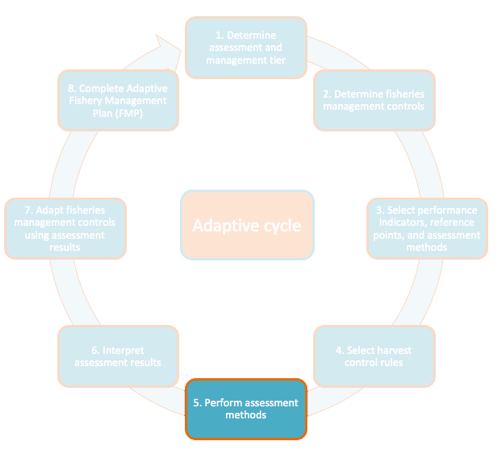

# Step 5 - Perform Assessment Methods

*What do my assessment methods say about the fishery?*

During this step, you will use your data to
calculate performance indicators using the chosen assessment methods.
Refer to *Appendix 5 – Assessment Method Descriptions* for detailed
descriptions of the assessment methods
