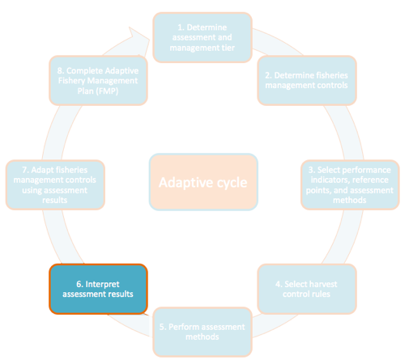

# Step 6 – Interpret assessment results

*What is the current status of the fishery?*

## 

## Step 6a - Determine the Most Likely Possible Interpretation for Each Performance Indicator

After assessment methods have been completed, use your results in Table
A1. 6 and HCRs in Table A1. 5 to determine the possible interpretation
and management implication for each performance indicator using the
following steps:

a)  Using your assessment results from Table A1. 6, use Table A1. 5 to
    look up the most likely interpretation from the choices provided in
    the “Possible Interpretation” column.

b)  Once the most likely possible interpretation has been chosen,
    determine the management implication by locating the colored circle
    traffic light in the “Management Implication column”

## Step 6b – Verify Assessment Result and Interpretation

Verify the assessment result using the following steps:

1.  Double-check calculations by reviewing the assessment calculations.

2.  Double-check that each assessment performed was stratified to the
    spatial extent of the fishery; for example, run analyses for each
    gear type, boat type, and/or fishing area.

3.  Double-check that reference points are appropriate for your fishery
    using available literature, expert opinion, and local ecological
    knowledge

4.  Review fishery-dependent sampling protocol; assess whether or not
    the spatial extent of the fishery-dependent survey overlaps with
    known or assumed distribution of fish population as well as fishing
    effort and gear type. If the sampling protocol, fish population, and
    fishing effort do not overlap, there may be biases in the assessment
    results that should be considering in your interpretation.

5.  Review fishery-independent sampling protocol; assess whether or not
    the spatial extent of the fishery-independent survey overlaps with
    known or assumed distribution of fish population as well as fishing
    effort. If the sampling protocol, fish population, and fishing
    effort do not overlap, there may be biases in the assessment results
    that should be considering in your interpretation.

6.  Examine any effort metrics to determine if they are consistent with
    your interpretation

7.  Groundtruth assessment result and interpretation with community.
    Consult with local experts to determine if the assessment results
    align with their knowledge of the fishery (fishers, middlemen,
    village elders, academic research groups, etc.) Often, assessment
    results can be counterintuitive, and multiple performance indicators
    may be conflicting in their message. Fishers can be especially
    helpful in interpreting performance indicators that seem
    counter-intuitive but can be explained by fishermen behavior – for
    example, if fished:unfished density ratio is down but catch and CPUE
    are up, the fishermen might say that although fish abundance seems
    low (low fished:unfished density ratio) prices were high that season
    and the weather was good, resulting in better targeting (higher
    CPUE) and higher catches. This process can either take place in a
    focus group discussion or structured interviews with key
    stakeholders. Through this process, try to arrive at a consistent
    interpretation.

8.  If trends persist, each performance indicator points towards a
    consistent interpretation, and if the community agrees with the
    interpretation, proceed to Step 7

9.  In situations where conflicting indicators cannot be rectified, or
    if the community cannot corroborate the assessment results,
    additional community outreach or other forms of social marketing may
    be necessary to arrive at consensus. *It’s important that all
    stakeholders are comfortable and confident with the assessment
    interpretation because it will be used to trigger a harvest control
    rule in Step 7.*
