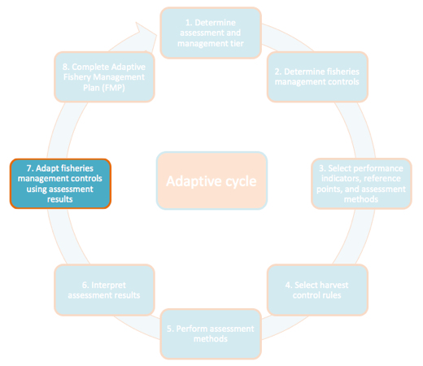

# Step 7 – Adjust Fisheries Management Controls Using Defined Harvest Control Rules

*How should I adjust fisheries management controls based on my
assessment results and interpretation?*

After interpreting and verifying the assessment results, implement the
appropriate HCR defined in Table A1. 5. Depending on the severity of the
HCR and likely community reaction, it may be necessary to conduct
additional community outreach or other social marketing activities to
ensure buy-in and compliance. For example, if a limit reference point is
reached and the fishery for a particular species must be closed, this
will likely require significant community outreach.
